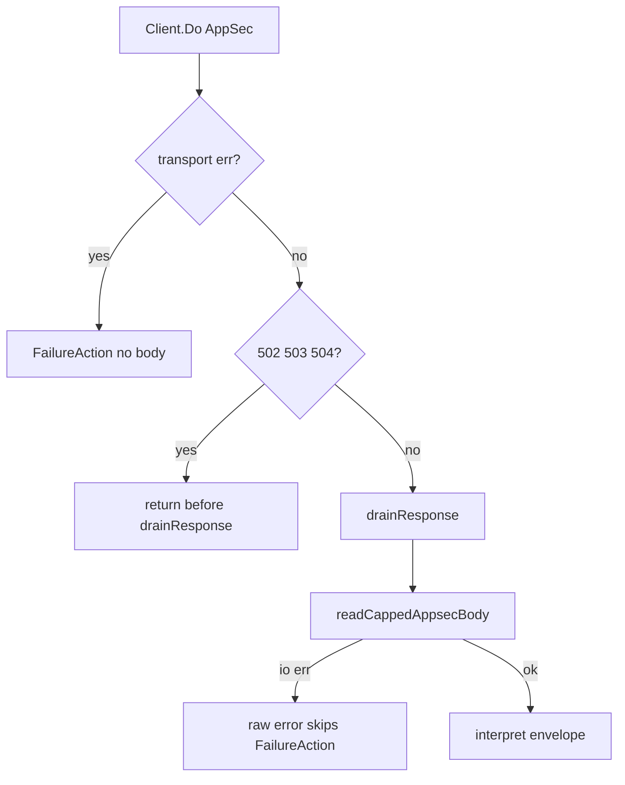

Developer review: needs changes — 2026-09-17T20:29:58Z

## What this changes
**Operators.** `crowdsecAppsecBodyLimit` `0` now forwards the full readable body (README: unlimited; omitted default stays 10485760). `crowdsecAppsecFailureAction` also covers an io error reading the AppSec response body. DELETE is not an unreadable-body drop.

**Admin users.** None.

**Developers.** `appsec.Client.Query` drains every live AppSec response including 502/503/504; treats body-limit `0` as unlimited (skip `LimitReader`); routes AppSec response-body io errors through `FailureAction` via package-local sentinel (`errors.Is`); rebuilds outbound `ContentLength` and `Content-Length` from the forwarded bytes (omits client `Content-Length` and `Transfer-Encoding`); removes DELETE from `isMethodWithBody`. Tests store into `transport` via `currentTransport()`. Baseline specs `core_plugin_appsec_client` and `core_plugin_appsec_failure-action` now hold those requirements; the OpenSpec change is archived. Usage packet `core_plugin_appsec` names `query.go` and the `errors.Is` classification (not a Language term for the sentinel).

**End users.** An HTTP/3 DELETE is no longer banned for a body it never sends. An unhealthy AppSec listener no longer leaks keep-alive. Unlimited body inspection actually forwards the body.

## Motivation
On `master`, `Query` still has the five dest defects first recorded in stale PRs #35 and #43. This PR re-implements those defects on current `master` so #35 and #43 can close when this lands. When AppSec answers 502, 503, or 504, the body is not drained, so the keep-alive slot cannot be reused — exactly while AppSec is unhealthy. `crowdsecAppsecBodyLimit` `0` falls through to a GET with no body. A failed read of the AppSec response skips `FailureAction`. Copied client headers leave a stale `Content-Length`. An HTTP/3 DELETE with `ContentLength < 0` is treated as an unreadable-body drop.

Leaving `master` as-is keeps leaking connections during AppSec outages, silently disables body inspection at the unlimited setting, fail-closes on read errors contrary to `passthrough`/`captcha`, and 403s bodyless HTTP/3 DELETE.

## Merge readiness
Ready title is on PR #70. Main Process failed dest nestif on CaptchaProvider, not this apply. 1 item remains.

Priority: P2 — real operator and end-user pain (connection leaks, wrong WAF body, HTTP/3 DELETE 403) with a contained Query fix
Reviewed head: a299878
Owner decision: Required. See Decision needed.

## Review scores
| Measure | Result | What it means |
| --- | --- | --- |
| Overall readiness | 2/6 | Main Process failed; both e2e succeeded |
| CI proof | 2/6 | Main Process failure https://github.com/david-garcia-garcia/crowdsec-bouncer-traefik-plugin/actions/runs/35270440632/job/105368096478 |
| Local tests proof | N/A | `prHost` remote; CI proof covers |
| Review resolution | 6/6 | no comments |

## Verification
| Check | Result | Evidence |
| --- | --- | --- |
| Branch | 2026-09-17-appsec-query-hardening pushed | git |
| OpenSpec | appsec-query-hardening | openspec/changes/archive/2026-09-17-appsec-query-hardening/ |
| Pull request | https://github.com/david-garcia-garcia/crowdsec-bouncer-traefik-plugin/pull/70 | pr-host |
| CI | Main Process failure https://github.com/david-garcia-garcia/crowdsec-bouncer-traefik-plugin/actions/runs/35270440632/job/105368096478 ; e2e (docker + pester) success https://github.com/david-garcia-garcia/crowdsec-bouncer-traefik-plugin/actions/runs/35270440552/job/105368460721 ; e2e (binary + mock LAPI) success https://github.com/david-garcia-garcia/crowdsec-bouncer-traefik-plugin/actions/runs/35270440552/job/105368460406 | GitHub MCP get_check_runs |
| Local tests | passed | handoff.yaml localTests |
| PR comments | no comments | comments: none |

## Specs
- [core_plugin_appsec_client](https://github.com/david-garcia-garcia/crowdsec-bouncer-traefik-plugin/blob/2026-09-17-appsec-query-hardening/openspec/changes/archive/2026-09-17-appsec-query-hardening/proposal.md) — modified
- [core_plugin_appsec_failure-action](https://github.com/david-garcia-garcia/crowdsec-bouncer-traefik-plugin/blob/2026-09-17-appsec-query-hardening/openspec/changes/archive/2026-09-17-appsec-query-hardening/proposal.md) — modified

## Follow-up issues
- [Dest nestif on CaptchaProvider validation](https://github.com/david-garcia-garcia/crowdsec-bouncer-traefik-plugin/blob/2026-09-17-appsec-query-hardening/knowledge/debt/2026-09-17-configuration-captcha-nestif.md) — dest Main Process lint fails nestif on CaptchaProvider validation.

## How this fits together
Local ticket `2026-09-17-appsec-query-hardening` → branch of the same name → PR #70 (ready title; requirement originated in #35 and #43) → OpenSpec change archived; Main Process failed dest nestif on `a299878`.

## Decision needed
| Question | Decision | By |
| --- | --- | --- |
| Should the header copy also strip hop-by-hop names (Connection, Upgrade, …) like PR #35? | assumed — no. This ticket asks to rebuild Content-Length. Skip only body-size headers (Content-Length, Transfer-Encoding). Do not add a hop-by-hop filter. | explore |
| Do oversized AppSec response bodies (responseBodyTooLarge) go through FailureAction? | assumed — no. Only io.ReadAll errors on the AppSec body. Oversized 200 allow and oversized non-200 error stay as dest today. | explore |
| Should readable-body forward be gated on isMethodWithBody (PR #35 readForwardBody)? | assumed — no. Only delete DELETE from the unreadable-body set. Keep today’s Body != nil copy for any method when a body is readable (including limit 0). | explore |
| Any new public knob (including restoring crowdsecAppsecUnreadableBodyBlock)? | assumed — none. 0 already means unlimited on the existing key. Do not reintroduce the removed bool. | explore |
| Does this run take gRPC / streaming body policy (PR #51)? | assumed — no. Out of scope. A DELETE must not be dropped for a body it never sends, regardless of #51. | explore |

## Before merge
- [ ] [P2] Green Main Process (dest nestif on `pkg/configuration/configuration.go` CaptchaProvider — not in this apply)
- [x] Cite #35 and #43 on the ready PR body (Motivation)
- [x] Apply the five Query defects on current #64 transport
- [x] Local `go test ./pkg/...` and `go test .` passed
- [x] Standards sentinel applied; usage packet records `errors.Is` classification
- [x] Archive: FindSpecHost fold into existing AppSec leaves; catalog validate 0; change moved to archive
- [x] Ready title (drop 🚧)

## Findings
None.

## Axis review
[Standards](https://github.com/david-garcia-garcia/crowdsec-bouncer-traefik-plugin/blob/2026-09-17-appsec-query-hardening/devstate/2026/09/2026-09-17-appsec-query-hardening/codereview_standards.md) — 1 total, 0 pending, 1 completed
[Spec](https://github.com/david-garcia-garcia/crowdsec-bouncer-traefik-plugin/blob/2026-09-17-appsec-query-hardening/devstate/2026/09/2026-09-17-appsec-query-hardening/codereview_spec.md) — 0 total, 0 pending, 0 completed
[Security](https://github.com/david-garcia-garcia/crowdsec-bouncer-traefik-plugin/blob/2026-09-17-appsec-query-hardening/devstate/2026/09/2026-09-17-appsec-query-hardening/codereview_security.md) — 0 total, 0 pending, 0 completed
[Performance](https://github.com/david-garcia-garcia/crowdsec-bouncer-traefik-plugin/blob/2026-09-17-appsec-query-hardening/devstate/2026/09/2026-09-17-appsec-query-hardening/codereview_performance.md) — 1 total, 0 pending, 0 completed, 1 skipped
[Dead](https://github.com/david-garcia-garcia/crowdsec-bouncer-traefik-plugin/blob/2026-09-17-appsec-query-hardening/devstate/2026/09/2026-09-17-appsec-query-hardening/codereview_dead.md) — 0 total, 0 pending, 0 completed
[Test coverage](https://github.com/david-garcia-garcia/crowdsec-bouncer-traefik-plugin/blob/2026-09-17-appsec-query-hardening/devstate/2026/09/2026-09-17-appsec-query-hardening/codereview_coverage.md) — 0 total, 0 pending, 0 completed

## Agent review details

### Review metrics
| Metric | Value | Why it matters |
| --- | --- | --- |
| Specs in this PR | 0 added / 2 modified | Same list as Specs |
| Open reviewer comments walked | 0 FIX / 0 ANSWER / 0 open | Unanswered review is merge risk |
| Reviewed head | a299878ef1f8c6cdcba7f5643c9e12ba96f783cf | Card must match the branch you measured |

### Stored data model
None.

### Technical review
Best possible solution versus `master`: drain every AppSec response that arrived; treat body-limit `0` as unlimited (skip LimitReader); route read failures through FailureAction keeping `appsecQuery:readBody` via package-local sentinel; rebuild Content-Length from bytes sent; take DELETE out of `isMethodWithBody`. Keep #64 transport. Do not rebase #35/#43.

Do we have a high-confidence way to reproduce? Yes — five tests failed on dest then passed after the apply (`go test ./pkg/appsec/`).

Is this the best way to solve the issue? Yes — re-implement the five dest defects from #35 and #43 on current transport; classify read-body io with `errors.Is` instead of a string prefix; usage packet records that classification without a Language term for the internal sentinel. Dest nestif was not taken. Unlimited `0` stays unbounded as specified. Archive folded into the two existing AppSec leaves.

### Evidence
What I checked:
- Pin `origin/master...HEAD` excluding `devstate/` and `.cursor/`; reviewed head `a299878ef1f8c6cdcba7f5643c9e12ba96f783cf`
- One OPEN PR #70; title set to ready gitmoji form
- `comments.md` absent; `comments: none`
- Main Process failure nestif `if config.CaptchaProvider != ""` complexity 6 https://github.com/david-garcia-garcia/crowdsec-bouncer-traefik-plugin/actions/runs/35270440632/job/105368096478
- e2e (docker + pester) success https://github.com/david-garcia-garcia/crowdsec-bouncer-traefik-plugin/actions/runs/35270440552/job/105368460721
- e2e (binary + mock LAPI) success https://github.com/david-garcia-garcia/crowdsec-bouncer-traefik-plugin/actions/runs/35270440552/job/105368460406
- `handoff.yaml` `localTests: passed`
- Axis files: Standards 1 done; Performance 1 skipped; Spec/Security/Dead/Coverage none
- PR comments empty (comments: none)

### Rank-up moves
None.
