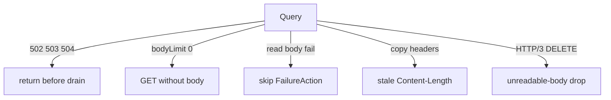

Developer review: in progress — 2026-09-17T19:01:53Z

## What this changes
**Operators.** None.

**Admin users.** None.

**Developers.** Prepare only: requirement grounded and stub PR opened. No apply versus `master`.

**End users.** None.

## Motivation
On `master`, `appsec.Client.Query` has five contained defects on the path that copies a request to the AppSec listener. When that listener answers 502, 503, or 504, `Query` returns before `drainResponse`, so the keep-alive slot cannot be reused — exactly while AppSec is unhealthy. Setting `crowdsecAppsecBodyLimit` to `0` (the value that should mean “inspect everything”) falls through to a GET with no body. A failed read of the AppSec response skips `FailureAction`, so a configured `ban` or `captcha` is not applied for that class. Copied client headers keep a stale `Content-Length` when the forwarded body is a different length. An HTTP/3 DELETE with `ContentLength < 0` is treated as an unreadable body and dropped or banned, even though DELETE was never going to send one.

If this does not land, an unhealthy AppSec listener also leaks connections to it, operators who choose unlimited inspection send nothing, and DELETE clients over HTTP/3 can be banned for a body they never had. PRs #35 and #43 already named these holes and are not mergeable on today’s hot-swappable transport.

## Merge readiness
Prepare grounded (`qualified`). Explore is next. 3 items remain.

Priority: P2 — common-path AppSec query defects with a contained fix; connection leak and wrong DELETE/body-limit behaviour while AppSec is in use
Reviewed head: 04eb063
Owner decision: None.

## Review scores
| Measure | Result | What it means |
| --- | --- | --- |
| Overall readiness | 3/6 | CI still in progress; no apply yet |
| CI proof | 3/6 | in progress Main Process https://github.com/david-garcia-garcia/crowdsec-bouncer-traefik-plugin/actions/runs/35262351108 ; e2e (binary + mock LAPI) https://github.com/david-garcia-garcia/crowdsec-bouncer-traefik-plugin/actions/runs/35262350970/job/105340935578 ; e2e (docker + pester) https://github.com/david-garcia-garcia/crowdsec-bouncer-traefik-plugin/actions/runs/35262350970/job/105340935071 |
| Local tests proof | N/A | `localTests: none` (before implement; remote PR) |
| Review resolution | 6/6 | OPEN PR #70; no review comments |

## Verification
| Check | Result | Evidence |
| --- | --- | --- |
| Branch | 2026-09-17-appsec-query-hardening pushed | `git` / origin |
| OpenSpec | none | `openspec/` |
| Pull request | https://github.com/david-garcia-garcia/crowdsec-bouncer-traefik-plugin/pull/70 | pr-host List/Create |
| CI | build 35262351108 in progress https://github.com/david-garcia-garcia/crowdsec-bouncer-traefik-plugin/actions/runs/35262351108 ; build 35262350970 in progress https://github.com/david-garcia-garcia/crowdsec-bouncer-traefik-plugin/actions/runs/35262350970 | pr-host CI |
| Local tests | none | handoff.yaml localTests |
| PR comments | no comments | no comments.md |

## Specs
None.

## Follow-up issues
None.

## How this fits together
Local caller spec → branch `2026-09-17-appsec-query-hardening` from `master` → stub PR #70. Explore next.

## Decision needed
None.

## Before merge
- [ ] Explore then apply the five `query.go` defects on the current `atomic.Value` transport
- [ ] One test that fails before each fix; update AppSec spec leaves and the AppSec devdoc for unreadable-body methods and a zero body limit
- [ ] Cite PRs #35 and #43 on the ready PR body

## Findings
- [P2] 502/503/504 return before `drainResponse` — (general). Path: `pkg/appsec/query.go`.
- [P2] `appsecBodyLimit == 0` forwards a GET without a body — (general). Path: `pkg/appsec/query.go`.
- [P2] AppSec body read failure skips `FailureAction` — (general). Path: `pkg/appsec/query.go`.
- [P2] Outbound `Content-Length` is copied, not rebuilt — (general). Path: `pkg/appsec/query.go`.
- [P2] HTTP/3 DELETE is treated as a method that had a body — (general). Path: `pkg/appsec/query.go`.

## Axis review
None.

## Agent review details

### Review metrics
| Metric | Value | Why it matters |
| --- | --- | --- |
| Specs in this PR | none | Same list as ## Specs |
| Open reviewer comments walked | 0 FIX / 0 ANSWER / 0 open | Unanswered review is merge risk |
| Reviewed head | 04eb0632cdc1e94445a1dc1f4aa5b77f382b746d | Card must match the branch you measured |

### Stored data model
None.

### Technical review
Best possible solution versus `master`: drain every AppSec response that arrived; treat body-limit `0` as unlimited; route read failures through `FailureAction`; rebuild `Content-Length` from bytes sent; take DELETE out of `isMethodWithBody`. Keep #64 transport. Do not rebase #35/#43.

Do we have a high-confidence way to reproduce? Yes — `Query` early-return vs `defer drainResponse`; `appsecBodyLimit > 0` guard; `readCappedAppsecBody` raw error; header `Add`; DELETE in `isMethodWithBody`. Keep-alive reuse test covers 200/403/500 only.

Is this the best way to solve the issue? Not applied yet. Re-implement on today’s transport; do not restore removed fields or `crowdsecAppsecUnreadableBodyBlock`.

### Evidence
What I checked:
- dest `origin/master` `a57c8485a7ef8af3ec1eee986dd45ddff4cc926c` has empty product diff on this branch
- `pkg/appsec/query.go` matches the five ticket claims
- `NewTestClient` stores `transport`, not an `httpClient` field
- `crowdsecAppsecUnreadableBodyBlock` is already removed on dest
- OPEN comment set empty
- CI: Main Process and both e2e jobs in progress (runs 35262351108, 35262350970)

### Rank-up moves
None.
