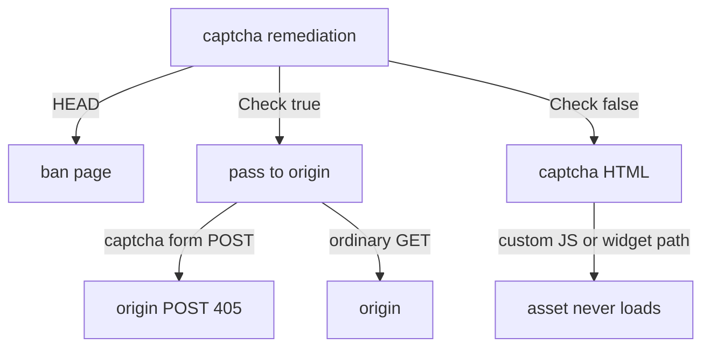

Developer review: needs changes — 2026-09-17T19:23:15Z

## What this changes
**Operators.** None.

**Admin users.** None.

**Developers.** Apply-ready OpenSpec change `captcha-request-routing` adds `core_plugin_middleware_captcha-routing` (solved-form POST 302, exact-path custom-resource passthrough, HEAD on the captcha path). No apply versus `master`.

**End users.** None.

## Motivation
On `master`, `handleRemediationServeHTTP` still forwards a captcha-form POST after the gate cookie already allows the visitor. A second tab that submits the solved form hits origin as POST; GET-only origins answer 405. The same function remediates same-route custom challenge assets, so the widget never loads, and it drops captcha-kind HEAD to ban.

If this does not land, duplicate-tab solve stays a 405 and custom-provider challenges stay unrenderable. PRs #48 and #50 named both holes and are not mergeable on today's HMAC gate.

## Merge readiness
Propose is apply-ready. Main Process failed. Implement has not started. 3 items remain.

Priority: P2 — real end-user pain on duplicate captcha submit and custom challenge assets, limited blast radius
Reviewed head: 80d1993
Owner decision: Required. See Decision needed.

## Review scores
| Measure | Result | What it means |
| --- | --- | --- |
| Overall readiness | 2/6 | Main Process failed |
| CI proof | 2/6 | Main Process failed https://github.com/david-garcia-garcia/crowdsec-bouncer-traefik-plugin/actions/runs/35263798205 |
| Local tests proof | N/A | `localTests: none` (before implement; remote PR) |
| Review resolution | 6/6 | OPEN PR #68; no review comments |

## Verification
| Check | Result | Evidence |
| --- | --- | --- |
| Branch | 2026-09-17-captcha-request-routing pushed | `git` / origin `80d1993` |
| OpenSpec | captcha-request-routing | `openspec/changes/captcha-request-routing/` |
| Pull request | https://github.com/david-garcia-garcia/crowdsec-bouncer-traefik-plugin/pull/68 | pr-host List |
| CI | build 35263798205 Main Process failure https://github.com/david-garcia-garcia/crowdsec-bouncer-traefik-plugin/actions/runs/35263798205 ; e2e binary success and e2e docker in progress https://github.com/david-garcia-garcia/crowdsec-bouncer-traefik-plugin/actions/runs/35263798158 | pr-host CI |
| Local tests | none | handoff.yaml localTests |
| PR comments | no comments | no comments.md |

## Specs
- [core_plugin_middleware_captcha-routing](https://github.com/david-garcia-garcia/crowdsec-bouncer-traefik-plugin/blob/2026-09-17-captcha-request-routing/openspec/changes/captcha-request-routing/proposal.md) — added

## Follow-up issues
None.

## How this fits together
Local ticket → branch `2026-09-17-captcha-request-routing` → stub PR #68 → propose wrote change `captcha-request-routing`. Implement next.

## Decision needed
| Question | Decision | By |
| --- | --- | --- |
| What is the passthrough match set — `CaptchaCustomJsURL` path only, or also a widget/challenge URL? | assumed — exact path of `CaptchaCustomJsURL` and, when set, exact path of optional `captchaCustomChallengeUrl`. Not `CaptchaCustomValidateURL`. Not a directory prefix. | explore |
| Does that need a new optional public key? | assumed — yes, optional `captchaCustomChallengeUrl` / `CaptchaCustomChallengeURL`. Empty means no second path. Custom validation still requires the existing four custom fields only. | explore |
| Path vs host vs prefix matching, and why that scope is safe? | assumed — `url.Parse` the configured URL, compare `parsed.Path` to `req.URL.Path` (must be non-empty and start with `/`). Ignore host and query. Exact path only. | explore |
| Should the Check-true form POST remint the gate cookie or hit the provider again? | assumed — neither. `WriteSolvedRedirect` only. Do not remint or re-verify. | explore |
| Should custom-resource passthrough skip AppSec? | assumed — no. Use `handleNextServeHTTP`. | explore |

## Before merge
- [x] Propose routing spec leaf and apply-ready OpenSpec change
- [ ] [P2] Implement captcha-kind routing (form POST 302, custom-resource passthrough, HEAD) with tests that fail before the fix
- [ ] Cite PRs #48 and #50 on the ready PR body
- [ ] [P2] Green Main Process (lint nestif on dest `validateCaptchaCredentialsAndTemplates`)

## Findings
- [P2] Check-true captcha-form POST reaches origin — (general). Path: `pkg/bouncer/bouncer.go`.
- [P2] Custom challenge assets have no passthrough — (general). Path: `pkg/bouncer/bouncer.go`.
- [P2] HEAD is excluded from the captcha path and falls to ban — (general). Path: `pkg/bouncer/bouncer.go`.
- [P2] Main Process lint failed nestif complexity 6 on dest `if config.CaptchaProvider != ""` — (general). Path: `pkg/configuration/configuration.go:336`. Propose delta is OpenSpec only.

## Axis review
None.

## Agent review details

### Review metrics
| Metric | Value | Why it matters |
| --- | --- | --- |
| Specs in this PR | 1 added / 0 modified | Same list as ## Specs |
| Open reviewer comments walked | 0 FIX / 0 ANSWER / 0 open | Unanswered review is merge risk |
| Reviewed head | 80d19939a4fb2e49b52bd1c92ffee49265bde0f7 | Card must match the branch you measured |

### Stored data model
None.

### Technical review
Best possible solution: new `core_plugin_middleware_captcha-routing` leaf; keep cookie `Check` and first-solve 302 on captcha-gate; exact-path passthrough so it is not a ban bypass.

Do we have a high-confidence way to reproduce? Yes — dest `handleRemediationServeHTTP` Check-true POST, missing resource match, and `Method != HEAD`.

Is this the best way to solve the issue? Yes versus `master` — re-implement on today's gate cookie; do not rebase #48/#50; no cache grace; no `Cache().Acquire`.

### Evidence
What I checked:
- `openspec validate captcha-request-routing --strict` passed
- FindSpecHost: new `core_plugin_middleware_captcha-routing` (high); no fold
- product delta `origin/master...HEAD` excluding `devstate/`: OpenSpec change only
- CI: Main Process failure run 35263798205; e2e binary success / docker in progress run 35263798158
- OPEN comment set empty

### Rank-up moves
None.
