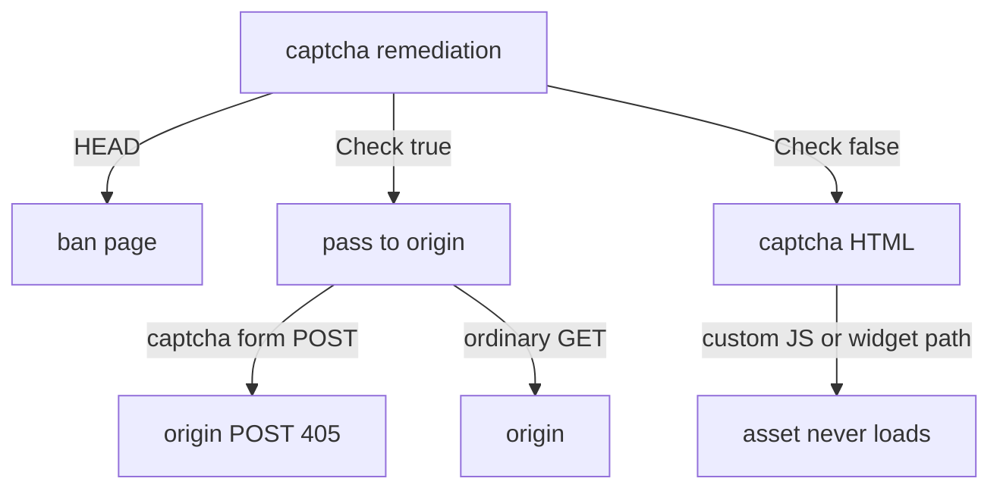

Developer review: ready for review — 2026-09-17T20:04:45Z

## What this changes
**Operators.** Optional `captchaCustomChallengeUrl` names a second exact browser path for custom-provider widgets. Empty keeps `CaptchaCustomJsURL` path only.

**Admin users.** None.

**Developers.** `handleRemediationServeHTTP` routes captcha-kind as custom-resource pass → Check-true form POST 302 → Check-true origin → `captcha.ServeHTTP` (HEAD included). Past-captcha is `Check(req, remoteIP)` and the HMAC cookie only. New leaf and usage packet `core_plugin_middleware_captcha-routing` (Language + How-to). Cites #48 and #50.

**End users.** A second-tab captcha submit 302s instead of POSTing origin. Same-route custom widget assets load under captcha. Captcha-kind HEAD previews the challenge, not the ban page.

## Motivation
On `master`, `handleRemediationServeHTTP` still forwards a captcha-form POST after the gate cookie already allows the visitor. A second tab that submits the solved form hits origin as POST; GET-only origins answer 405. The same function remediates same-route custom challenge assets, so the widget never loads, and it drops captcha-kind HEAD to ban.

If this does not land, duplicate-tab solve stays a 405 and custom-provider challenges stay unrenderable. PRs #48 and #50 named both holes and are not mergeable on today's HMAC gate.

## Merge readiness
Devdocs impact produced the missing Language terms. CI succeeded. 0 items remain.

Priority: P2 — real end-user pain on duplicate captcha submit and custom challenge assets, limited blast radius
Reviewed head: 17235c2
Owner decision: Required. See Decision needed.

## Review scores
| Measure | Result | What it means |
| --- | --- | --- |
| Overall readiness | 6/6 | CI succeeded; no open PR comments |
| CI proof | 6/6 | Main Process, e2e binary, and e2e docker succeeded https://github.com/david-garcia-garcia/crowdsec-bouncer-traefik-plugin/actions/runs/35268212314 |
| Local tests proof | N/A | `localTests: passed` (remote PR; CI proof covers remote) |
| Review resolution | 6/6 | OPEN PR #68; no review comments |

## Verification
| Check | Result | Evidence |
| --- | --- | --- |
| Branch | 2026-09-17-captcha-request-routing pushed | `git` / origin `17235c2` |
| OpenSpec | captcha-request-routing | `openspec/changes/captcha-request-routing/` |
| Pull request | https://github.com/david-garcia-garcia/crowdsec-bouncer-traefik-plugin/pull/68 | pr-host List |
| CI | build 35268212314 Main Process success https://github.com/david-garcia-garcia/crowdsec-bouncer-traefik-plugin/actions/runs/35268212314 ; e2e binary and e2e docker success https://github.com/david-garcia-garcia/crowdsec-bouncer-traefik-plugin/actions/runs/35268212324 | pr-host CI |
| Local tests | passed | handoff.yaml localTests |
| PR comments | no comments | no comments.md |

## Specs
- [core_plugin_middleware_captcha-routing](https://github.com/david-garcia-garcia/crowdsec-bouncer-traefik-plugin/blob/2026-09-17-captcha-request-routing/openspec/changes/captcha-request-routing/proposal.md) — added

## Follow-up issues
None.

## How this fits together
Local ticket → branch `2026-09-17-captcha-request-routing` → PR #68 → usage-doc impact for change `captcha-request-routing`. This body cites #48 and #50 so those PRs can close when this lands.

## Decision needed
| Question | Decision | By |
| --- | --- | --- |
| What is the passthrough match set — `CaptchaCustomJsURL` path only, or also a widget/challenge URL? | assumed — exact path of `CaptchaCustomJsURL` and, when set, exact path of optional `captchaCustomChallengeUrl`. Not `CaptchaCustomValidateURL`. Not a directory prefix. | explore |
| Does that need a new optional public key? | assumed — yes, optional `captchaCustomChallengeUrl` / `CaptchaCustomChallengeURL`. Empty means no second path. Custom validation still requires the existing four custom fields only. | explore |
| Path vs host vs prefix matching, and why that scope is safe? | assumed — `url.Parse` the configured URL, compare `parsed.Path` to `req.URL.Path` (must be non-empty and start with `/`). Ignore host and query. Exact path only. | explore |
| Should the Check-true form POST remint the gate cookie or hit the provider again? | assumed — neither. `WriteSolvedRedirect` only. Do not remint or re-verify. | explore |
| Should custom-resource passthrough skip AppSec? | assumed — no. Use `handleNextServeHTTP`. | explore |

## Before merge
None.

## Findings
None.

## Axis review
[Standards](https://github.com/david-garcia-garcia/crowdsec-bouncer-traefik-plugin/blob/2026-09-17-captcha-request-routing/devstate/2026/09/2026-09-17-captcha-request-routing/codereview_standards.md) — 0 total, 0 pending, 0 completed
[Spec](https://github.com/david-garcia-garcia/crowdsec-bouncer-traefik-plugin/blob/2026-09-17-captcha-request-routing/devstate/2026/09/2026-09-17-captcha-request-routing/codereview_spec.md) — 0 total, 0 pending, 0 completed
[Security](https://github.com/david-garcia-garcia/crowdsec-bouncer-traefik-plugin/blob/2026-09-17-captcha-request-routing/devstate/2026/09/2026-09-17-captcha-request-routing/codereview_security.md) — 0 total, 0 pending, 0 completed
[Performance](https://github.com/david-garcia-garcia/crowdsec-bouncer-traefik-plugin/blob/2026-09-17-captcha-request-routing/devstate/2026/09/2026-09-17-captcha-request-routing/codereview_performance.md) — 0 total, 0 pending, 0 completed
[Dead](https://github.com/david-garcia-garcia/crowdsec-bouncer-traefik-plugin/blob/2026-09-17-captcha-request-routing/devstate/2026/09/2026-09-17-captcha-request-routing/codereview_dead.md) — 0 total, 0 pending, 0 completed
[Test coverage](https://github.com/david-garcia-garcia/crowdsec-bouncer-traefik-plugin/blob/2026-09-17-captcha-request-routing/devstate/2026/09/2026-09-17-captcha-request-routing/codereview_coverage.md) — 0 total, 0 pending, 0 completed

## Agent review details

### Review metrics
| Metric | Value | Why it matters |
| --- | --- | --- |
| Specs in this PR | 1 added / 0 modified | Same list as ## Specs |
| Open reviewer comments walked | 0 FIX / 0 ANSWER / 0 open | Unanswered review is merge risk |
| Reviewed head | 17235c2719ba02c5791dd1f9f3599aa32064131e | Card must match the branch you measured |

### Stored data model
- Changed: Traefik plugin Config / `captchaCustomChallengeUrl` — string — sample `` (empty, JsURL-path only) or `https://widget.example/v0/challenge`. Upgrade: old configs still valid.

### Technical review
Best possible solution: captcha-kind routing on `handleRemediationServeHTTP` with cookie-only `Check`, exact-path custom-resource match, and no cache grace or stream-lease touch.

Do we have a high-confidence way to reproduce? Yes — handler tests for Check-true form POST 302, ordinary POST to origin, custom JS/challenge pass, ban no-pass, prefix/ValidateURL miss, captcha HEAD not ban.

Is this the best way to solve the issue? Yes versus `master` — owners stay on `captcha.Client`; passthrough is not a ban bypass; Yaegi-safe (no `atomic.Pointer[T]`).

### Evidence
What I checked:
- Devdocs impact on `origin/master...HEAD` excluding `devstate/` and `.cursor/` — units Captcha request routing + Captcha gate cookie
- language-gap produced on `core_plugin_middleware_captcha-routing` (Language terms now on disk)
- Captcha gate cookie packet unchanged (no stale-usage, no wrong-fold)
- CI on `17235c2`: Main Process success run 35268212314; e2e binary + e2e docker success run 35268212324
- product delta stays in `pkg/bouncer`, `pkg/captcha`, `pkg/configuration` (no `pkg/lapi` or `pkg/reclaim`)
- OPEN comment set empty
- Cites #48 and #50

### Rank-up moves
- Document `captchaCustomChallengeUrl` on the README captcha key list.
- Set the optional key on `examples/custom-captcha` so the hardcoded `/v0/challenge` path passes.
