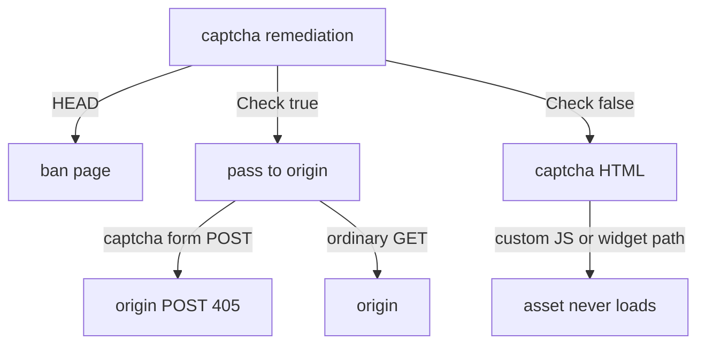

Developer review: in progress — 2026-09-17T18:39:12Z

## What this changes
**Operators.** None.

**Admin users.** None.

**Developers.** Prepare only: requirement grounded and stub PR opened. No apply versus `master`.

**End users.** None.

## Motivation
On `master`, `handleRemediationServeHTTP` has no notion of a captcha-form POST after the gate cookie already allows the visitor. A second tab that still submits the solved form is forwarded to origin as POST. GET-only origins answer 405. The same function remediates custom-provider challenge assets, so the widget script never loads, and it excludes HEAD from the captcha branch so a HEAD preview becomes a ban.

If this does not land, visitors who solve captcha in one tab still hit an error page from the other, and custom-provider challenges stay unrenderable. PRs #48 and #50 already named both holes and are not mergeable on today's HMAC gate.

## Merge readiness
Prepare grounded (`qualified-with-gaps`). Explore is next. 3 items remain.

Priority: P2 — real end-user pain on duplicate captcha submit and custom challenge assets, limited blast radius
Reviewed head: 1c6dd93
Owner decision: None.

## Review scores
| Measure | Result | What it means |
| --- | --- | --- |
| Overall readiness | 3/6 | CI in progress; no apply yet |
| CI proof | 3/6 | Main Process and both e2e jobs in progress |
| Local tests proof | N/A | `localTests: none` (before implement; remote PR) |
| Review resolution | 6/6 | OPEN PR #68; no review comments |

## Verification
| Check | Result | Evidence |
| --- | --- | --- |
| Branch | 2026-09-17-captcha-request-routing pushed | `git` / origin |
| OpenSpec | none | `openspec/` |
| Pull request | https://github.com/david-garcia-garcia/crowdsec-bouncer-traefik-plugin/pull/68 | pr-host List/Create |
| CI | build 35260086233 in progress https://github.com/david-garcia-garcia/crowdsec-bouncer-traefik-plugin/actions/runs/35260086233 ; build 35260086064 in progress https://github.com/david-garcia-garcia/crowdsec-bouncer-traefik-plugin/actions/runs/35260086064 | pr-host CI |
| Local tests | none | handoff.yaml localTests |
| PR comments | no comments | no comments.md |

## Specs
None.

## Follow-up issues
None.

## How this fits together
Local caller spec → branch `2026-09-17-captcha-request-routing` from `master` → stub PR #68. Qualify is `qualified-with-gaps`. Explore next.

## Decision needed
None.

## Before merge
- [ ] Explore passthrough match set, whether a challenge-URL key is required, and HEAD scope
- [ ] Implement both routing fixes on today's gate cookie, with tests that fail before the fix
- [ ] Cite PRs #48 and #50 on the ready PR body

## Findings
- [P2] Check-true captcha-form POST reaches origin — (general). Path: `pkg/bouncer/bouncer.go`.
- [P2] Custom challenge assets have no passthrough — (general). Path: `pkg/bouncer/bouncer.go`.
- [P2] HEAD is excluded from the captcha path and falls to ban — (general). Path: `pkg/bouncer/bouncer.go`.
- [P3] First-solve POST already 302s in `ServeHTTP`; remaining hole is the Check-true form POST — (general). Path: `pkg/captcha/captcha.go`.

## Axis review
None.

## Agent review details

### Review metrics
| Metric | Value | Why it matters |
| --- | --- | --- |
| Specs in this PR | none | Same list as ## Specs |
| Open reviewer comments walked | 0 FIX / 0 ANSWER / 0 open | Unanswered review is merge risk |
| Reviewed head | 1c6dd9324e56769b2a00f4c4f6641b0515221845 | Card must match the branch you measured |

### Stored data model
None.

### Technical review
Best possible solution: not applicable yet — prepare only, no apply versus `master`.

Do we have a high-confidence way to reproduce? Yes — current `handleRemediationServeHTTP` Check path and HEAD exclusion; `TestCaptchaMethodBasedLogic` encodes HEAD→ban.

Is this the best way to solve the issue? Not applied yet. Re-implement on today's cookie gate; do not rebase #48/#50.

### Evidence
What I checked:
- dest `origin/master` `340734f0a6cd75df49533452dc4feffa1bb56cc6` has `pkg/bouncer`, `pkg/captcha`, `pkg/configuration`
- stub PR #68 opened
- CI queued: runs 35260086233 and 35260086064
- OPEN comment set empty

### Rank-up moves
None.
