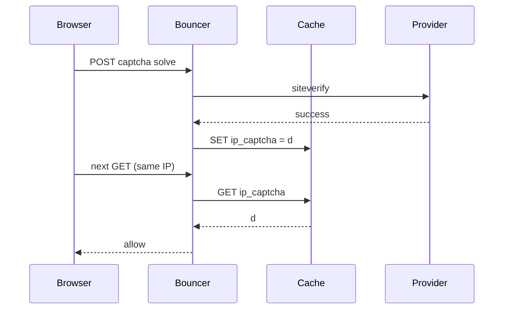

Developer review: in progress — 2026-09-17T06:55:00Z

## What this changes
**Operators.** None yet — prepare grounded replacing IP cache grace with a signed captcha cookie plus an IP-bind vs cookie-only knob; implement not started.

**Admin users.** None.

**Developers.** None yet — on `master`, `pkg/captcha` still uses `{ip}_captcha` in the shared cache; this branch will move grace to HMAC cookies and drop cache keys.

**End users.** None yet — after implement, captcha grace survives without Redis/memory grace keys and can be scoped per browser cookie instead of shared IP.

## Motivation
On `master`, a solved captcha writes `{remoteIP}_captcha` into the connection cache and later requests pass only while that key holds `d`. Grace therefore depends on cache reachability, shared-IP semantics, and cannot be carried as a portable browser credential. PR #45 proposed cache-backed session tokens; this ticket supersedes that with stateless signed cookies and closes #45 without merging.

If we do not merge a cookie-based gate, operators keep cache-tied grace (and stale Redis keys still count as solved), and the superseded PR #45 session design remains a distraction.

## Merge readiness
Prepare complete; explore is next. 7 workflow items remain.

Priority: P2 — real shared-IP and cache-dependency pain for captcha grace, with workarounds (per-connection cache, accepting IP-wide grace).

Reviewed head: 8216eef
Owner decision: None.

## Review scores
| Measure | Result | What it means |
| --- | --- | --- |
| Overall readiness | 1/6 | Stub PR only; no product change or CI yet |
| CI proof | 1/6 | Pushed; CI not seen |
| Local tests proof | N/A | Before implement |
| Review resolution | N/A | No PR comments inventoried |

## Verification
| Check | Result | Evidence |
| --- | --- | --- |
| Branch | 2026-09-17-captcha-stateless-gate pushed | git push |
| OpenSpec | none | handoff.yaml change |
| Pull request | https://github.com/david-garcia-garcia/crowdsec-bouncer-traefik-plugin/pull/58 | GitHub Create |
| CI | not seen | pr-host CI |
| Local tests | none | handoff.yaml localTests |
| PR comments | no comments | PR #58 comment list empty |

## Specs
None.

## Follow-up issues
None.

## How this fits together
Local ticket → branch `2026-09-17-captcha-stateless-gate` → stub PR #58 → close superseded PR #45 during implement/pullrequest → explore cookie/HMAC and OpenSpec cache-spec tension next.

## Decision needed
None.

## Before merge
- [ ] [P2] Explore cookie encoding, dedicated HMAC secret config, and OpenSpec update for cache grace removal
- [ ] [P2] Propose OpenSpec change for stateless captcha gate
- [ ] [P2] Implement signed cookie grace; remove cache keys from `pkg/captcha`
- [ ] [P2] Close PR #45 without merging
- [x] Prepare: requirement, worktree, stub PR

## Findings
None.

## Axis review
None.

## Agent review details

### Review metrics
| Metric | Value | Why it matters |
| --- | --- | --- |
| Specs in this PR | none | No product diff yet |
| Open reviewer comments walked | 0 FIX / 0 ANSWER / 0 open | No comments on stub PR |
| Reviewed head | 8216eef | Matches pushed branch |

### Stored data model
None.

### Technical review
Best possible solution: not evaluated — no apply yet.

Do we have a high-confidence way to reproduce? Yes — existing captcha/cache paths in `pkg/captcha/captcha.go` and bouncer remediation tests can be extended once cookies land.
