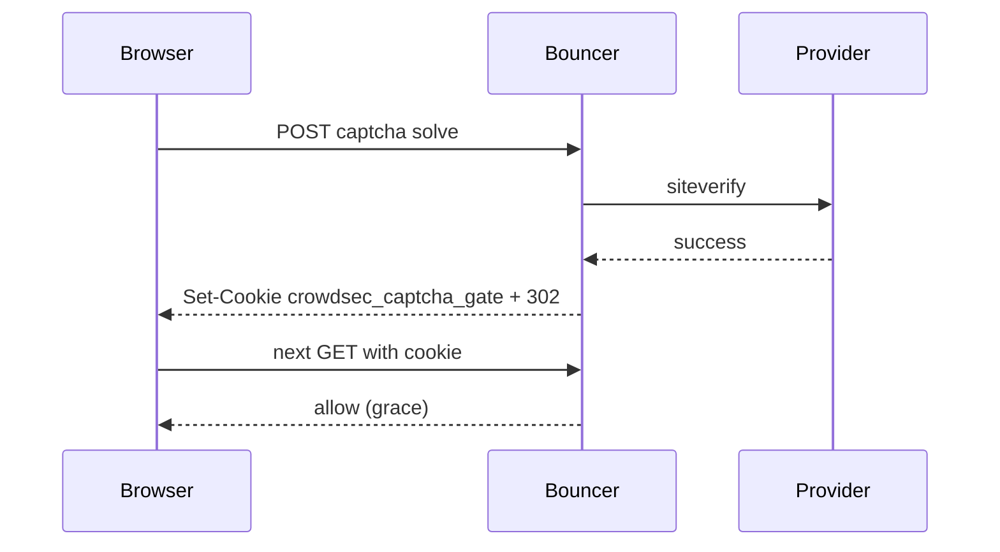

Developer review: ready for review — 2026-09-17T08:20:00Z

## What this changes
**Operators.** Set `bouncerCaptchaGateSecret` or `bouncerCaptchaGateSecretFile` whenever captcha is enabled; optional `captchaGateBindIP` (default bind client IP) controls whether grace is IP-scoped or cookie-only.

**Admin users.** None.

**Developers.** `pkg/captcha` issues and validates `crowdsec_captcha_gate` HMAC cookies; `Check(r, remoteIP)` no longer touches cache; OpenSpec adds `core_plugin_middleware_captcha-gate` and drops cache captcha grace from `core_cache_client_isolated-store`.

**End users.** After solving captcha, grace follows the browser cookie instead of a shared per-IP cache entry.

## Motivation
On `master`, a solved captcha writes `{remoteIP}_captcha` into the connection cache and later requests pass only while that key holds `d`. Grace therefore depends on cache reachability, shared-IP semantics, and cannot be carried as a portable browser credential. PR #45 proposed cache-backed session tokens; this ticket supersedes that with stateless signed cookies and closes #45 without merging.

If we do not merge a cookie-based gate, operators keep cache-tied grace (and stale Redis keys still count as solved), and the superseded PR #45 session design remains a distraction.

## Merge readiness
Implementation, review, devdocs, and archive complete. None remain.

Priority: P2 — real shared-IP and cache-dependency pain for captcha grace, with workarounds (per-connection cache, accepting IP-wide grace).

Reviewed head: 4ffba32
Owner decision: None.

## Review scores
| Measure | Result | What it means |
| --- | --- | --- |
| Overall readiness | 6/6 | Local tests passed; CI succeeded on latest push |
| CI proof | 6/6 | GitHub Actions succeeded on head commit |
| Local tests proof | 6/6 | handoff.yaml localTests passed |
| Review resolution | N/A | No PR comments |

## Verification
| Check | Result | Evidence |
| --- | --- | --- |
| Branch | 2026-09-17-captcha-stateless-gate pushed | git push |
| OpenSpec | captcha-stateless-gate (archived) | openspec/changes/archive/2026-09-17-captcha-stateless-gate |
| Pull request | https://github.com/david-garcia-garcia/crowdsec-bouncer-traefik-plugin/pull/58 | GitHub |
| CI | succeeded on latest push | pr-host CI |
| Local tests | passed | handoff.yaml localTests |
| PR comments | no comments | PR #58 |

## Specs
- [core_plugin_middleware_captcha-gate](https://github.com/david-garcia-garcia/crowdsec-bouncer-traefik-plugin/blob/2026-09-17-captcha-stateless-gate/openspec/changes/archive/2026-09-17-captcha-stateless-gate/proposal.md) — added
- [core_cache_client_isolated-store](https://github.com/david-garcia-garcia/crowdsec-bouncer-traefik-plugin/blob/2026-09-17-captcha-stateless-gate/openspec/changes/archive/2026-09-17-captcha-stateless-gate/proposal.md) — modified

## Follow-up issues
None.

## How this fits together
Local ticket → branch `2026-09-17-captcha-stateless-gate` → PR #58 → stateless captcha gate landed; PR #45 closed without merge.

## Decision needed
None.

## Before merge
None.

## Findings
None.

## Axis review
[Standards](https://github.com/david-garcia-garcia/crowdsec-bouncer-traefik-plugin/blob/2026-09-17-captcha-stateless-gate/devstate/2026/09/2026-09-17-captcha-stateless-gate/codereview_standards.md) — 0 total, 0 pending, 0 completed
[Spec](https://github.com/david-garcia-garcia/crowdsec-bouncer-traefik-plugin/blob/2026-09-17-captcha-stateless-gate/devstate/2026/09/2026-09-17-captcha-stateless-gate/codereview_spec.md) — 0 total, 0 pending, 0 completed
[Security](https://github.com/david-garcia-garcia/crowdsec-bouncer-traefik-plugin/blob/2026-09-17-captcha-stateless-gate/devstate/2026/09/2026-09-17-captcha-stateless-gate/codereview_security.md) — 0 total, 0 pending, 0 completed
[Performance](https://github.com/david-garcia-garcia/crowdsec-bouncer-traefik-plugin/blob/2026-09-17-captcha-stateless-gate/devstate/2026/09/2026-09-17-captcha-stateless-gate/codereview_performance.md) — 0 total, 0 pending, 0 completed
[Dead](https://github.com/david-garcia-garcia/crowdsec-bouncer-traefik-plugin/blob/2026-09-17-captcha-stateless-gate/devstate/2026/09/2026-09-17-captcha-stateless-gate/codereview_dead.md) — 0 total, 0 pending, 0 completed
[Test coverage](https://github.com/david-garcia-garcia/crowdsec-bouncer-traefik-plugin/blob/2026-09-17-captcha-stateless-gate/devstate/2026/09/2026-09-17-captcha-stateless-gate/codereview_coverage.md) — 0 total, 0 pending, 0 completed

## Agent review details

### Review metrics
| Metric | Value | Why it matters |
| --- | --- | --- |
| Specs in this PR | 1 added / 1 modified | Matches ## Specs |
| Open reviewer comments walked | 0 FIX / 0 ANSWER / 0 open | No review threads |
| Reviewed head | 4ffba32460e675513740ffa13dee159978a4936f | Branch tip before archive/docs commit |

### Stored data model
- Changed: browser cookie `crowdsec_captcha_gate` / value — string — sample `v1.1700000000.1.203.0.113.5.<base64url-hmac>`.

### Technical review
Best possible solution: stateless HMAC cookie matches explore decisions and removes cache coupling without Redis scope creep.

Do we have a high-confidence way to reproduce? Yes — `pkg/captcha/zzz_gate_test.go` and configuration validation tests.
