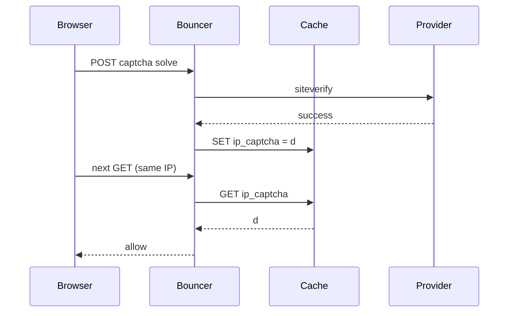

Developer review: in progress — 2026-09-17T07:52:21Z

## What this changes
**Operators.** None yet — explore locked deploy keys `captchaGateSecret` / `captchaGateSecretFile` and `captchaGateBindIP` (default bind IP); implement not started.

**Admin users.** None.

**Developers.** None yet — explore chose stateless `crowdsec_captcha_gate` cookie grace and dropping `{ip}_captcha` from `pkg/captcha`; product diff still pending propose/implement.

**End users.** None yet — after implement, captcha grace rides in the browser cookie instead of shared cache keys per IP.

## Motivation
On `master`, a solved captcha writes `{remoteIP}_captcha` into the connection cache and later requests pass only while that key holds `d`. Grace therefore depends on cache reachability, shared-IP semantics, and cannot be carried as a portable browser credential. PR #45 proposed cache-backed session tokens; this ticket supersedes that with stateless signed cookies and closes #45 without merging.

If we do not merge a cookie-based gate, operators keep cache-tied grace (and stale Redis keys still count as solved), and the superseded PR #45 session design remains a distraction.

## Merge readiness
Explore complete; propose is next. 6 workflow items remain.

Priority: P2 — real shared-IP and cache-dependency pain for captcha grace, with workarounds (per-connection cache, accepting IP-wide grace).

Reviewed head: 48ee782
Owner decision: Required. See Decision needed.

## Review scores
| Measure | Result | What it means |
| --- | --- | --- |
| Overall readiness | 2/6 | Explore done; no OpenSpec or product diff yet |
| CI proof | 6/6 | Actions run 35191740022 succeeded |
| Local tests proof | N/A | Before implement |
| Review resolution | N/A | No PR comments inventoried |

## Verification
| Check | Result | Evidence |
| --- | --- | --- |
| Branch | 2026-09-17-captcha-stateless-gate pushed | git push |
| OpenSpec | none | handoff.yaml change |
| Pull request | https://github.com/david-garcia-garcia/crowdsec-bouncer-traefik-plugin/pull/58 | GitHub |
| CI | build 35191740022 succeeded https://github.com/david-garcia-garcia/crowdsec-bouncer-traefik-plugin/actions/runs/35191740022 | pr-host CI |
| Local tests | none | handoff.yaml localTests |
| PR comments | no comments | PR #58 comment list empty |

## Specs
None.

## Follow-up issues
None.

## How this fits together
Local ticket → branch `2026-09-17-captcha-stateless-gate` → stub PR #58 → explore fixed cookie/HMAC and cache removal → propose OpenSpec next → close PR #45 during implement/pullrequest.

## Decision needed
| Question | Decision | By |
| --- | --- | --- |
| Cookie name, attributes, and whether v1 adds public Traefik keys for them? | assumed — name `crowdsec_captcha_gate`; HttpOnly; Path=/; SameSite=Lax; MaxAge=grace seconds; Secure iff `r.TLS != nil`; no Domain; no public keys for name/flags. | explore |
| Public knob for bind-IP vs cookie-only, and dedicated HMAC secret field? | assumed — `captchaGateBindIP` bool default true; `captchaGateSecret` + `captchaGateSecretFile` via existing `GetVariable`. Empty secret when captcha is enabled is rejected at ValidateParams. Do not derive from `CaptchaSecretKey` or LAPI key. | explore |
| Payload encoding and expiry? | assumed — compact `v1.<unix_issued>.<0|1>.<ip>` + `.` + base64url HMAC-SHA256 of that prefix; expiry is `issued + CaptchaGracePeriodSeconds`; 30s clock skew allowed on the low side. Cookie-only still writes `0` and empty ip. Compare HMAC with `hmac.Equal`. | explore |
| IPv6 normalization when comparing bound IP? | assumed — compare `req.remoteIP` to the payload ip as opaque strings. `GetRemoteIP` already chose the hop string; captcha does not call `net.ParseIP.String()`. | explore |

## Before merge
- [ ] [P2] Propose OpenSpec change for stateless captcha gate
- [ ] [P2] Implement signed cookie grace; remove cache keys from `pkg/captcha`
- [ ] [P2] Close PR #45 without merging
- [x] Explore cookie encoding, dedicated HMAC secret config, and OpenSpec update for cache grace removal
- [x] Prepare: requirement, worktree, stub PR

## Findings
None.

## Axis review
None.

## Agent review details

### Review metrics
| Metric | Value | Why it matters |
| --- | --- | --- |
| Specs in this PR | none | No product diff yet |
| Open reviewer comments walked | 0 FIX / 0 ANSWER / 0 open | No comments on stub PR |
| Reviewed head | 48ee782242240277001c662caa0709ad7448285e | Matches pushed branch |

### Stored data model
None.

### Technical review
Best possible solution: not evaluated — no apply yet.

Do we have a high-confidence way to reproduce? Yes — existing captcha/cache paths in `pkg/captcha/captcha.go` and bouncer remediation tests can be extended once cookies land.
