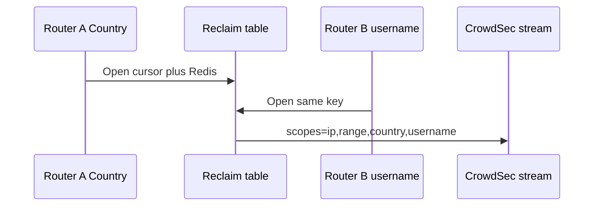

Developer review: needs changes — 2026-09-17T19:09:26Z

IssueKey: 2026-09-17-cursor-only-reclaim-key
JobName: 2026-09-17-cursor-only-reclaim-key

## What this changes
**Operators.** Redis keys stay on `SessionHex`; no cache migration. Two stream routers that share one LAPI URL+key and Redis now share one poller even when intervals or header maps differ (first-wins intervals).

**Admin users.** None.

**Developers.** Stream/live Open keys are cursor plus Redis (`lapi:stream:` / `lapi:` + SessionHex + store-params hash). Live routers union `scopes=` on the Client. `Peek` / `PeekLivePrefix` / `View` are gone. `pkg/reclaim` is a utilities v1.0.3 shim (`OpenTyped` not taken). Debt file deleted.

**End users.** A joiner router’s header scopes now enter the shared stream poll instead of being first-wins ignored.

## Motivation
The last debt of this series was the stream Open key still hashing intervals, CAPI scenarios, `updateMaxFailure`, and `decisionScopeHeaders`. On `master`, two live stream routers that share one CrowdSec cursor row but disagree on those knobs warn-and-wire onto the first slot, so `scopes=` and the store filter stay first-wins. Peek existed only for that sibling path, which is why `pkg/reclaim` was still a local table fork.

Not merging leaves a Country joiner missing streamed Country bans, keeps Peek, and leaves the last series debt file open.

## Merge readiness
Apply landed and Main Process succeeded; e2e docker+pester failed. 1 item remains.

Priority: P2 — real operator pain (joiner header scopes never enter the poll) with a workaround (identical remaining settings on every router)
Reviewed head: f52c5f8
Owner decision: Required. See Decision needed.

## Review scores
| Measure | Result | What it means |
| --- | --- | --- |
| Overall readiness | 2/6 | CI e2e docker+pester failed |
| CI proof | 2/6 | Main Process succeeded; e2e docker+pester failed https://github.com/david-garcia-garcia/crowdsec-bouncer-traefik-plugin/actions/runs/35262784061/job/105342496030 |
| Local tests proof | N/A | `prHost` remote; local `go test ./...` passed |
| Review resolution | 6/6 | comments.md none |

## Verification
| Check | Result | Evidence |
| --- | --- | --- |
| Branch | 2026-09-17-cursor-only-reclaim-key pushed | git |
| OpenSpec | cursor-only-reclaim-key | openspec/changes/cursor-only-reclaim-key/ |
| Pull request | https://github.com/david-garcia-garcia/crowdsec-bouncer-traefik-plugin/pull/67 | pr-host |
| CI | build 35262784061 failure https://github.com/david-garcia-garcia/crowdsec-bouncer-traefik-plugin/actions/runs/35262784061/job/105342496030 | pr-host CI; Main Process success https://github.com/david-garcia-garcia/crowdsec-bouncer-traefik-plugin/actions/runs/35262784095/job/105342371209 |
| Local tests | passed | handoff.yaml localTests |
| PR comments | no comments | comments: none |

## Specs
- [core_plugin_lapi_scope-union](https://github.com/david-garcia-garcia/crowdsec-bouncer-traefik-plugin/blob/2026-09-17-cursor-only-reclaim-key/openspec/changes/cursor-only-reclaim-key/proposal.md) — added
- [core_plugin_lapi_reclaim-key](https://github.com/david-garcia-garcia/crowdsec-bouncer-traefik-plugin/blob/2026-09-17-cursor-only-reclaim-key/openspec/changes/cursor-only-reclaim-key/proposal.md) — modified
- [core_cache_client_decision-store](https://github.com/david-garcia-garcia/crowdsec-bouncer-traefik-plugin/blob/2026-09-17-cursor-only-reclaim-key/openspec/changes/cursor-only-reclaim-key/proposal.md) — modified
- [core_plugin_decisions_scopes](https://github.com/david-garcia-garcia/crowdsec-bouncer-traefik-plugin/blob/2026-09-17-cursor-only-reclaim-key/openspec/changes/cursor-only-reclaim-key/proposal.md) — modified
- [std_go_reclaim_context-lease](https://github.com/david-garcia-garcia/crowdsec-bouncer-traefik-plugin/blob/2026-09-17-cursor-only-reclaim-key/openspec/changes/cursor-only-reclaim-key/proposal.md) — modified

## Follow-up issues
None.

## How this fits together
Ticket 2026-09-17-cursor-only-reclaim-key is branch `2026-09-17-cursor-only-reclaim-key` on PR 67. Apply is pushed at f52c5f8; Main Process succeeded; e2e docker+pester failed.

## Decision needed
| Question | Decision | By |
| --- | --- | --- |
| How to hold a live-router `scopes=` union without mutating write-once `decisionScopeHeaders`? | assumed — new Client-owned registry keyed by constructor ctx; register after bind; unregister on ctx Done; snapshot under Client mutex | propose |
| Does live/none `Key` drop the same remaining fields as stream? | assumed — yes. Live Open key is `lapi:` + SessionHex + Redis `storeParams` hash | propose |
| Exact Client key string versus `StoreKey`? | assumed — keep `lapi:stream:<SessionHex>:<storeParamsHash>` and `lapi:<SessionHex>:<storeParamsHash>` | propose |
| When the live-router union grows after the CrowdSec cursor has advanced, do we send `startup=true`? | assumed — no. Document the miss window | propose |
| When the union shrinks, do we sweep stale header-scope cache keys? | assumed — no. Bound the ask | propose |

## Before merge
- [ ] [P2] e2e (docker + pester) failed: “Should record appsec origin dropped after a CRS injection” https://github.com/david-garcia-garcia/crowdsec-bouncer-traefik-plugin/actions/runs/35262784061/job/105342496030
- [x] Apply: cursor+Redis key, union `scopes=`, Peek deleted, utilities reclaim shim, debt file closed
- [x] Local `go test ./...` passed
- [x] Main Process succeeded https://github.com/david-garcia-garcia/crowdsec-bouncer-traefik-plugin/actions/runs/35262784095/job/105342371209

## Findings
- [[P3] nestif flatten after Sync](pkg/configuration/configuration.go) — FIX — Master merge brought a complexity-6 nestif Main Process rejected; extracted `validateEnabledCaptchaSettings`. Path: `pkg/configuration/configuration.go`. Reply none.
- [[P2] e2e pester AppSec CRS](https://github.com/david-garcia-garcia/crowdsec-bouncer-traefik-plugin/actions/runs/35262784061/job/105342496030) — FIX — Unrelated AppSec origin-dropped case failed; this apply did not change AppSec key or captcha. Path: (general). Reply none.

## Axis review
None.

## Agent review details

### Review metrics
| Metric | Value | Why it matters |
| --- | --- | --- |
| Specs in this PR | 1 added / 4 modified | Same list as ## Specs |
| Open reviewer comments walked | 0 FIX / 0 ANSWER / 0 open | comments.md none |
| Reviewed head | f52c5f8303afaedb56a3a52ec32b32abc369aae5 | Card matches measured branch |

### Stored data model
None.

### Technical review
Best possible solution: DestBranch hashed remaining settings and Peeked siblings; this change keys by the CrowdSec row plus Redis and unions live scopes on the shared Client.

Do we have a high-confidence way to reproduce? Yes, `go test ./pkg/lapi/` covers interval share, Redis isolate, header-map share, sleeper Wake, and Country+username union.

Is this the best way to solve the issue? Yes versus DestBranch: Open of the cursor+Redis key Wakes the sleeper, so Peek is gone instead of kept for warn-and-wire.

### Evidence
What I checked:
- Local `go test ./...` passed (handoff.yaml `localTests: passed`)
- Main Process success on f52c5f8 (build 35262784095)
- e2e docker+pester failure on AppSec CRS (build 35262784061)
- Grep: no `Peek` / `PeekLivePrefix` / `View` in live Go; utilities `reclaim` imported only from the shim
- `OpenTyped` not taken (`reclaim/opentyped.go` still takes hooks-as-funcs)
- Debt file deleted; issues.md row Taken

### Rank-up moves
- Re-run e2e docker+pester; the failed case is AppSec origin metrics, not the reclaim key.
