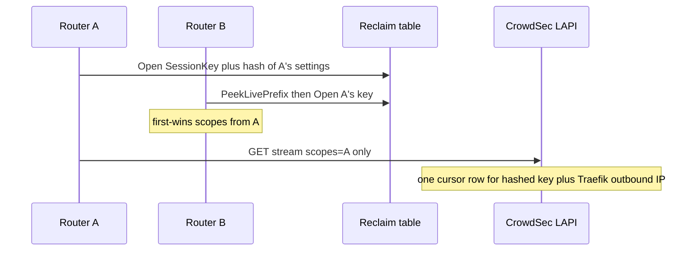

Developer review: in progress — 2026-09-17T18:00:53Z

## What this changes
**Operators.** None.

**Admin users.** None.

**Developers.** Prepare only: requirement grounded and stub PR opened. No apply versus `master`.

**End users.** None.

## Motivation
On `master`, two stream routers that share one CrowdSec cursor row still Open `SessionKey` as session prefix plus a first-wins settings hash. A live joiner that disagrees is warn-and-wired onto the owner slot; `scopes=` and the store filter then use whichever router constructed the Client first, so the joiner’s header scopes never enter the poll. `Peek` / `PeekLivePrefix` exist only for that sibling path, and that is why `pkg/reclaim` is still a local table fork after `pkg/cache` already imports utilities `simpleredis`.

If this does not land, the last debt of the series stays open: a settings mismatch still splits or first-wins, and a second router’s header remediations stay missing on the shared stream.

## Merge readiness
Prepare grounded (`qualified-with-gaps`). Explore is next. 3 items remain.

Priority: P2 — a live joiner’s header scopes are dropped on the shared poller; a sleeping settings change still opens a second key
Reviewed head: 8078825
Owner decision: None.

## Review scores
| Measure | Result | What it means |
| --- | --- | --- |
| Overall readiness | 3/6 | CI still queued; no apply yet |
| CI proof | 3/6 | Main Process and both e2e jobs queued on run 35256193727 / 35256194033 |
| Local tests proof | N/A | `localTests: none` (before implement; remote PR) |
| Review resolution | 6/6 | OPEN PR #67; no review comments |

## Verification
| Check | Result | Evidence |
| --- | --- | --- |
| Branch | 2026-09-17-cursor-only-reclaim-key pushed | `git` / origin |
| OpenSpec | none | `openspec/` |
| Pull request | https://github.com/david-garcia-garcia/crowdsec-bouncer-traefik-plugin/pull/67 | pr-host List/Create |
| CI | build 35256194033 queued https://github.com/david-garcia-garcia/crowdsec-bouncer-traefik-plugin/actions/runs/35256194033 | pr-host CI |
| Local tests | none | handoff.yaml localTests |
| PR comments | no comments | no comments.md |

## Specs
None.

## Follow-up issues
None.

## How this fits together
Local ticket on `knowledge/debt/2026-09-17-cursor-only-reclaim-key.md` → branch `2026-09-17-cursor-only-reclaim-key` from `master` → stub PR #67. Qualify is `qualified-with-gaps`. Explore next.

## Decision needed
None.

## Before merge
- [ ] Explore Redis-on-key versus CrowdSec-row, and a scope union that does not mutate write-once Client scalars
- [ ] Apply the four-part change (cursor key, union `scopes=`, delete Peek, import utilities reclaim)
- [ ] Close `knowledge/debt/2026-09-17-cursor-only-reclaim-key.md` when implement lands

## Findings
- [P2] First-wins `scopes=` already drops a live joiner’s header remediations — (general). Path: `pkg/lapi/client_decisions.go`.
- [P3] Ticket `CachePrefix` is not found; `#66` already prefixes Redis with `SessionHex` — (general). Path: `pkg/lapi/decisionstore.go`.
- [P3] `OpenTyped` does not remove hooks-as-funcs — (general). Path: utilities `reclaim/opentyped.go`.

## Axis review
None.

## Agent review details

### Review metrics
| Metric | Value | Why it matters |
| --- | --- | --- |
| Specs in this PR | none | Same list as ## Specs; do not paste diff --stat |
| Open reviewer comments walked | 0 FIX / 0 ANSWER / 0 open | Unanswered review is merge risk |
| Reviewed head | 80788251210e2cbe1f654c39f7624a1cc14b67af | Card must match the branch you measured |

### Stored data model
None.

### Technical review
Best possible solution: not an apply yet; requirement is the four-part cursor key plus union scopes plus upstream reclaim shim.

Do we have a high-confidence way to reproduce? Yes, `OpenStream` PeekLivePrefix plus `streamQuery` / `storeStreamDecision` on DestBranch.

Is this the best way to solve the issue? Yes — one cursor-shaped incarnation is what CrowdSec already does; first-wins scopes is the remaining miss.

### Evidence
What I checked:
- Dest `origin/master` is `45b4a4a`; ticket subsystems exist there (`git ls-tree`)
- Local utilities clone is `v1.0.3` `950b08d`; `table.go` matches local except CRLF (`python` byte compare)
- `CachePrefix` not found (`rg`); Peek also used in `zzz_plugin_test.go`
- Stub PR #67; CI queued (MCP `get_check_runs`)

### Rank-up moves
None.
