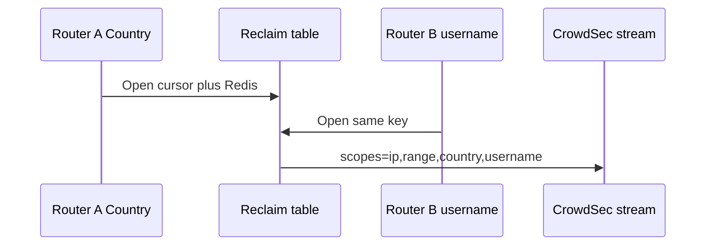

Developer review: in progress — 2026-09-17T19:54:24Z

IssueKey: 2026-09-17-cursor-only-reclaim-key
JobName: 2026-09-17-cursor-only-reclaim-key

## What this changes
**Operators.** Redis keys stay on `SessionHex`; no cache migration. Two stream routers that share one LAPI URL+key and Redis now share one poller even when intervals or header maps differ. None/live routers that disagree on `metricsUpdateIntervalSeconds` still get sibling Clients (write-once ticker), same as DestBranch `IdentityHex`.

**Admin users.** None.

**Developers.** Stream Open key is cursor plus Redis (`lapi:stream:` + SessionHex + store-params hash). Live/none `Key` is `lapi:` + SessionHex + identity hash that keeps `MetricsUpdateIntervalSeconds` and still drops CAPI scenarios / `updateMaxFailure` / `UpdateIntervalSeconds`. Live routers union `scopes=` on the Client. `Peek` / `PeekLivePrefix` / `View` are gone. `pkg/reclaim` is a utilities v1.0.3 shim (`OpenTyped` not taken). Debt file deleted. Catalog specs synced; change folder is `openspec/changes/archive/2026-09-17-cursor-only-reclaim-key/`.

**End users.** A joiner router’s header scopes now enter the shared stream poll instead of being first-wins ignored.

## Motivation
The last debt of this series was the stream Open key still hashing intervals, CAPI scenarios, `updateMaxFailure`, and `decisionScopeHeaders`. On `master`, two live stream routers that share one CrowdSec cursor row but disagree on those knobs warn-and-wire onto the first slot, so `scopes=` and the store filter stay first-wins. Peek existed only for that sibling path, which is why `pkg/reclaim` was still a local table fork.

Not merging leaves a Country joiner missing streamed Country bans, keeps Peek, and leaves the last series debt file open.

Live/none on DestBranch already hashed `MetricsUpdateIntervalSeconds` into `IdentityHex`. Sharing one none Client cannot both honor write-once `metricsInterval` and publish `/appsec` `metrics=1` within 20s, so this PR keeps that field on the live/none identity payload and does not put intervals back on stream or `StoreKey`.

## Merge readiness
Archive synced; CI on this head is still running. 0 items remain.

Priority: P2 — real operator pain (joiner header scopes never enter the poll) with a workaround (identical remaining settings on every router)
Reviewed head: 565d946
Owner decision: Required. See Decision needed.

## Review scores
| Measure | Result | What it means |
| --- | --- | --- |
| Overall readiness | 3/6 | CI on 565d946 is in progress |
| CI proof | 3/6 | Main Process, e2e binary+mock, and e2e docker+pester in progress |
| Local tests proof | N/A | `prHost` remote; localTests passed |
| Review resolution | 6/6 | comments.md none |

## Verification
| Check | Result | Evidence |
| --- | --- | --- |
| Branch | 2026-09-17-cursor-only-reclaim-key pushed | git |
| OpenSpec | cursor-only-reclaim-key archived | openspec/changes/archive/2026-09-17-cursor-only-reclaim-key/ |
| Pull request | https://github.com/david-garcia-garcia/crowdsec-bouncer-traefik-plugin/pull/67 | pr-host |
| CI | build 35267579819 in progress https://github.com/david-garcia-garcia/crowdsec-bouncer-traefik-plugin/actions/runs/35267579819/job/105358483923 | pr-host CI; e2e docker+pester in progress https://github.com/david-garcia-garcia/crowdsec-bouncer-traefik-plugin/actions/runs/35267579736/job/105358483636 ; e2e binary+mock in progress https://github.com/david-garcia-garcia/crowdsec-bouncer-traefik-plugin/actions/runs/35267579736/job/105358483897 |
| Local tests | passed | handoff.yaml localTests |
| PR comments | no comments | comments: none |

## Specs
- [core_plugin_lapi_scope-union](https://github.com/david-garcia-garcia/crowdsec-bouncer-traefik-plugin/blob/2026-09-17-cursor-only-reclaim-key/openspec/changes/archive/2026-09-17-cursor-only-reclaim-key/proposal.md) — added
- [core_plugin_lapi_reclaim-key](https://github.com/david-garcia-garcia/crowdsec-bouncer-traefik-plugin/blob/2026-09-17-cursor-only-reclaim-key/openspec/changes/archive/2026-09-17-cursor-only-reclaim-key/proposal.md) — modified
- [core_cache_client_decision-store](https://github.com/david-garcia-garcia/crowdsec-bouncer-traefik-plugin/blob/2026-09-17-cursor-only-reclaim-key/openspec/changes/archive/2026-09-17-cursor-only-reclaim-key/proposal.md) — modified
- [core_plugin_decisions_scopes](https://github.com/david-garcia-garcia/crowdsec-bouncer-traefik-plugin/blob/2026-09-17-cursor-only-reclaim-key/openspec/changes/archive/2026-09-17-cursor-only-reclaim-key/proposal.md) — modified
- [std_go_reclaim_context-lease](https://github.com/david-garcia-garcia/crowdsec-bouncer-traefik-plugin/blob/2026-09-17-cursor-only-reclaim-key/openspec/changes/archive/2026-09-17-cursor-only-reclaim-key/proposal.md) — modified

## Follow-up issues
None.

## How this fits together
Ticket 2026-09-17-cursor-only-reclaim-key is branch `2026-09-17-cursor-only-reclaim-key` on PR 67. Archive is pushed at 565d946; CI on that head is in progress.

## Decision needed
| Question | Decision | By |
| --- | --- | --- |
| How to hold a live-router `scopes=` union without mutating write-once `decisionScopeHeaders`? | assumed — new Client-owned registry keyed by constructor ctx; register after bind; unregister on ctx Done; snapshot under Client mutex | propose |
| Exact Client key string versus `StoreKey`? | assumed — keep `lapi:stream:<SessionHex>:<storeParamsHash>` and `lapi:<SessionHex>:<hash>` | propose |
| When the live-router union grows after the CrowdSec cursor has advanced, do we send `startup=true`? | assumed — no. Document the miss window | propose |
| When the union shrinks, do we sweep stale header-scope cache keys? | assumed — no. Bound the ask | propose |

## Before merge
None.

## Findings
- [[P3] nestif flatten after Sync](pkg/configuration/configuration.go) — FIX — Master merge brought a complexity-6 nestif Main Process rejected; extracted `validateEnabledCaptchaSettings`. Path: `pkg/configuration/configuration.go`. Reply none.
- [[P2] e2e pester AppSec CRS](https://github.com/david-garcia-garcia/crowdsec-bouncer-traefik-plugin/actions/runs/35264215571/job/105347192915) — FIX — First apply dropped `MetricsUpdateIntervalSeconds` from live/none `Key`; none `/appsec` `metrics=1` shared the default 600s ticker. Identity payload keeps the interval; stream and `StoreKey` still omit it. Path: `pkg/lapi/identity.go`. Reply none.

## Axis review
[Standards](https://github.com/david-garcia-garcia/crowdsec-bouncer-traefik-plugin/blob/2026-09-17-cursor-only-reclaim-key/devstate/2026/09/2026-09-17-cursor-only-reclaim-key/codereview_standards.md) — 4 total, 0 pending, 4 completed
[Spec](https://github.com/david-garcia-garcia/crowdsec-bouncer-traefik-plugin/blob/2026-09-17-cursor-only-reclaim-key/devstate/2026/09/2026-09-17-cursor-only-reclaim-key/codereview_spec.md) — 0 total, 0 pending, 0 completed
[Security](https://github.com/david-garcia-garcia/crowdsec-bouncer-traefik-plugin/blob/2026-09-17-cursor-only-reclaim-key/devstate/2026/09/2026-09-17-cursor-only-reclaim-key/codereview_security.md) — 0 total, 0 pending, 0 completed
[Performance](https://github.com/david-garcia-garcia/crowdsec-bouncer-traefik-plugin/blob/2026-09-17-cursor-only-reclaim-key/devstate/2026/09/2026-09-17-cursor-only-reclaim-key/codereview_performance.md) — 0 total, 0 pending, 0 completed
[Dead](https://github.com/david-garcia-garcia/crowdsec-bouncer-traefik-plugin/blob/2026-09-17-cursor-only-reclaim-key/devstate/2026/09/2026-09-17-cursor-only-reclaim-key/codereview_dead.md) — 1 total, 0 pending, 0 completed, 1 skipped
[Test coverage](https://github.com/david-garcia-garcia/crowdsec-bouncer-traefik-plugin/blob/2026-09-17-cursor-only-reclaim-key/devstate/2026/09/2026-09-17-cursor-only-reclaim-key/codereview_coverage.md) — 2 total, 0 pending, 2 completed

## Agent review details

### Review metrics
| Metric | Value | Why it matters |
| --- | --- | --- |
| Specs in this PR | 1 added / 4 modified | Same list as ## Specs |
| Open reviewer comments walked | 0 FIX / 0 ANSWER / 0 open | comments.md none |
| Reviewed head | 565d946ad89052612aba4c02819d4ed498cafae1 | Card matches measured branch |

### Stored data model
None.

### Technical review
Best possible solution: DestBranch hashed remaining settings and Peeked siblings; this change keys stream by the CrowdSec row plus Redis, unions live scopes on the shared Client, and keeps `MetricsUpdateIntervalSeconds` on the live/none identity so write-once tickers stay per Client.

Do we have a high-confidence way to reproduce? Yes, `go test ./pkg/lapi/` covers stream interval share, none Key split with same `StoreKey`, Redis isolate, header-map share, sleeper Wake, and Country+username union.

Is this the best way to solve the issue? Yes versus DestBranch: Open of the cursor+Redis key Wakes the sleeper, so Peek is gone instead of kept for warn-and-wire. Sibling none Clients beat mutating write-once `metricsInterval`.

### Evidence
What I checked:
- Local `go test ./...` passed (handoff.yaml `localTests: passed`)
- Archive validators exit 0 (`validate-spec-map --write`, verify, `validate-artifact-names`)
- Live change folder gone; archive at `openspec/changes/archive/2026-09-17-cursor-only-reclaim-key/`
- CI on 565d946 in progress (builds 35267579819 / 35267579736)
- Live/none `Key` hashes `identity` including `MetricsUpdateIntervalSeconds`; `SessionKey` and `StoreKey` omit it (`pkg/lapi/identity.go`, `pkg/lapi/session.go`, `pkg/lapi/decisionstore.go`)
- Grep: no `Peek` / `PeekLivePrefix` / `View` in live Go; utilities `reclaim` imported only from the shim
- `OpenTyped` not taken (`reclaim/opentyped.go` still takes hooks-as-funcs)
- Debt file deleted; issues.md row Taken

### Rank-up moves
None.
