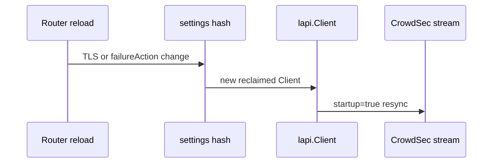

Developer review: in progress — 2026-09-17T14:00:44+00:00

IssueKey: 2026-09-17-lapi-transport-router-policy
JobName: 2026-09-17-lapi-transport-router-policy

## What this changes
**Operators.** None.

**Admin users.** None.

**Developers.** Prepare only: bus (`devstate/`), requirement, and deferred debt notes; no product code yet.

**End users.** None.

## Motivation
Reloading Traefik middleware with the same CrowdSec LAPI identity should keep the stream cursor; today per-router failure policy, live TTL, TLS, and HTTP timeout sit in `streamSettings`, so any tweak hashes to a new reclaimed `lapi.Client` and forces `startup=true` resync.

On `master`, `pkg/lapi/session.go` folds those knobs into the settings hash while the server-side cursor depends only on LAPI key and egress IP. Redis-backed cache already survives settings changes via `SessionHex`, so the resync buys nothing when operators rotate certs or tune failure action per router.

If we do not merge a fix, harmless reloads continue to drop stream continuity and silently ignore the second router’s failure-action and Redis fail-closed settings.

## Merge readiness
Prepare complete; product work not started. 4 follow-up debt notes indexed.

Priority: P2 — real operator pain on reload (stream resync) with workaround (avoid config churn).
Reviewed head: 3ba6e2d
Owner decision: None.

## Review scores
| Measure | Result | What it means |
| --- | --- | --- |
| Overall readiness | 1/6 | Stub PR only; no implementation or green CI |
| CI proof | 1/6 | Pushed; CI not seen yet |
| Local tests proof | N/A | Before implement (`localTests: none`) |
| Review resolution | N/A | No PR review comments inventoried |

## Verification
| Check | Result | Evidence |
| --- | --- | --- |
| Branch | 2026-09-17-lapi-transport-router-policy pushed | git push |
| OpenSpec | none | handoff.yaml |
| Pull request | https://github.com/david-garcia-garcia/crowdsec-bouncer-traefik-plugin/pull/61 | GitHub MCP |
| CI | not seen | not measured |
| Local tests | none | handoff.yaml |
| PR comments | no comments | comments: none |

## Specs
None.

## Follow-up issues
- [ ] [Shared LAPI decision store reclaim entry](https://github.com/david-garcia-garcia/crowdsec-bouncer-traefik-plugin/blob/2026-09-17-lapi-transport-router-policy/knowledge/debt/2026-09-17-lapi-shared-decision-store.md) — local cache prefix ignored; stream lease not shared in memory.
- [ ] [Narrow LAPI session key to cursor identity](https://github.com/david-garcia-garcia/crowdsec-bouncer-traefik-plugin/blob/2026-09-17-lapi-transport-router-policy/knowledge/debt/2026-09-17-lapi-narrow-session-key.md) — defer peek removal and live-router scope union on session key.
- [ ] [AppSec and captcha surfaces unchanged](https://github.com/david-garcia-garcia/crowdsec-bouncer-traefik-plugin/blob/2026-09-17-lapi-transport-router-policy/knowledge/debt/2026-09-17-appsec-captcha-unchanged.md) — ticket binds AppSec/captcha out of this LAPI refactor.
- [ ] [Split MetricsReporter from LAPI Client](https://github.com/david-garcia-garcia/crowdsec-bouncer-traefik-plugin/blob/2026-09-17-lapi-transport-router-policy/knowledge/debt/2026-09-17-lapi-metrics-reporter-split.md) — metrics reporter remains fused with Client until a follow-up.

## How this fits together
Local ticket → branch `2026-09-17-lapi-transport-router-policy` → stub PR #61 → CI pending.

## Decision needed
None.

## Before merge
- [ ] [P2] Explore reclaim open/joiner hooks and spec tension with `core_plugin_middleware_instance-reclaim`
- [ ] [P2] Implement per-router policy off LAPI hash and hot-swappable transport
- [x] Prepare: requirement, debt notes, stub PR

## Findings
None.

## Axis review
| Axis | Link | Score |
| --- | --- | --- |
| Standards | None. | N/A |
| Spec | None. | N/A |
| Security | None. | N/A |
| Performance | None. | N/A |
| Dead | None. | N/A |
| Coverage | None. | N/A |

### Stored data model
None.
