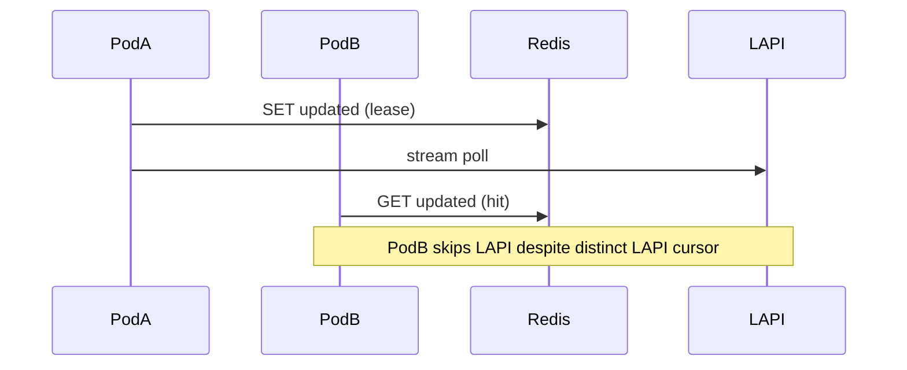

Developer review: in progress — 2026-09-17T12:12:30Z

## What this changes
**Operators.** Optional Traefik plugin key `redisCacheInstanceId` (empty → hostname) will scope Redis cache keys per pod when `redisCacheEnabled`; propose lands OpenSpec only — wiring not deployed until implement.

**Admin users.** None.

**Developers.** OpenSpec change `redis-instance-prefix` modifies `core_cache_client_isolated-store`: `CachePrefix` becomes `{LAPI hex base}:{instance id}`; reclaim `SessionKey` unchanged; LAPI stream cursor stays CrowdSec-owned (key + IP).

**End users.** None.

## Motivation
On `master`, two Traefik pods with the same LAPI key and `redisCacheEnabled` share one Redis namespace keyed only by LAPI session. CrowdSec LAPI assigns a separate stream cursor per bouncer row (hashed API key plus outbound client IP), so each pod should poll independently. The shared `updated` lease instead makes one pod skip LAPI while others reuse the same dump and remediation keys — a multi-pod correctness bug, not a reason to remove Redis (PR #59 was dropped for that).

If we do not merge instance-scoped prefixes, operators who centralize Redis for durability still get wrong stream sharing across replicas.

## Merge readiness
Propose complete; implement is next. 5 workflow items remain.

Priority: P2 — multi-pod stream/cache corruption with a workaround (disable Redis or isolate Redis per pod).

Reviewed head: 51355a1
Owner decision: None.

## Review scores
| Measure | Result | What it means |
| --- | --- | --- |
| Overall readiness | 1/6 | OpenSpec + bus only; no product code yet |
| CI proof | 1/6 | Push pending this phase; CI not seen |
| Local tests proof | N/A | Before implement |
| Review resolution | N/A | No PR comments inventoried |

## Verification
| Check | Result | Evidence |
| --- | --- | --- |
| Branch | 2026-09-17-redis-instance-prefix (push pending) | git |
| OpenSpec | redis-instance-prefix (4/4 artifacts) | openspec status |
| Pull request | https://github.com/david-garcia-garcia/crowdsec-bouncer-traefik-plugin/pull/60 | handoff.yaml |
| CI | not seen | pr-host CI |
| Local tests | none | handoff.yaml localTests |
| PR comments | no comments | PR #60 |

## Specs
- [proposal.md](https://github.com/david-garcia-garcia/crowdsec-bouncer-traefik-plugin/blob/2026-09-17-redis-instance-prefix/openspec/changes/redis-instance-prefix/proposal.md)
- [design.md](https://github.com/david-garcia-garcia/crowdsec-bouncer-traefik-plugin/blob/2026-09-17-redis-instance-prefix/openspec/changes/redis-instance-prefix/design.md)
- [tasks.md](https://github.com/david-garcia-garcia/crowdsec-bouncer-traefik-plugin/blob/2026-09-17-redis-instance-prefix/openspec/changes/redis-instance-prefix/tasks.md)
- [core_cache_client_isolated-store delta](https://github.com/david-garcia-garcia/crowdsec-bouncer-traefik-plugin/blob/2026-09-17-redis-instance-prefix/openspec/changes/redis-instance-prefix/specs/core_cache_client_isolated-store/spec.md)

## Follow-up issues
None.

## How this fits together
Local ticket → branch `2026-09-17-redis-instance-prefix` → stub PR #60 → explore → propose `redis-instance-prefix` → implement `CachePrefix` + `redisCacheInstanceId` → devdocs `core_cache_redis.md`.

## Decision needed
- `redisCacheInstanceId`: optional; trim; max 128; charset `[A-Za-z0-9._-]+` when set; empty → hostname (`explore` assumed; captured in OpenSpec).
- Hostname failure → literal `unknown-instance` + warn; no random id (`explore` assumed).
- Do not add instance id to `SessionKey` / reclaim; Redis prefix only (`explore` assumed).
- Instance identity owner: config knob + hostname at `CachePrefix` compute (`explore` assumed).
- Apply instance suffix to live/none Redis prefixes too (`explore` assumed).
- Prefix encoding: `{hexBase}:{sanitizedInstance}` (`explore` assumed).

## Before merge
- [x] [P2] Explore instance identity (hostname vs config knob) and warn-and-wire interaction
- [x] [P2] Propose OpenSpec + devdocs (Redis as per-instance store, not stream bus)
- [ ] [P2] Implement `CachePrefix` instance dimension; keep `redisCacheEnabled`
- [x] Prepare: requirement, worktree, stub PR

## Findings
None.

## Axis review
None.

## Agent review details

### Review metrics
| Metric | Value | Why it matters |
| --- | --- | --- |
| Specs in this PR | 1 modified capability delta | `core_cache_client_isolated-store` |
| Open reviewer comments walked | 0 FIX / 0 ANSWER / 0 open | No comments on stub PR |
| Reviewed head | 51355a1 | Local HEAD at propose close |

### Stored data model
None.

### Technical review
Best possible solution: propose — fold instance prefix into existing cache isolated-store spec; no parallel Redis enable flag; reclaim unchanged. Product code not landed yet.

Do we have a high-confidence way to reproduce? Partial — code trace of shared `SessionHex` + `updated` lease; live multi-pod Redis not run this phase.

[sgsi-dev-ticket-status:2026-09-17-redis-instance-prefix]
