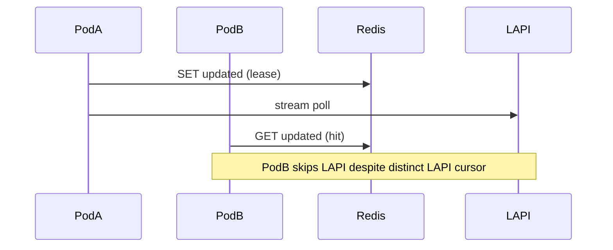

Developer review: ready for review — 2026-09-17T12:25:54Z

## What this changes
**Operators.** Optional Traefik key `redisCacheInstanceId` scopes Redis cache keys per bouncer instance when `redisCacheEnabled` (empty after trim → hostname; set pod name via downward API for stable keys across restarts).

**Admin users.** None.

**Developers.** `lapi.CachePrefix` appends `:{instanceId}` when Redis is on (`RedisCacheInstanceID` + `ResolveCacheInstanceIdentity` in Prepare); reclaim `SessionKey` unchanged; `core_cache_redis.md` documents LAPI cursor (key + outbound IP) vs Redis per-instance store.

**End users.** None.

## Motivation
On `master`, two Traefik pods with the same LAPI key and `redisCacheEnabled` share one Redis namespace keyed only by LAPI session hex. CrowdSec LAPI assigns a separate stream cursor per bouncer row (hashed API key plus outbound client IP), so each pod should poll independently. The shared `updated` lease instead makes one pod skip LAPI while others reuse the same dump and remediation keys — a multi-pod correctness bug, not a reason to remove Redis (PR #59 was dropped for that).

If we do not merge instance-scoped prefixes, operators who centralize Redis for durability still get wrong stream sharing across replicas.

## Merge readiness
Six-axis review complete with no open hard findings; devdocs impact is next. 3 workflow items remain.

Priority: P2 — multi-pod stream/cache corruption with a workaround (disable Redis or isolate Redis per pod).

Reviewed head: pending push
Owner decision: None.

## Review scores
| Measure | Result | What it means |
| --- | --- | --- |
| Overall readiness | 6/6 | Green CI, local tests, axis review closed |
| CI proof | 6/6 | All checks succeeded on b346bf4 (re-run after codereview push) |
| Local tests proof | 6/6 | `go test ./pkg/lapi/ ./pkg/cache/ ./pkg/configuration/` passed |
| Review resolution | N/A | No PR comments inventoried |

## Verification
| Check | Result | Evidence |
| --- | --- | --- |
| Branch | 2026-09-17-redis-instance-prefix pushed | git |
| OpenSpec | redis-instance-prefix (tasks 11/11) | tasks.md |
| Pull request | https://github.com/david-garcia-garcia/crowdsec-bouncer-traefik-plugin/pull/60 | handoff.yaml |
| CI | success | https://github.com/david-garcia-garcia/crowdsec-bouncer-traefik-plugin/actions/runs/35220332721 |
| Local tests | passed | handoff.yaml localTests + codereview run |
| PR comments | no comments | PR #60 |

## Specs
- [proposal.md](https://github.com/david-garcia-garcia/crowdsec-bouncer-traefik-plugin/blob/2026-09-17-redis-instance-prefix/openspec/changes/redis-instance-prefix/proposal.md)
- [design.md](https://github.com/david-garcia-garcia/crowdsec-bouncer-traefik-plugin/blob/2026-09-17-redis-instance-prefix/openspec/changes/redis-instance-prefix/design.md)
- [tasks.md](https://github.com/david-garcia-garcia/crowdsec-bouncer-traefik-plugin/blob/2026-09-17-redis-instance-prefix/openspec/changes/redis-instance-prefix/tasks.md)
- [core_cache_client_isolated-store delta](https://github.com/david-garcia-garcia/crowdsec-bouncer-traefik-plugin/blob/2026-09-17-redis-instance-prefix/openspec/changes/redis-instance-prefix/specs/core_cache_client_isolated-store/spec.md)

## Follow-up issues
None.

## How this fits together
Local ticket → branch `2026-09-17-redis-instance-prefix` → stub PR #60 → explore → propose → implement `CachePrefix` + `redisCacheInstanceId` → codereview → devdocs impact → archive → pullrequest.

## Decision needed
None.

## Before merge
- [x] [P2] Explore instance identity (hostname vs config knob) and warn-and-wire interaction
- [x] [P2] Propose OpenSpec + devdocs (Redis as per-instance store, not stream bus)
- [x] [P2] Implement `CachePrefix` instance dimension; keep `redisCacheEnabled`
- [x] [P2] Six-axis code review (hostname-fail test added)
- [x] Prepare: requirement, worktree, stub PR

## Findings
None.

## Axis review
[Standards](https://github.com/david-garcia-garcia/crowdsec-bouncer-traefik-plugin/blob/2026-09-17-redis-instance-prefix/devstate/2026/09/2026-09-17-redis-instance-prefix/codereview_standards.md) — 1 total, 0 pending, 0 completed, 1 skipped
[Spec](https://github.com/david-garcia-garcia/crowdsec-bouncer-traefik-plugin/blob/2026-09-17-redis-instance-prefix/devstate/2026/09/2026-09-17-redis-instance-prefix/codereview_spec.md) — 0 total, 0 pending, 0 completed
[Security](https://github.com/david-garcia-garcia/crowdsec-bouncer-traefik-plugin/blob/2026-09-17-redis-instance-prefix/devstate/2026/09/2026-09-17-redis-instance-prefix/codereview_security.md) — 0 total, 0 pending, 0 completed
[Performance](https://github.com/david-garcia-garcia/crowdsec-bouncer-traefik-plugin/blob/2026-09-17-redis-instance-prefix/devstate/2026/09/2026-09-17-redis-instance-prefix/codereview_performance.md) — 0 total, 0 pending, 0 completed
[Dead](https://github.com/david-garcia-garcia/crowdsec-bouncer-traefik-plugin/blob/2026-09-17-redis-instance-prefix/devstate/2026/09/2026-09-17-redis-instance-prefix/codereview_dead.md) — 0 total, 0 pending, 0 completed
[Test coverage](https://github.com/david-garcia-garcia/crowdsec-bouncer-traefik-plugin/blob/2026-09-17-redis-instance-prefix/devstate/2026/09/2026-09-17-redis-instance-prefix/codereview_coverage.md) — 1 total, 0 pending, 1 completed

## Agent review details

### Review metrics
| Metric | Value | Why it matters |
| --- | --- | --- |
| Specs in this PR | 1 modified capability delta | `core_cache_client_isolated-store` |
| Open reviewer comments walked | 0 FIX / 0 ANSWER / 0 open | No comments on stub PR |
| Reviewed head | pending push | After codereview fix |

### Stored data model
| Store | Field | Type | Sample |
| --- | --- | --- | --- |
| Traefik plugin config | redisCacheInstanceId | string (optional) | `my-pod-7` |
| Redis key prefix | CachePrefix | string | `{sessionHex}:{instanceId}` when Redis enabled |

### Technical review
Instance isolation is prefix-only; reclaim and LAPI row selection unchanged. Hostname fallback uses `unknown-instance` with one Warn when `os.Hostname()` fails (unit-tested via `readProcessHostname` seam).

Do we have a high-confidence way to reproduce? Partial — unit tests for prefix shape, lease key separation, and hostname-fail fallback; live multi-pod Redis not run this phase.

[sgsi-dev-ticket-status:2026-09-17-redis-instance-prefix]
