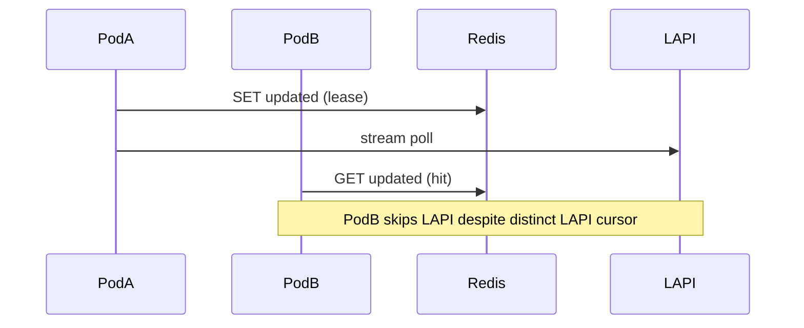

Developer review: in progress — 2026-09-17T12:07:19Z

## What this changes
**Operators.** None yet — prepare grounded per-pod Redis key prefixes so shared Redis does not serialize LAPI stream polls across pods; implement not started.

**Admin users.** None.

**Developers.** None yet — on `master`, `CachePrefix` for stream/alone is `SessionHex` (LAPI URL+key only), so `handleStreamCache`'s `updated` lease is global per session in Redis.

**End users.** None.

## Motivation
On `master`, two Traefik pods with the same LAPI key and `redisCacheEnabled` share one Redis namespace keyed only by LAPI session. CrowdSec LAPI assigns a separate stream cursor per bouncer row (hashed API key plus outbound client IP), so each pod should poll independently. The shared `updated` lease instead makes one pod skip LAPI while others reuse the same dump and remediation keys — a multi-pod correctness bug, not a reason to remove Redis (PR #59 was dropped for that).

If we do not merge instance-scoped prefixes, operators who centralize Redis for durability still get wrong stream sharing across replicas.

## Merge readiness
Prepare complete; explore is next. 7 workflow items remain.

Priority: P2 — multi-pod stream/cache corruption with a workaround (disable Redis or isolate Redis per pod).

Reviewed head: 21e3a60
Owner decision: None.

## Review scores
| Measure | Result | What it means |
| --- | --- | --- |
| Overall readiness | 1/6 | Stub PR only; no product change or CI yet |
| CI proof | 1/6 | Pushed; CI not seen |
| Local tests proof | N/A | Before implement |
| Review resolution | N/A | No PR comments inventoried |

## Verification
| Check | Result | Evidence |
| --- | --- | --- |
| Branch | 2026-09-17-redis-instance-prefix pushed | git push |
| OpenSpec | none | handoff.yaml change |
| Pull request | https://github.com/david-garcia-garcia/crowdsec-bouncer-traefik-plugin/pull/60 | GitHub Create |
| CI | not seen | pr-host CI |
| Local tests | none | handoff.yaml localTests |
| PR comments | no comments | PR #60 comment list empty |

## Specs
None.

## Follow-up issues
None.

## How this fits together
Local ticket → branch `2026-09-17-redis-instance-prefix` (worktree `wt-modsec-2026-09-17-redis-instance-prefix`, base `master`) → stub PR #60 → explore instance-id knob vs reclaim `SessionKey` tension → propose prefix + devdocs.

## Decision needed
None.

## Before merge
- [ ] [P2] Explore instance identity (hostname vs config knob) and warn-and-wire interaction
- [ ] [P2] Propose OpenSpec + devdocs (Redis as per-instance store, not stream bus)
- [ ] [P2] Implement `CachePrefix` instance dimension; keep `redisCacheEnabled`
- [x] Prepare: requirement, worktree, stub PR

## Findings
None.

## Axis review
None.

## Agent review details

### Review metrics
| Metric | Value | Why it matters |
| --- | --- | --- |
| Specs in this PR | none | No product diff yet |
| Open reviewer comments walked | 0 FIX / 0 ANSWER / 0 open | No comments on stub PR |
| Reviewed head | 21e3a60 | Matches pushed branch |

### Stored data model
None.

### Technical review
Best possible solution: not evaluated — no apply yet.

Do we have a high-confidence way to reproduce? Yes — multi-pod Redis with shared `SessionHex` and `handleStreamCache:alreadyUpdated` path documented in requirement.md.
