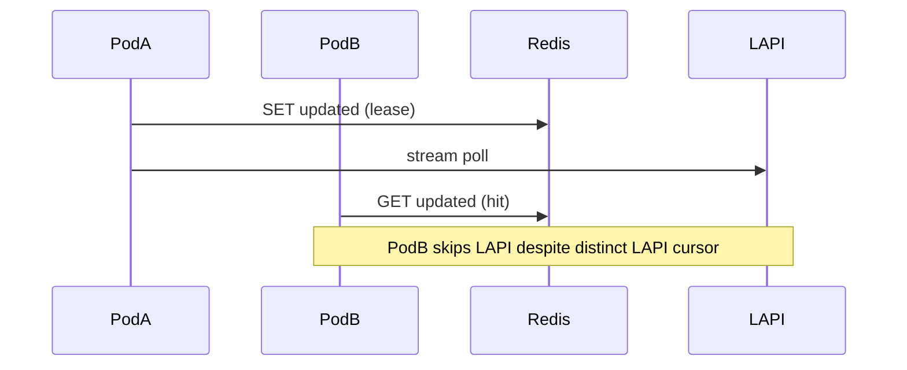

Developer review: ready for review — 2026-09-17T12:41:05Z

## What this changes
**Operators.** Optional Traefik key `redisCacheInstanceId` scopes Redis cache keys per bouncer instance when `redisCacheEnabled` (empty after trim → hostname; set pod name via downward API for stable keys across restarts).

**Admin users.** None.

**Developers.** `lapi.CachePrefix` appends `:{instanceId}` when Redis is on; OpenSpec change archived; live spec `core_cache_client_isolated-store` documents per-instance Redis vs LAPI stream cursor (key + outbound IP).

**End users.** None.

## Motivation
On `master`, two Traefik pods with the same LAPI key and `redisCacheEnabled` share one Redis namespace keyed only by LAPI session hex. CrowdSec LAPI assigns a separate stream cursor per bouncer row (hashed API key plus outbound client IP), so each pod should poll independently. The shared `updated` lease instead makes one pod skip LAPI while others reuse the same dump and remediation keys — a multi-pod correctness bug, not a reason to remove Redis (PR #59 was dropped for that).

If we do not merge instance-scoped prefixes, operators who centralize Redis for durability still get wrong stream sharing across replicas.

## Merge readiness
Workflow complete; CI green on reviewed head. 0 items remain.

Priority: P2 — multi-pod stream/cache corruption with a workaround (disable Redis or isolate Redis per pod).

Reviewed head: 3ea11e3
Owner decision: None.

## Review scores
| Measure | Result | What it means |
| --- | --- | --- |
| Overall readiness | 6/6 | Green CI on 3ea11e3; no open checklist or PR comments |
| CI proof | 6/6 | Main + both e2e checks succeeded (runs 35222120256, 35222120152) |
| Local tests proof | N/A | Remote PR; CI covers verification |
| Review resolution | 6/6 | No devstate/comments.md; no PR review threads |

## Verification
| Check | Result | Evidence |
| --- | --- | --- |
| Branch | 2026-09-17-redis-instance-prefix pushed | git |
| OpenSpec | redis-instance-prefix archived | `openspec/changes/archive/2026-09-17-redis-instance-prefix/` |
| Pull request | https://github.com/david-garcia-garcia/crowdsec-bouncer-traefik-plugin/pull/60 | handoff.yaml |
| CI | build 35222120256 success https://github.com/david-garcia-garcia/crowdsec-bouncer-traefik-plugin/actions/runs/35222120256 | PR check runs on 3ea11e3 |
| Local tests | passed | handoff.yaml localTests |
| PR comments | no comments | PR #60 |

## Specs
- [core_cache_client_isolated-store](https://github.com/david-garcia-garcia/crowdsec-bouncer-traefik-plugin/blob/2026-09-17-redis-instance-prefix/openspec/changes/archive/2026-09-17-redis-instance-prefix/proposal.md) — modified

## Follow-up issues
None.

## How this fits together
Local ticket → branch `2026-09-17-redis-instance-prefix` → PR #60 → full workflow through archive → pullrequest closed with green CI on `3ea11e3`.

## Decision needed
None.

## Before merge
None.

## Findings
None.

## Axis review
[Standards](https://github.com/david-garcia-garcia/crowdsec-bouncer-traefik-plugin/blob/2026-09-17-redis-instance-prefix/devstate/2026/09/2026-09-17-redis-instance-prefix/codereview_standards.md) — 1 total, 0 pending, 0 completed, 1 skipped
[Spec](https://github.com/david-garcia-garcia/crowdsec-bouncer-traefik-plugin/blob/2026-09-17-redis-instance-prefix/devstate/2026/09/2026-09-17-redis-instance-prefix/codereview_spec.md) — 0 total, 0 pending, 0 completed
[Security](https://github.com/david-garcia-garcia/crowdsec-bouncer-traefik-plugin/blob/2026-09-17-redis-instance-prefix/devstate/2026/09/2026-09-17-redis-instance-prefix/codereview_security.md) — 0 total, 0 pending, 0 completed
[Performance](https://github.com/david-garcia-garcia/crowdsec-bouncer-traefik-plugin/blob/2026-09-17-redis-instance-prefix/devstate/2026/09/2026-09-17-redis-instance-prefix/codereview_performance.md) — 0 total, 0 pending, 0 completed
[Dead](https://github.com/david-garcia-garcia/crowdsec-bouncer-traefik-plugin/blob/2026-09-17-redis-instance-prefix/devstate/2026/09/2026-09-17-redis-instance-prefix/codereview_dead.md) — 0 total, 0 pending, 0 completed
[Test coverage](https://github.com/david-garcia-garcia/crowdsec-bouncer-traefik-plugin/blob/2026-09-17-redis-instance-prefix/devstate/2026/09/2026-09-17-redis-instance-prefix/codereview_coverage.md) — 1 total, 0 pending, 1 completed

## Agent review details

### Review metrics
| Metric | Value | Why it matters |
| --- | --- | --- |
| Specs in this PR | 1 modified | `core_cache_client_isolated-store` |
| Open reviewer comments walked | 0 FIX / 0 ANSWER / 0 open | No comments on PR |
| Reviewed head | 3ea11e3ce73bf4f638eca5652037e7c61ced035f | Matches green CI head |

### Stored data model
- Changed: Traefik plugin config / `redisCacheInstanceId` — string — sample `my-pod-7`.
- Changed: Redis key prefix / `CachePrefix` — string — sample `{sessionHex}:{instanceId}` when Redis enabled. Upgrade: old keys remain under session-only prefix until TTL/eviction.

### Technical review
Best possible solution: Instance isolation via Redis prefix only; reclaim and LAPI row selection unchanged; optional operator id plus hostname fallback.

Do we have a high-confidence way to reproduce? Partial — unit tests for prefix shape, lease separation, and hostname-fail fallback; live multi-pod Redis not run this ticket.

Is this the best way to solve the issue? Yes — matches LAPI per-row cursors without removing shared Redis durability.

### Evidence
What I checked:
- PR #60 check runs on `3ea11e3` (GitHub, runs 35222120256 + 35222120152)
- `origin/master...HEAD` product delta (git, 3ea11e3)

### Rank-up moves
None.

[sgsi-dev-ticket-status:2026-09-17-redis-instance-prefix]
