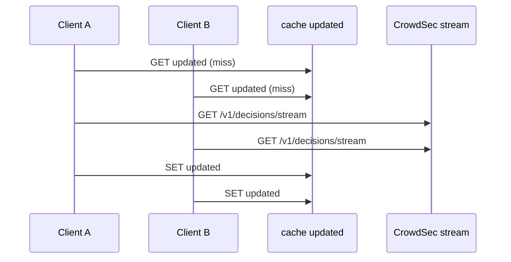

Developer review: ready for review — 2026-09-17T17:22:28Z

## What this changes
**Operators.** Live/none Redis keys now use `SessionHex` (cursor) instead of `IdentityHex`; old live keys are not migrated (one-interval miss). Watch `handleStreamCache:updated` / `alreadyUpdated` and reclaim dispose of `decisionstore:`.

**Admin users.** None.

**Developers.** `lapi.DecisionStore` is a reclaim value that owns `cache.Client`; `Acquire` is Redis `EVAL` or a memory mutex; `Client.Close` no longer closes the shared cache. Specs remap isolated-store → decision-store.

**End users.** None.

## Motivation
Two Traefik routers on the same CrowdSec LAPI row can still be two `lapi.Client` incarnations (different intervals, or live vs a different settings hash). On DestBranch each Client owns its own cache, so they do not share remediations, and `handleStreamCache` is Get-then-Set of `updated` — two pollers on one store can both miss and both fetch.

If we do not merge, those routers keep two incomplete maps and can steal stream deltas from each other. The workaround (force every router onto one Client key) blocks interval and live splits that should share bans.

## Merge readiness
Implement landed and CI succeeded. 1 item remains.

Priority: P2 — routers on one LAPI row can miss remediations or double-fetch the stream, with a workaround of forcing one Client key
Reviewed head: c8c1073
Owner decision: Required. See Decision needed.

## Review scores
| Measure | Result | What it means |
| --- | --- | --- |
| Overall readiness | 6/6 | CI succeeded, local tests passed, no open PR comments |
| CI proof | 6/6 | Main Process + both e2e jobs succeeded |
| Local tests proof | N/A | prHost is github; CI proof covers remote |
| Review resolution | 6/6 | no comments.md inventory |

## Verification
| Check | Result | Evidence |
| --- | --- | --- |
| Branch | 2026-09-17-shared-decision-store pushed | git |
| OpenSpec | shared-decision-store | openspec/changes/shared-decision-store/ |
| Pull request | https://github.com/david-garcia-garcia/crowdsec-bouncer-traefik-plugin/pull/66 | pr-host |
| CI | Main Process success https://github.com/david-garcia-garcia/crowdsec-bouncer-traefik-plugin/actions/runs/35251773403/job/105305610116 ; e2e (binary + mock LAPI) success https://github.com/david-garcia-garcia/crowdsec-bouncer-traefik-plugin/actions/runs/35251773254/job/105305609150 ; e2e (docker + pester) success https://github.com/david-garcia-garcia/crowdsec-bouncer-traefik-plugin/actions/runs/35251773254/job/105305609329 | GitHub check runs |
| Local tests | passed | handoff.yaml localTests |
| PR comments | no comments | comments: none |

## Specs
- [core_cache_client_decision-store](https://github.com/david-garcia-garcia/crowdsec-bouncer-traefik-plugin/blob/2026-09-17-shared-decision-store/openspec/changes/shared-decision-store/proposal.md) — added
- [core_cache_client_isolated-store](https://github.com/david-garcia-garcia/crowdsec-bouncer-traefik-plugin/blob/2026-09-17-shared-decision-store/openspec/changes/shared-decision-store/proposal.md) — modified
- [core_plugin_lapi_stream-lease](https://github.com/david-garcia-garcia/crowdsec-bouncer-traefik-plugin/blob/2026-09-17-shared-decision-store/openspec/changes/shared-decision-store/proposal.md) — modified
- [core_plugin_lapi_reclaim-key](https://github.com/david-garcia-garcia/crowdsec-bouncer-traefik-plugin/blob/2026-09-17-shared-decision-store/openspec/changes/shared-decision-store/proposal.md) — modified
- [core_cache_redis_utilities-client](https://github.com/david-garcia-garcia/crowdsec-bouncer-traefik-plugin/blob/2026-09-17-shared-decision-store/openspec/changes/shared-decision-store/proposal.md) — modified

## Follow-up issues
None.

## How this fits together
Local ticket 2026-09-17-shared-decision-store is branch 2026-09-17-shared-decision-store, PR 66, DestBranch master. Implement applied change `shared-decision-store`; Main Process and both e2e jobs succeeded on c8c1073.

## Decision needed
| Question | Decision | By |
| --- | --- | --- |
| Should explore/propose add a `core_plugin_reclaim` usage packet? | assumed — no. `std_go_reclaim` and `core_plugin_middleware` already document New-ctx reclaim. A third packet would fold the same unit. Isolated-cache usage is updated when the store is shared, not replaced by a reclaim glossary. | propose |

## Before merge
- [x] Shared DecisionStore + atomic stream lease landed; debt file deleted
- [x] Main Process and both e2e jobs succeeded on c8c1073

## Findings
None.

## Axis review
None.

## Agent review details

### Review metrics
| Metric | Value | Why it matters |
| --- | --- | --- |
| Specs in this PR | 1 added / 4 modified | Same list as ## Specs |
| Open reviewer comments walked | 0 FIX / 0 ANSWER / 0 open | Unanswered review is merge risk |
| Reviewed head | c8c1073894550aedd2e6662f1e762295cb2d3b0b | Card must match the branch you measured |

### Stored data model
- Changed: Redis keys (live/none) / prefix — string — sample `IdentityHex` → `SessionHex`. Upgrade: old keys not rewritten; one-interval miss until the stream fills the new prefix.
- Changed: cache key `updated` / write path — string lease — sample still `t` / no-ban; now SET-if-absent via Eval (Redis) or mutex+Set (memory). Upgrade: old Get-then-Set keys still valid.

### Technical review
Best possible solution: one reclaim DecisionStore per cursor plus Redis params, with an atomic `updated` acquire, instead of DestBranch’s per-Client map and Get-then-Set lease.

Do we have a high-confidence way to reproduce? Yes — two live Clients with different `updateIntervalSeconds` share one store; two memory or Redis pollers produce one stream GET; sibling `Close` leaves the Redis pool live.

Is this the best way to solve the issue? Yes — reclaim already owns process lifetime; Eval is the ticketed Redis primitive; memory has no CAS on the vendored heap.

### Evidence
What I checked:
- `cache.Client.Close` is safe to call more than once (`SimpleRedis.Close` CAS; existing `Test_ClientCloseRedis`)
- `RedisCacheReadHosts` is already in `streamSettings` and live `identity`; `decisionScopeHeaders` is stream-only (no spec-gap disagreement)
- `go test ./...` passed locally; Main Process + both e2e succeeded on c8c1073
- No `atomic.Pointer[T]` added; `Client.Close` no longer calls `cache.Client.Close`; Peek / PeekLivePrefix / View remain

### Rank-up moves
None.
