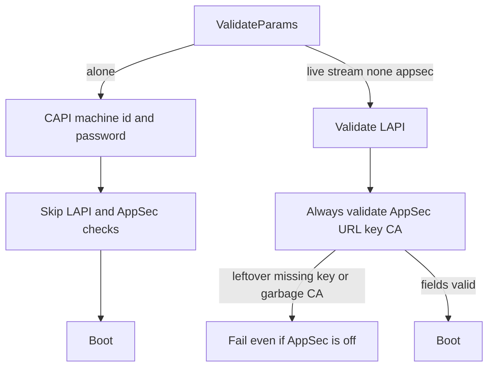

Developer review: in progress — 2026-09-18T16:10:47Z

## What this changes
**Operators.** None.

**Admin users.** None.

**Developers.** Prepare only: grounded the AppSec-enabled validation gate and opened stub PR #97. Versus `master`, live/stream still always run AppSec URL/key/CA checks; alone still skips that helper after CAPI credentials.

**End users.** None.

## Motivation
`ValidateParams` decides whether leftover AppSec URL, key-file, and HTTPS CA knobs can stop a router from booting. Dest splits that by mode: live and stream always run those AppSec checks; alone skips the whole LAPI+AppSec helper after CAPI machine id and password.

On `master`, a live or stream router with `crowdsecAppsecEnabled` false still fails when `crowdsecAppsecKeyFile` is missing or `crowdsecAppsecScheme` is explicit `https` with a garbage CA. Alone with AppSec on and those same leftovers boots. Default AppSec failure action is ban, so later requests on that router drop.

Not merging leaves two operator failures: unused AppSec fields in a shared snippet block boot, and an AppSec-on alone router with a bad CA or missing key file does not fail at startup.

## Merge readiness
Prepare is grounded (`qualified`). The enabled gate is not on this branch yet. 2 items remain.

Priority: P2 — real operator pain, with a workaround or limited blast radius
Reviewed head: eb314db
Owner decision: None.

## Review scores
| Measure | Result | What it means |
| --- | --- | --- |
| Overall readiness | 3/6 | CI in progress; no product gate yet |
| CI proof | 3/6 | All measured checks in progress |
| Local tests proof | N/A | Before implement; remote PR uses CI |
| Review resolution | 6/6 | OPEN PR #97; no reviewer comments |

## Verification
| Check | Result | Evidence |
| --- | --- | --- |
| Branch | 2026-09-18-appsec-validate-when-enabled pushed | `git` `origin/2026-09-18-appsec-validate-when-enabled` at `eb314db` |
| OpenSpec | none | `openspec/` unchanged vs `master` |
| Pull request | https://github.com/david-garcia-garcia/crowdsec-bouncer-traefik-plugin/pull/97 | pr-host Create |
| CI | e2e (binary + mock LAPI) in progress https://github.com/david-garcia-garcia/crowdsec-bouncer-traefik-plugin/actions/runs/35366860838/job/105671321416 ; e2e (docker + pester) in progress https://github.com/david-garcia-garcia/crowdsec-bouncer-traefik-plugin/actions/runs/35366860838/job/105671320983 ; Race detector in progress https://github.com/david-garcia-garcia/crowdsec-bouncer-traefik-plugin/actions/runs/35366860809/job/105671320487 ; Main Process in progress https://github.com/david-garcia-garcia/crowdsec-bouncer-traefik-plugin/actions/runs/35366860809/job/105671320194 | pr-host CI |
| Local tests | none | handoff.yaml localTests |
| PR comments | no comments | no `comments.md` |

## Specs
None.

## Follow-up issues
None.

## How this fits together
Local ticket `2026-09-18-appsec-validate-when-enabled` runs on branch `2026-09-18-appsec-validate-when-enabled` as PR #97. CI has started on the prepare commit.

## Decision needed
None.

## Before merge
- [ ] [P2] Gate `validateAppsecURLKeyAndTLS` on `crowdsecAppsecEnabled` in every mode; keep alone skipping LAPI URL/key/TLS.
- [ ] [P2] Add the four mode/enabled leftover-CA and missing-key-file cases; update dest tests and specs that assume live/stream always validate AppSec when off.

## Findings
None.

## Axis review
None.

## Agent review details

### Review metrics
| Metric | Value | Why it matters |
| --- | --- | --- |
| Specs in this PR | none | Same list as ## Specs |
| Open reviewer comments walked | 0 FIX / 0 ANSWER / 0 open | Unanswered review is merge risk |
| Reviewed head | eb314db16e611996fee4f8bfd93e9596e286a388 | Card must match the branch you measured |

### Stored data model
None.

### Technical review
Best possible solution: Not yet — this branch only records the requirement; DestBranch still always validates AppSec in live/stream and skips it in alone.

Do we have a high-confidence way to reproduce? Yes, `ValidateParams` table case "AppSec HTTPS with invalid CA while LAPI HTTP" fails on dest with AppSec off; alone + AppSec on + garbage CA is missing and would pass today.

Is this the best way to solve the issue? Not applied yet. The constraint that matters is the enabled gate in all modes, not the declined always-on-in-alone approach.

### Evidence
What I checked:
- Dest `origin/master` at `e9852e5` has `validateLapiAndAppsecConnection` always calling `validateAppsecURLKeyAndTLS`; alone skips that helper (`git ls-tree`, `pkg/configuration/configuration.go`)
- OPEN PR #97; comment inventory empty (pr-host)
- CI: four checks in progress (pr-host check runs)

### Rank-up moves
None.
