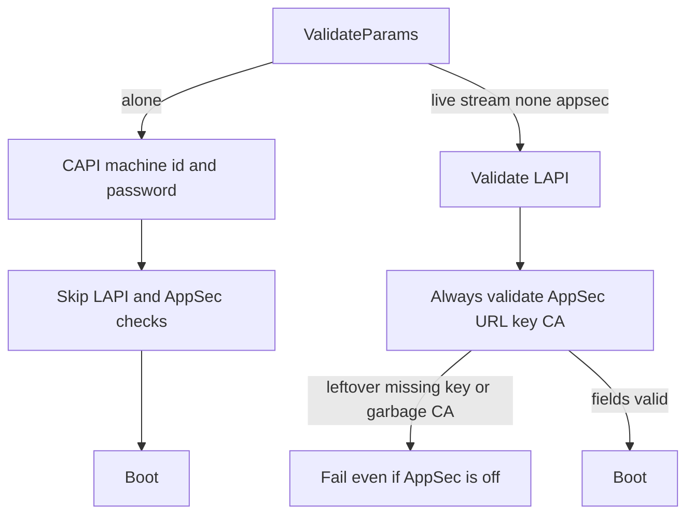

Developer review: ready for review — 2026-09-18T16:29:13Z

## What this changes
**Operators.** Leftover invalid AppSec CA or a missing `crowdsecAppsecKeyFile` no longer fail `ValidateParams` when `crowdsecAppsecEnabled` is false. Alone with AppSec on and those same leftovers now fails closed at startup.

**Admin users.** None.

**Developers.** `ValidateParams` calls `validateAppsecURLKeyAndTLS` only when `CrowdsecAppsecEnabled` is true, in every mode. Alone still skips LAPI URL, key, and TLS after CAPI credentials. The `validateLapiAndAppsecConnection` wrapper is gone.

**End users.** None.

## Motivation
`ValidateParams` decides whether leftover AppSec URL, key-file, and HTTPS CA knobs can stop a router from booting. Dest splits that by mode: live and stream always run those AppSec checks; alone skips the whole LAPI+AppSec helper after CAPI machine id and password.

On `master`, a live or stream router with `crowdsecAppsecEnabled` false still fails when `crowdsecAppsecKeyFile` is missing or `crowdsecAppsecScheme` is explicit `https` with a garbage CA. Alone with AppSec on and those same leftovers boots. Default AppSec failure action is ban, so later requests on that router drop.

Not merging leaves two operator failures: unused AppSec fields in a shared snippet block boot, and an AppSec-on alone router with a bad CA or missing key file does not fail at startup.

## Merge readiness
AppSec URL, key-file, and HTTPS CA checks now run only when `crowdsecAppsecEnabled` is true. 0 items remain.

Priority: P2 — real operator pain, with a workaround or limited blast radius
Reviewed head: 5cc0b15
Owner decision: Required. See Decision needed.

## Review scores
| Measure | Result | What it means |
| --- | --- | --- |
| Overall readiness | 6/6 | CI succeeded; no open PR comments |
| CI proof | 6/6 | All measured checks succeeded |
| Local tests proof | N/A | Remote PR; CI proof covers this |
| Review resolution | 6/6 | OPEN PR #97; no reviewer comments |

## Verification
| Check | Result | Evidence |
| --- | --- | --- |
| Branch | 2026-09-18-appsec-validate-when-enabled pushed | `git` `origin/2026-09-18-appsec-validate-when-enabled` at `5cc0b15` |
| OpenSpec | appsec-validate-when-enabled | `openspec/changes/appsec-validate-when-enabled/` |
| Pull request | https://github.com/david-garcia-garcia/crowdsec-bouncer-traefik-plugin/pull/97 | pr-host List |
| CI | Race detector success https://github.com/david-garcia-garcia/crowdsec-bouncer-traefik-plugin/actions/runs/35368346165/job/105676116995 ; Main Process success https://github.com/david-garcia-garcia/crowdsec-bouncer-traefik-plugin/actions/runs/35368346165/job/105676116879 ; e2e (binary + mock LAPI) success https://github.com/david-garcia-garcia/crowdsec-bouncer-traefik-plugin/actions/runs/35368345844/job/105676116812 ; e2e (docker + pester) success https://github.com/david-garcia-garcia/crowdsec-bouncer-traefik-plugin/actions/runs/35368345844/job/105676116918 | pr-host CI |
| Local tests | passed | handoff.yaml localTests |
| PR comments | no comments | no `comments.md` |

## Specs
- [core_plugin_middleware_config-validation](https://github.com/david-garcia-garcia/crowdsec-bouncer-traefik-plugin/blob/2026-09-18-appsec-validate-when-enabled/openspec/changes/appsec-validate-when-enabled/proposal.md) — modified

## Follow-up issues
None.

## How this fits together
Local ticket `2026-09-18-appsec-validate-when-enabled` on branch `2026-09-18-appsec-validate-when-enabled` as PR #97. Implement gated AppSec validation on `crowdsecAppsecEnabled`; CI on `5cc0b15` succeeded.

## Decision needed
| Question | Decision | By |
| --- | --- | --- |
| Do none and appsec modes share the same enabled gate even though the required test list names live/stream/alone? | assumed — yes, all modes. Do not add empty-host (#89) cases. A leftover-CA success under `crowdsecMode: appsec` with AppSec off is allowed if cheap; the existing warn test stays. | propose |
| Should AppSec CA parse use `effectiveAppsecScheme` (inherit LAPI `https`) instead of explicit `CrowdsecAppsecScheme == https`? | assumed — keep today’s explicit-scheme trigger. Changing inherit-https CA parse would rewrite live/stream validation and is out of scope. | propose |
| When AppSec is enabled and the key is empty, should `ValidateParams` fail? | assumed — no. Keep the helper’s empty-key pass; `appsec.Prepare` still copies the LAPI key. This ticket only adds the enabled gate around the existing helper. | propose |
| Should leftover `CrowdsecAppsecFailureAction` / body-limit checks also skip when AppSec is off (Redis leftover-password analog)? | assumed — leave them. Failure-action behavior is out of scope. Dest still always `GetVariable`s `RedisCachePassword`; do not change Redis in this ticket. | propose |
| Does this change `appsec.Prepare`, reclaim, or `New` process lifetime? | assumed — no. `ValidateParams` is the constructor gate. Runtime AppSec client, reclaim, and failure-action stay out. | propose |
| Should leftover AppSec fields warn when the knob is false? | assumed — no. Ticket is skip validation, not a new warn. Bound the ask. | propose |

## Before merge
None.

## Findings
None.

## Axis review
None.

## Agent review details

### Review metrics
| Metric | Value | Why it matters |
| --- | --- | --- |
| Specs in this PR | 0 added / 1 modified | Same list as ## Specs |
| Open reviewer comments walked | 0 FIX / 0 ANSWER / 0 open | Unanswered review is merge risk |
| Reviewed head | 5cc0b156a9b45edf36eb8ab877dc6813a04d1ed0 | Card must match the branch you measured |

### Stored data model
None.

### Technical review
Best possible solution: gate `validateAppsecURLKeyAndTLS` on `CrowdsecAppsecEnabled` in every mode; do not reuse declined PR #80’s always-on AppSec checks in alone.

Do we have a high-confidence way to reproduce? Yes — `Test_ValidateParams` leftover-CA and missing-key cases now pass when AppSec is off and fail when it is on (`go test ./pkg/configuration/`).

Is this the best way to solve the issue? Yes versus DestBranch — reuse the existing helper behind the enabled knob; do not invent a second signal or restore PR #80.

### Evidence
What I checked:
- `origin/master...HEAD` product delta is the enabled gate, tests, and OpenSpec change (`git diff` excluding `devstate/` and `.cursor/`)
- `go test ./pkg/configuration/` and `golangci-lint run ./pkg/configuration/...` passed
- `go test -cover ./...` passed
- OPEN PR #97; comment inventory empty (pr-host List)
- CI on head `5cc0b15`: four checks success (pr-host check runs)

### Rank-up moves
None.
