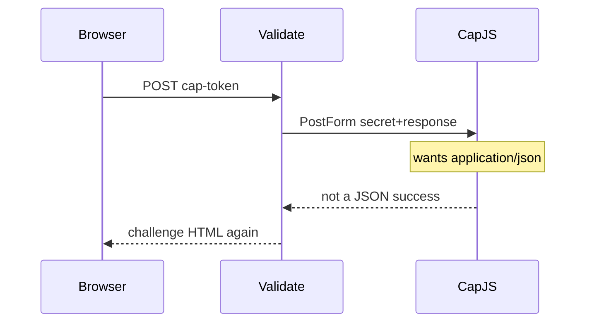

Developer review: in progress — 2026-09-18T18:24:30Z

## What this changes
**Operators.** Optional `captchaCustomValidateBody`: omit/`form` keeps today’s urlencoded siteverify; `json` (custom only) POSTs `application/json` `{"secret","response"}`. CapJS example: `captchaCustomValidateUrl` + `captchaCustomResponse: cap-token` + `json`.

**Admin users.** None.

**Developers.** `CaptchaCustomValidateBody` is validated in `validateCaptcha` and stored on `captcha.Client` (sibling of `challengeURL`). Custom+`json` uses `postSiteverify` JSON; form/omit and built-ins stay `PostForm`. Dest `Validate(r)` still has no address, so no `remoteip`. Specs folded on `core_plugin_middleware_captcha-siteverify` and `core_plugin_middleware_config-validation`.

**End users.** A custom CapJS solve that dest re-challenged can now pass: 302 plus `crowdsec_captcha_gate` when the operator sets `json`.

## Motivation
Custom captcha already lets an operator name the browser token field and the siteverify URL. Dest always posts that second hop as urlencoded `secret` and `response`. Cap Standalone / CapJS documents the same two fields as a JSON object with `Content-Type: application/json`.

On dest, a custom provider pointed at a CapJS `/<site_key>/siteverify` URL still sends `PostForm`. The provider does not see JSON, so `success` stays false, the gate cookie is not minted, and the client is re-shown the challenge. Form-compatible custom providers (Wicketkeeper) keep working because omit/form is today’s path.

Without the knob, CapJS custom stays unusable on this plugin.

## Merge readiness
Six-axis review applied one Leave a trail comment. CI on e3d44858 is still running. 1 item remains.

Priority: P2 — CapJS custom siteverify fails on dest while form providers still work
Reviewed head: e3d44858
Owner decision: None.

## Review scores
| Measure | Result | What it means |
| --- | --- | --- |
| Overall readiness | 3/6 | CI on the reviewed head is still in progress |
| CI proof | 3/6 | required checks queued or in progress on e3d44858 |
| Local tests proof | N/A | `prHost` remote; CI proof covers it (`localTests: passed`) |
| Review resolution | 6/6 | OPEN PR #105; no review comments |

## Verification
| Check | Result | Evidence |
| --- | --- | --- |
| Branch | 2026-09-18-captcha-custom-json-verify pushed | `git` / origin e3d44858 |
| OpenSpec | captcha-custom-validate-body | `openspec/changes/captcha-custom-validate-body/` |
| Pull request | https://github.com/david-garcia-garcia/crowdsec-bouncer-traefik-plugin/pull/105 | pr-host List |
| CI | Main Process queued https://github.com/david-garcia-garcia/crowdsec-bouncer-traefik-plugin/actions/runs/35379948168/job/105713485282 ; Race detector queued https://github.com/david-garcia-garcia/crowdsec-bouncer-traefik-plugin/actions/runs/35379948168/job/105713485630 ; e2e (binary + mock LAPI) in_progress https://github.com/david-garcia-garcia/crowdsec-bouncer-traefik-plugin/actions/runs/35379948087/job/105713484991 ; e2e (docker + pester) in_progress https://github.com/david-garcia-garcia/crowdsec-bouncer-traefik-plugin/actions/runs/35379948087/job/105713484814 | GitHub check runs on e3d44858 |
| Local tests | passed | handoff.yaml localTests |
| PR comments | no comments | no comments.md; Comment-List empty |

## Specs
- [core_plugin_middleware_captcha-siteverify](https://github.com/david-garcia-garcia/crowdsec-bouncer-traefik-plugin/blob/2026-09-18-captcha-custom-json-verify/openspec/changes/captcha-custom-validate-body/proposal.md) — modified
- [core_plugin_middleware_config-validation](https://github.com/david-garcia-garcia/crowdsec-bouncer-traefik-plugin/blob/2026-09-18-captcha-custom-json-verify/openspec/changes/captcha-custom-validate-body/proposal.md) — modified

## Follow-up issues
None.

## How this fits together
Local ticket → branch `2026-09-18-captcha-custom-json-verify` from `origin/master` → stub PR #105 → OpenSpec `captcha-custom-validate-body` applied → six-axis review on e3d44858 → CI running.

## Decision needed
None.

## Before merge
- [ ] CI on e3d44858 (queued / in progress)
- [x] Six-axis review (1 hard Leave a trail applied at 01596af9)
- [x] Implement `captchaCustomValidateBody` (`""`/`form` vs `json`) for custom only, with tests and a CapJS README example
- [x] OpenSpec change `captcha-custom-validate-body` apply-ready
- [x] Stub PR #105 opened

## Findings
- [P3] Leave a trail on `validateCaptcha` token-check — FIX — added the missing one-line block comment. Path: `pkg/configuration/configuration.go:620`. Reply none.

## Axis review
[Standards](https://github.com/david-garcia-garcia/crowdsec-bouncer-traefik-plugin/blob/2026-09-18-captcha-custom-json-verify/devstate/2026/09/2026-09-18-captcha-custom-json-verify/codereview_standards.md) — 1 total, 0 pending, 1 completed
[Spec](https://github.com/david-garcia-garcia/crowdsec-bouncer-traefik-plugin/blob/2026-09-18-captcha-custom-json-verify/devstate/2026/09/2026-09-18-captcha-custom-json-verify/codereview_spec.md) — 0 total, 0 pending, 0 completed
[Security](https://github.com/david-garcia-garcia/crowdsec-bouncer-traefik-plugin/blob/2026-09-18-captcha-custom-json-verify/devstate/2026/09/2026-09-18-captcha-custom-json-verify/codereview_security.md) — 0 total, 0 pending, 0 completed
[Performance](https://github.com/david-garcia-garcia/crowdsec-bouncer-traefik-plugin/blob/2026-09-18-captcha-custom-json-verify/devstate/2026/09/2026-09-18-captcha-custom-json-verify/codereview_performance.md) — 0 total, 0 pending, 0 completed
[Dead](https://github.com/david-garcia-garcia/crowdsec-bouncer-traefik-plugin/blob/2026-09-18-captcha-custom-json-verify/devstate/2026/09/2026-09-18-captcha-custom-json-verify/codereview_dead.md) — 0 total, 0 pending, 0 completed
[Test coverage](https://github.com/david-garcia-garcia/crowdsec-bouncer-traefik-plugin/blob/2026-09-18-captcha-custom-json-verify/devstate/2026/09/2026-09-18-captcha-custom-json-verify/codereview_coverage.md) — 0 total, 0 pending, 0 completed

## Agent review details

### Review metrics
| Metric | Value | Why it matters |
| --- | --- | --- |
| Specs in this PR | 0 added / 2 modified | Same list as ## Specs |
| Open reviewer comments walked | 0 FIX / 0 ANSWER / 0 open | Unanswered review is merge risk |
| Reviewed head | e3d44858e3d05fb8d305962afeb330d1c5b698f1 | Card must match the branch you measured |

### Stored data model
None.

### Technical review
Best possible solution: custom-only `captchaCustomValidateBody` (`""`/`form` keep dest `PostForm`; `json` POSTs official Cap JSON) versus dest `PostForm`-only `Validate`.

Do we have a high-confidence way to reproduce? Yes — httptest custom+json sees `application/json` `secret`/`response`; dest `Validate(r)` omits `remoteip`.

Is this the best way to solve the issue? Yes — a custom-only encoding knob keeps Wicketkeeper form default and avoids a `trycap` provider.

### Evidence
What I checked:
- dest after Sync still `Validate(r)` only; no `remoteip` invented (`pkg/captcha/captcha.go`)
- six-axis files under the run root; Standards 1 hard applied at 01596af9
- CI on e3d44858: Main Process queued, Race detector queued, e2e mock in_progress, e2e docker in_progress
- PR #105 Comment-List empty

### Rank-up moves
None.
