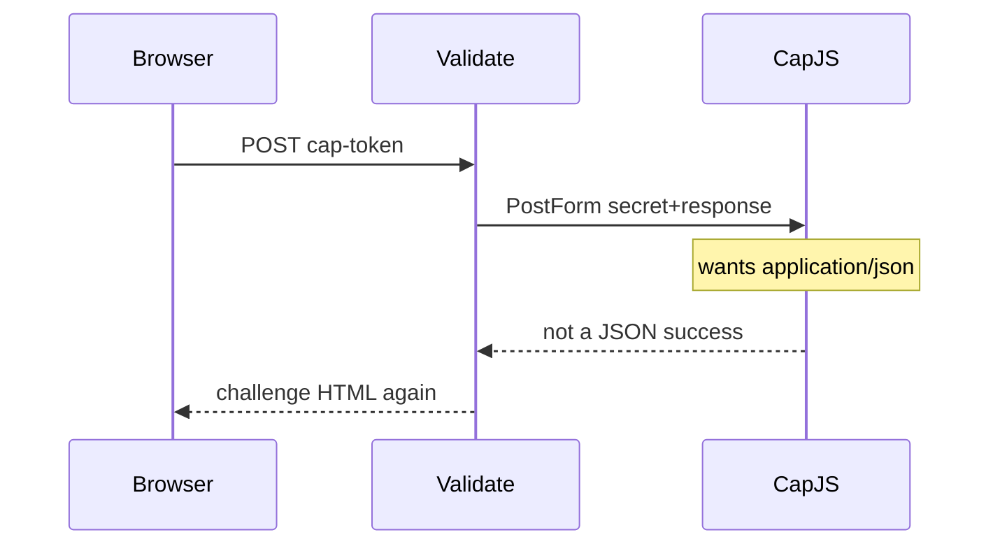

Developer review: in progress — 2026-09-18T17:55:25Z

## What this changes
**Operators.** None.

**Admin users.** None.

**Developers.** None.

**End users.** None.

## Motivation
Custom captcha already lets an operator name the browser token field and the siteverify URL. Dest always posts that second hop as urlencoded `secret` and `response`. Cap Standalone / CapJS documents the same two fields as a JSON object with `Content-Type: application/json`.

On dest, a custom provider pointed at a CapJS `/<site_key>/siteverify` URL still sends `PostForm`. The provider does not see JSON, so `success` stays false, the gate cookie is not minted, and the client is re-shown the challenge. Form-compatible custom providers (Wicketkeeper) keep working because omit/form is today’s path.

Without the knob, CapJS custom stays unusable on this plugin, and later work has no spec or test for the encoding split.

## Merge readiness
Prepare stub only; no product apply yet. 6 items remain.

Priority: P2 — CapJS custom siteverify fails on dest while form providers still work
Reviewed head: 0700e91
Owner decision: None.

## Review scores
| Measure | Result | What it means |
| --- | --- | --- |
| Overall readiness | 3/6 | CI still in progress; no product apply |
| CI proof | 3/6 | in progress — [Race detector succeeded](https://github.com/david-garcia-garcia/crowdsec-bouncer-traefik-plugin/actions/runs/35377076525/job/105704161130); [Main Process](https://github.com/david-garcia-garcia/crowdsec-bouncer-traefik-plugin/actions/runs/35377076525/job/105704161384), [e2e mock](https://github.com/david-garcia-garcia/crowdsec-bouncer-traefik-plugin/actions/runs/35377076520/job/105704161566), [e2e docker](https://github.com/david-garcia-garcia/crowdsec-bouncer-traefik-plugin/actions/runs/35377076520/job/105704161735) running |
| Local tests proof | N/A | `localTests: none` before implement |
| Review resolution | 6/6 | OPEN PR #105; no review comments |

## Verification
| Check | Result | Evidence |
| --- | --- | --- |
| Branch | 2026-09-18-captcha-custom-json-verify pushed | `git` / origin |
| OpenSpec | none | `openspec/` |
| Pull request | https://github.com/david-garcia-garcia/crowdsec-bouncer-traefik-plugin/pull/105 | pr-host Create |
| CI | Race detector success; Main Process and both e2e in progress | GitHub check runs on 0700e91 |
| Local tests | none | handoff.yaml localTests |
| PR comments | no comments | no comments.md; Comment-List empty |

## Specs
None.

## Follow-up issues
None.

## How this fits together
Local ticket → branch `2026-09-18-captcha-custom-json-verify` from `origin/master` → stub PR #105 → CI started on the empty start commit.

## Decision needed
None.

## Before merge
- [ ] Add `captchaCustomValidateBody` (`""`/`form` vs `json`) for custom only, with tests and a CapJS README example
- [x] Stub PR #105 opened

## Findings
None.

## Axis review
None.

## Agent review details

### Review metrics
| Metric | Value | Why it matters |
| --- | --- | --- |
| Specs in this PR | none | Same list as ## Specs |
| Open reviewer comments walked | 0 FIX / 0 ANSWER / 0 open | Unanswered review is merge risk |
| Reviewed head | 0700e91ef7b014cea6b32e803807d686cf3123bb | Card must match the branch you measured |

### Stored data model
None.

### Technical review
Best possible solution: not applied yet versus dest `PostForm`-only `Validate`.

Do we have a high-confidence way to reproduce? Yes, dest `Validate` always `PostForm`; CapJS documents JSON siteverify.

Is this the best way to solve the issue? Yes — a custom-only encoding knob keeps Wicketkeeper form default and avoids a `trycap` provider.

### Evidence
What I checked:
- dest `Validate(r)` posts urlencoded `secret`+`response` only (`pkg/captcha/captcha.go`, `origin/master` 46a81d0)
- no `CaptchaCustomValidateBody` (`pkg/configuration/configuration.go`)
- Wicketkeeper example documents urlencoded siteverify (`examples/custom-captcha/README.md`)
- PR #105 Comment-List empty; one OPEN PR for this head

### Rank-up moves
None.
