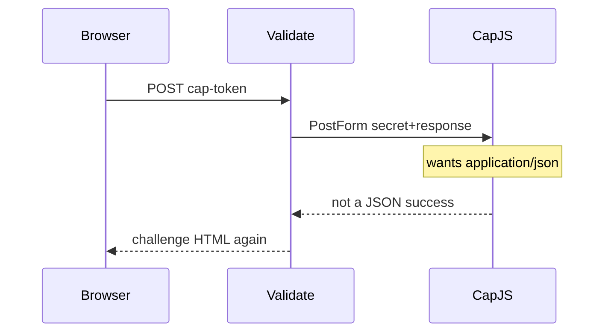

Developer review: in progress — 2026-09-18T18:06:32Z

## What this changes
**Operators.** None.

**Admin users.** None.

**Developers.** OpenSpec change `captcha-custom-validate-body` folds custom siteverify request encoding onto `core_plugin_middleware_captcha-siteverify` and `CaptchaCustomValidateBody` tokens onto `core_plugin_middleware_config-validation`. No product apply yet.

**End users.** None.

## Motivation
Custom captcha already lets an operator name the browser token field and the siteverify URL. Dest always posts that second hop as urlencoded `secret` and `response`. Cap Standalone / CapJS documents the same two fields as a JSON object with `Content-Type: application/json`.

On dest, a custom provider pointed at a CapJS `/<site_key>/siteverify` URL still sends `PostForm`. The provider does not see JSON, so `success` stays false, the gate cookie is not minted, and the client is re-shown the challenge. Form-compatible custom providers (Wicketkeeper) keep working because omit/form is today’s path.

Without the knob, CapJS custom stays unusable on this plugin, and later work has no spec or test for the encoding split.

## Merge readiness
Propose apply-ready; no product apply yet. 5 items remain.

Priority: P2 — CapJS custom siteverify fails on dest while form providers still work
Reviewed head: 4b299f4
Owner decision: None.

## Review scores
| Measure | Result | What it means |
| --- | --- | --- |
| Overall readiness | 3/6 | CI in progress on the propose head; no product apply |
| CI proof | 3/6 | in progress — [Main Process](https://github.com/david-garcia-garcia/crowdsec-bouncer-traefik-plugin/actions/runs/35378176157/job/105707774311), [e2e mock](https://github.com/david-garcia-garcia/crowdsec-bouncer-traefik-plugin/actions/runs/35378176171/job/105707825784) running; [Race detector](https://github.com/david-garcia-garcia/crowdsec-bouncer-traefik-plugin/actions/runs/35378176157/job/105707774547), [e2e docker](https://github.com/david-garcia-garcia/crowdsec-bouncer-traefik-plugin/actions/runs/35378176171/job/105707825999) queued |
| Local tests proof | N/A | `localTests: none` before implement |
| Review resolution | 6/6 | OPEN PR #105; no review comments |

## Verification
| Check | Result | Evidence |
| --- | --- | --- |
| Branch | 2026-09-18-captcha-custom-json-verify pushed | `git` / origin |
| OpenSpec | captcha-custom-validate-body | `openspec/changes/captcha-custom-validate-body/` |
| Pull request | https://github.com/david-garcia-garcia/crowdsec-bouncer-traefik-plugin/pull/105 | pr-host List |
| CI | in progress on 4b299f4 | GitHub check runs 35378176157 / 35378176171 |
| Local tests | none | handoff.yaml localTests |
| PR comments | no comments | no comments.md; Comment-List empty |

## Specs
- [core_plugin_middleware_captcha-siteverify](https://github.com/david-garcia-garcia/crowdsec-bouncer-traefik-plugin/blob/2026-09-18-captcha-custom-json-verify/openspec/changes/captcha-custom-validate-body/proposal.md) — modified
- [core_plugin_middleware_config-validation](https://github.com/david-garcia-garcia/crowdsec-bouncer-traefik-plugin/blob/2026-09-18-captcha-custom-json-verify/openspec/changes/captcha-custom-validate-body/proposal.md) — modified

## Follow-up issues
None.

## How this fits together
Local ticket → branch `2026-09-18-captcha-custom-json-verify` from `origin/master` → stub PR #105 → OpenSpec `captcha-custom-validate-body` apply-ready → CI running on 4b299f4.

## Decision needed
None.

## Before merge
- [ ] Implement `captchaCustomValidateBody` (`""`/`form` vs `json`) for custom only, with tests and a CapJS README example
- [x] OpenSpec change `captcha-custom-validate-body` apply-ready
- [x] Stub PR #105 opened

## Findings
None.

## Axis review
None.

## Agent review details

### Review metrics
| Metric | Value | Why it matters |
| --- | --- | --- |
| Specs in this PR | 0 added / 2 modified | Same list as ## Specs |
| Open reviewer comments walked | 0 FIX / 0 ANSWER / 0 open | Unanswered review is merge risk |
| Reviewed head | 4b299f41a33849388ce317dfda41dee1a897637c | Card must match the branch you measured |

### Stored data model
None.

### Technical review
Best possible solution: custom-only `captchaCustomValidateBody` (`""`/`form` keep dest `PostForm`; `json` POSTs official Cap JSON) versus dest `PostForm`-only `Validate`.

Do we have a high-confidence way to reproduce? Yes, dest `Validate` always `PostForm`; CapJS documents JSON siteverify.

Is this the best way to solve the issue? Yes — a custom-only encoding knob keeps Wicketkeeper form default and avoids a `trycap` provider.

### Evidence
What I checked:
- dest `Validate(r)` posts urlencoded `secret`+`response` only (`pkg/captcha/captcha.go`, `origin/master` 46a81d0)
- OpenSpec change `captcha-custom-validate-body` apply-ready (`openspec validate` passed, 4b299f4)
- FindSpecHost fold: `core_plugin_middleware_captcha-siteverify`, `core_plugin_middleware_config-validation`
- PR #105 Comment-List empty; CI pending on 4b299f4

### Rank-up moves
None.
