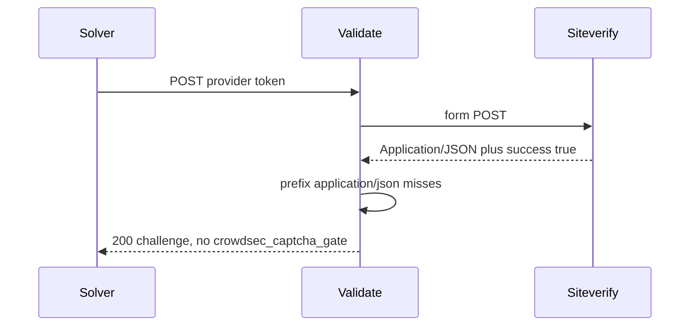

Developer review: in progress — 2026-09-18T14:31:31Z

## What this changes
**Operators.** None.

**Admin users.** None.

**Developers.** Records RFC 9110 media-type case rules in `knowledge/research/ext_http_media-types/`. Siteverify `Validate` still matches `Content-Type` with a lowercase `application/json` prefix.

**End users.** None.

## Motivation
After a captcha solve, this plugin POSTs the token to the provider siteverify URL and only mints `crowdsec_captcha_gate` when that response is treated as JSON with `success:true`. On `master`, that JSON check is `strings.HasPrefix(Content-Type, "application/json")`.

A provider that sends `Application/JSON` plus `{"success":true}` is classified as non-JSON (`responseType:noJson`). `ServeHTTP` then writes the 200 challenge page and skips the gate cookie and 302. RFC 9110 type and subtype tokens are case-insensitive, so that header is JSON.

Explore reproduced that path: the same stub with `Application/JSON` returned `200` and the challenge HTML; the lowercase `application/json` control still 302s and sets the cookie. If this does not land, a successful solve against a provider (or proxy) that capitalizes the media type never clears captcha.

## Merge readiness
Explore recorded; siteverify match is unchanged. 1 item remains.

Priority: P2 — real solver pain when the provider capitalizes Content-Type, limited to that header match
Reviewed head: a26b99b
Owner decision: Required. See Decision needed.

## Review scores
| Measure | Result | What it means |
| --- | --- | --- |
| Overall readiness | 3/6 | CI is still queued; no product fix on the branch |
| CI proof | 3/6 | Checks queued on [35356776385](https://github.com/david-garcia-garcia/crowdsec-bouncer-traefik-plugin/actions/runs/35356776385) and [35356776277](https://github.com/david-garcia-garcia/crowdsec-bouncer-traefik-plugin/actions/runs/35356776277) |
| Local tests proof | N/A | `localTests: none`; remote CI is the proof axis |
| Review resolution | 6/6 | No OPEN PR comments |

## Verification
| Check | Result | Evidence |
| --- | --- | --- |
| Branch | 2026-09-18-captcha-siteverify-content-type-case pushed | `git` `a26b99b` |
| OpenSpec | none | `openspec/` |
| Pull request | https://github.com/david-garcia-garcia/crowdsec-bouncer-traefik-plugin/pull/94 | GitHub PR 94 |
| CI | build 35356776385 queued https://github.com/david-garcia-garcia/crowdsec-bouncer-traefik-plugin/actions/runs/35356776385 ; build 35356776277 queued https://github.com/david-garcia-garcia/crowdsec-bouncer-traefik-plugin/actions/runs/35356776277 | GitHub check runs |
| Local tests | none | handoff.yaml localTests |
| PR comments | no comments | no comments.md |

## Specs
None.

## Follow-up issues
None.

## How this fits together
Explore wrote `explore.md` on branch `2026-09-18-captcha-siteverify-content-type-case`; stub PR 94 is OPEN; CI is queued on that head; the siteverify match is not applied yet.

## Decision needed
| Question | Decision | By |
| --- | --- | --- |
| Which helper should `Validate` use to read the siteverify media type? | assumed — call `mime.ParseMediaType` on the response `Content-Type` (already used for inbound form in this file) and compare the type token to `application/json`. Do not keep `strings.HasPrefix` and do not add a parallel EqualFold helper. | explore |
| Where should the dest regression live, and may it keep the hunt name? | assumed — add a `zzz_*_test.go` under `pkg/captcha/` (existing `zzz_servehttp_test.go` or a new `zzz_` file). The function may keep `TestHunt_siteverifyJSONContentTypeIsCaseInsensitive`. Do not copy a hunt worktree file as dest. | explore |
| Which spec unit owns the siteverify media-type match? | assumed — propose runs FindSpecHost. Do not fold this requirement into `core_plugin_middleware_captcha-routing` (owns `handleRemediationServeHTTP` routing) or `core_plugin_middleware_captcha-gate` (owns the gate cookie). Those units do not own `Validate`'s `Content-Type` match. | explore |

## Before merge
- [ ] Treat siteverify as JSON when the media type before parameters equals `application/json` case-insensitively; `success:true` must set the gate cookie and 302; add a regression [P2]
- [x] Stub PR opened
- [x] Explore reproduced `Application/JSON` → 200 challenge

## Findings
None.

## Axis review
None.

## Agent review details

### Review metrics
| Metric | Value | Why it matters |
| --- | --- | --- |
| Specs in this PR | none | Same list as ## Specs; do not paste diff --stat |
| Open reviewer comments walked | 0 FIX / 0 ANSWER / 0 open | Unanswered review is merge risk |
| Reviewed head | a26b99b1f14a1b5ff9d2e6a3a7e2a1e57eaf77df | Card must match the branch you measured |

### Stored data model
None.

### Technical review
Best possible solution: DestBranch still does the case-sensitive prefix check; this PR only records the RFC rule implement should follow.

Do we have a high-confidence way to reproduce? Yes — throwaway `TestHunt_siteverifyJSONContentTypeIsCaseInsensitive` failed (`solve want 302, got 200 E2E_CAPTCHA_PAGE_MARKER`); lowercase control passed.

Is this the best way to solve the issue? Not solved yet versus DestBranch; the required match is media type before parameters, case-insensitive, via `mime.ParseMediaType`.

### Evidence
What I checked:
- `Validate` Content-Type prefix and `(false, nil)` → 200 challenge (`pkg/captcha/captcha.go`, `origin/master` `fad36a1`)
- Existing solve stub uses lowercase `application/json` (`pkg/captcha/zzz_servehttp_test.go`, `fad36a1`)
- RFC 9110 § 8.3.1 type/subtype case-insensitive (`knowledge/research/ext_http_media-types/notes.md`, `a26b99b`)
- Hunt reproduction FAIL on this worktree (`go test ./pkg/captcha -run TestHunt_siteverifyJSONContentTypeIsCaseInsensitive`, deleted after)
- Control PASS (`Test_ServeHTTP_dummyProviderSolveIssuesGateCookie`)
- PR 94 OPEN, comments empty, checks queued (`a26b99b`)

### Rank-up moves
None.
