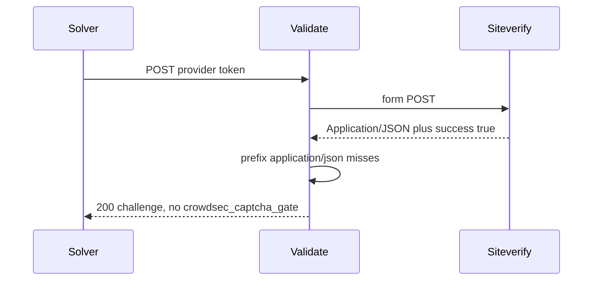

Developer review: ready for review — 2026-09-18T14:49:33Z

## What this changes
**Operators.** None.

**Admin users.** None.

**Developers.** `Client.Validate` treats a provider siteverify response as JSON when the `Content-Type` media type before parameters equals `application/json` (via `mime.ParseMediaType`); `success:true` still issues `crowdsec_captcha_gate` and 302. Adds `TestHunt_siteverifyJSONContentTypeIsCaseInsensitive` and spec `core_plugin_middleware_captcha-siteverify`.

**End users.** A successful captcha solve against a provider that sends mixed-case JSON `Content-Type` now receives the gate cookie and redirect instead of another challenge page.

## Motivation
After a captcha solve, this plugin POSTs the token to the provider siteverify URL and only mints `crowdsec_captcha_gate` when that response is treated as JSON with `success:true`. On `master`, that JSON check is `strings.HasPrefix(Content-Type, "application/json")`.

A provider that sends `Application/JSON` plus `{"success":true}` is classified as non-JSON (`responseType:noJson`). `ServeHTTP` then writes the 200 challenge page and skips the gate cookie and 302. RFC 9110 type and subtype tokens are case-insensitive, so that header is JSON. If this does not land, a successful solve against a provider (or proxy) that capitalizes the media type never clears captcha.

## Merge readiness
Implement applied the siteverify media-type match and CI succeeded. 0 items remain.

Priority: P2 — real solver pain when the provider capitalizes Content-Type, limited to that header match
Reviewed head: 3b00468
Owner decision: Required. See Decision needed.

## Review scores
| Measure | Result | What it means |
| --- | --- | --- |
| Overall readiness | 6/6 | CI succeeded and there are no open PR comments |
| CI proof | 6/6 | All checks succeeded on [35358201876](https://github.com/david-garcia-garcia/crowdsec-bouncer-traefik-plugin/actions/runs/35358201876) and [35358201849](https://github.com/david-garcia-garcia/crowdsec-bouncer-traefik-plugin/actions/runs/35358201849) |
| Local tests proof | N/A | `prHost` is remote; CI proof covers remote |
| Review resolution | 6/6 | No OPEN PR comments |

## Verification
| Check | Result | Evidence |
| --- | --- | --- |
| Branch | 2026-09-18-captcha-siteverify-content-type-case pushed | `git` `3b00468` |
| OpenSpec | captcha-siteverify-content-type-case | `openspec/changes/captcha-siteverify-content-type-case/` |
| Pull request | https://github.com/david-garcia-garcia/crowdsec-bouncer-traefik-plugin/pull/94 | GitHub PR 94 |
| CI | build 35358201876 success https://github.com/david-garcia-garcia/crowdsec-bouncer-traefik-plugin/actions/runs/35358201876 ; build 35358201849 success https://github.com/david-garcia-garcia/crowdsec-bouncer-traefik-plugin/actions/runs/35358201849 | GitHub check runs |
| Local tests | passed | handoff.yaml localTests |
| PR comments | no comments | no comments.md |

## Specs
- [core_plugin_middleware_captcha-siteverify](https://github.com/david-garcia-garcia/crowdsec-bouncer-traefik-plugin/blob/2026-09-18-captcha-siteverify-content-type-case/openspec/changes/captcha-siteverify-content-type-case/proposal.md) — added

## Follow-up issues
None.

## How this fits together
Implement applied the `Validate` media-type match and hunt regression on branch `2026-09-18-captcha-siteverify-content-type-case`; stub PR 94 is OPEN; CI succeeded on that head.

## Decision needed
| Question | Decision | By |
| --- | --- | --- |
| Which helper should `Validate` use to read the siteverify media type? | assumed — call `mime.ParseMediaType` on the response `Content-Type` (already used for inbound form in this file) and compare the type token to `application/json`. Do not keep `strings.HasPrefix` and do not add a parallel EqualFold helper. | explore |
| Where should the dest regression live, and may it keep the hunt name? | assumed — add a `zzz_*_test.go` under `pkg/captcha/` (existing `zzz_servehttp_test.go` or a new `zzz_` file). The function may keep `TestHunt_siteverifyJSONContentTypeIsCaseInsensitive`. Do not copy a hunt worktree file as dest. | explore |

## Before merge
- [x] Treat siteverify as JSON when the media type before parameters equals `application/json` case-insensitively; `success:true` sets the gate cookie and 302; hunt regression landed [P2]
- [x] Local `go test ./pkg/...` and `go test .` passed
- [x] CI succeeded on `3b00468`
- [x] Stub PR opened
- [x] Explore reproduced `Application/JSON` → 200 challenge
- [x] OpenSpec change `captcha-siteverify-content-type-case` apply-ready

## Findings
None.

## Axis review
None.

## Agent review details

### Review metrics
| Metric | Value | Why it matters |
| --- | --- | --- |
| Specs in this PR | 1 added / 0 modified | Same list as ## Specs; do not paste diff --stat |
| Open reviewer comments walked | 0 FIX / 0 ANSWER / 0 open | Unanswered review is merge risk |
| Reviewed head | 3b0046889f0759261e8d03a8c7605158a25e3596 | Card must match the branch you measured |

### Stored data model
None.

### Technical review
Best possible solution: DestBranch still uses a lowercase `application/json` prefix; this PR classifies siteverify JSON with `mime.ParseMediaType` equals-before-parameters in `Validate`.

Do we have a high-confidence way to reproduce? Yes — committed `TestHunt_siteverifyJSONContentTypeIsCaseInsensitive` (`Application/JSON` + `{"success":true}` → 302 and `crowdsec_captcha_gate`).

Is this the best way to solve the issue? Yes versus DestBranch: fix the shared `Validate` media-type owner, not a `ServeHTTP` special case.

### Evidence
What I checked:
- `Validate` now parses `Content-Type` with `mime.ParseMediaType` (`pkg/captcha/captcha.go`, `18c1dc3`)
- Hunt regression asserts 302 and `crowdsec_captcha_gate` (`pkg/captcha/zzz_servehttp_test.go`, `8228cb8`)
- Local `go test ./pkg/... -count=1` and `go test . -count=1` passed (`3b00468`)
- PR 94 checks succeeded: Main Process, Race detector, e2e binary+mock, e2e docker+pester (builds 35358201876 and 35358201849)
- RFC 9110 § 8.3.1 type/subtype case-insensitive (`knowledge/research/ext_http_media-types/notes.md`)

### Rank-up moves
None.
