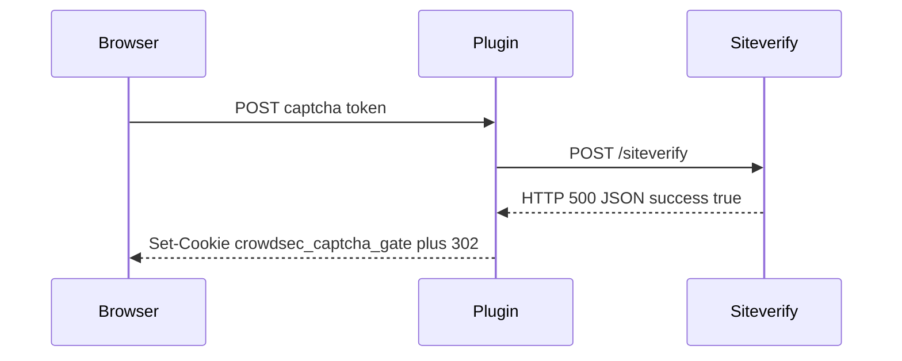

Developer review: in progress — 2026-09-18T14:20:45Z

## What this changes
**Operators.** None.

**Admin users.** None.

**Developers.** None.

**End users.** None.

## Motivation
Captcha `Validate` POSTs the visitor token to the provider siteverify URL. On DestBranch it treats a received JSON body with `success: true` as a solve and never reads the HTTP status.

That means an HTTP 500 (or any non-2xx) that still sends `Content-Type: application/json` and `{"success":true}` mints `crowdsec_captcha_gate` and 302s as solved. Measured this explore: a throwaway ServeHTTP POST with that stub returned `status=302` and the gate cookie. Transport failures (`PostForm` error) already fail closed; this path is a received error status, not that case.

If we do not merge, a broken or lying siteverify hop can grant captcha grace without a 2xx verify.

## Merge readiness
Explore is written; product apply has not started. 3 items remain.

Priority: P2 — real end-user harm (false captcha solve) when siteverify returns a non-2xx JSON success body, limited blast radius.
Reviewed head: 2b30956
Owner decision: Required. See Decision needed.

## Review scores
| Measure | Result | What it means |
| --- | --- | --- |
| Overall readiness | 3/6 | CI queued; no apply yet |
| CI proof | 3/6 | Main Process and Race detector queued https://github.com/david-garcia-garcia/crowdsec-bouncer-traefik-plugin/actions/runs/35355617980/job/105634126685 |
| Local tests proof | N/A | Before implement (`localTests: none`) |
| Review resolution | 6/6 | OPEN PR, no review comments |

## Verification
| Check | Result | Evidence |
| --- | --- | --- |
| Branch | 2026-09-18-captcha-siteverify-ignores-http-status pushed | git |
| OpenSpec | none | `openspec/` |
| Pull request | https://github.com/david-garcia-garcia/crowdsec-bouncer-traefik-plugin/pull/86 | pr-host List |
| CI | build 35355617980 queued https://github.com/david-garcia-garcia/crowdsec-bouncer-traefik-plugin/actions/runs/35355617980 | GitHub check runs |
| Local tests | none | handoff.yaml localTests |
| PR comments | no comments | no comments.md |

## Specs
None.

## Follow-up issues
None.

## How this fits together
Local dump → branch `2026-09-18-captcha-siteverify-ignores-http-status` → stub PR #86 → explore on `2b30956` with the 500+JSON success mint reproduced. Product fix is not in this head.

## Decision needed
| Question | Decision | By |
| --- | --- | --- |
| Non-2xx as `(false, nil)` (re-render challenge) vs `(false, err)` (HTTP 400)? | assumed — `(false, nil)`. Ticket and hunt only forbid cookie + solved 302. Failed verify matches the Content-Type miss. Leave transport `(false, err)` on the #28 path. | explore |
| What is 2xx? | assumed — `status >= 200 && status < 300`. Same band as LAPI first-digit `2`. Requirement says 2xx, not 200-only. | explore |
| Where does the regression test live, and must it keep the hunt name? | assumed — `pkg/captcha/` `zzz_*_test.go`; ServeHTTP asserts no gate cookie and not 302 (and 200 challenge if `(false, nil)`). Hunt name is not on dest; do not require it. | explore |
| Which spec owns siteverify HTTP acceptance? | assumed — new `core_plugin_middleware_captcha-siteverify` via FindSpecHost at propose. Gate spec keeps cookie + first-solve 302 after success. Do not rename `captcha-gate`. | explore |
| Drain the siteverify body on the new non-2xx return? | assumed — no. Keep existing `defer` close, same as the Content-Type miss. Do not add a LAPI-style drain in this defect. | explore |
| Log or metric on non-2xx? | assumed — Debug with the status, sibling of `responseType:noJson`. No new metric. | explore |

## Before merge
- [ ] Require a 2xx siteverify status before decoding `success`
- [ ] Add a regression test for HTTP 500 + JSON `{"success":true}` (no gate cookie, no solved 302)
- [ ] Keep transport-error handling (`PostForm` err) on the #28 path

## Findings
None.

## Axis review
None.

## Agent review details

### Review metrics
| Metric | Value | Why it matters |
| --- | --- | --- |
| Specs in this PR | none | Same list as ## Specs |
| Open reviewer comments walked | 0 FIX / 0 ANSWER / 0 open | Unanswered review is merge risk |
| Reviewed head | 2b30956e185705ce1f943afff51e83b59e0467a3 | Card must match the branch you measured |

### Stored data model
None.

### Technical review
Best possible solution: not chosen yet — dest still accepts non-2xx JSON `success: true` as a solve.

Do we have a high-confidence way to reproduce? Yes — throwaway ServeHTTP POST this explore: HTTP 500 + JSON success minted `crowdsec_captcha_gate` and 302.

Is this the best way to solve the issue? Not applied. Desired is 2xx-before-decode only; explore assumed `(false, nil)` for non-2xx.

### Evidence
What I checked:
- `Validate` after `PostForm` checks Content-Type and `success`, not `StatusCode` (`pkg/captcha/captcha.go`)
- Throwaway ServeHTTP POST: HTTP 500 + JSON `{"success":true}` → 302 + `crowdsec_captcha_gate` (deleted after the run)
- Hunt test not on dest (path not found)
- Official hCaptcha / reCAPTCHA / Turnstile pages define the verdict as JSON `success`, not HTTP status
- PR #86 open; CI run 35355617980 queued on head 2b30956

### Rank-up moves
None.

[sgsi-dev-ticket-status:2026-09-18-captcha-siteverify-ignores-http-status]
