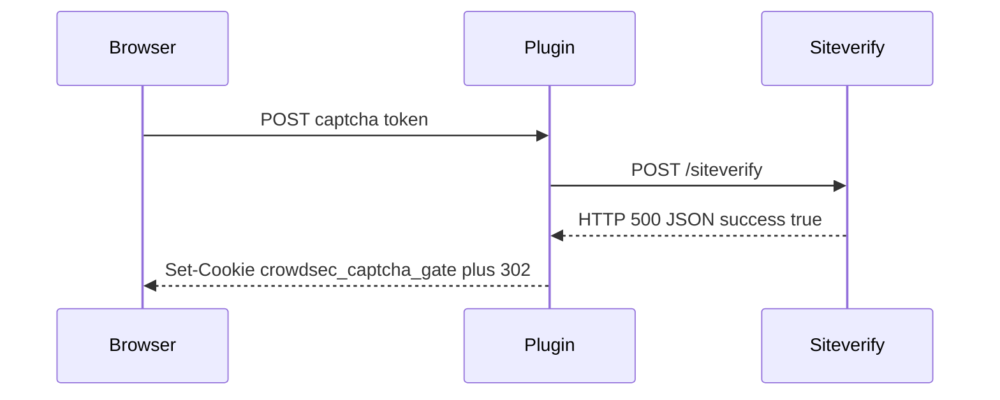

Developer review: in progress — 2026-09-18T14:15:28Z

## What this changes
**Operators.** None.

**Admin users.** None.

**Developers.** None.

**End users.** None.

## Motivation
On master, captcha `Validate` POSTs the visitor token to the provider siteverify URL, then treats the body as a solve whenever it is JSON with `success: true`. It never reads the HTTP status.

That means an HTTP 500 (or any non-2xx) that still sends `Content-Type: application/json` and `{"success":true}` mints `crowdsec_captcha_gate` and 302s as solved. Transport failures (`PostForm` error) already fail closed; this path is a received error status, not that case.

If we do not merge, a broken or lying siteverify hop can grant captcha grace without a 2xx verify.

## Merge readiness
Prepare is done; product apply has not started. 4 items remain.

Priority: P2 — real end-user harm (false captcha solve) when siteverify returns a non-2xx JSON success body, limited blast radius.
Reviewed head: bbf1153
Owner decision: None.

## Review scores
| Measure | Result | What it means |
| --- | --- | --- |
| Overall readiness | 3/6 | CI still in progress; no apply yet |
| CI proof | 3/6 | Main Process in progress; Race detector queued https://github.com/david-garcia-garcia/crowdsec-bouncer-traefik-plugin/actions/runs/35355077589/job/105632334242 |
| Local tests proof | N/A | Before implement (`localTests: none`) |
| Review resolution | 6/6 | OPEN PR, no review comments |

## Verification
| Check | Result | Evidence |
| --- | --- | --- |
| Branch | 2026-09-18-captcha-siteverify-ignores-http-status pushed | git |
| OpenSpec | none | `openspec/` |
| Pull request | https://github.com/david-garcia-garcia/crowdsec-bouncer-traefik-plugin/pull/86 | pr-host Create |
| CI | build 35355077589 in progress https://github.com/david-garcia-garcia/crowdsec-bouncer-traefik-plugin/actions/runs/35355077589 | GitHub check runs |
| Local tests | none | handoff.yaml localTests |
| PR comments | no comments | no comments.md |

## Specs
None.

## Follow-up issues
None.

## How this fits together
Local dump → branch `2026-09-18-captcha-siteverify-ignores-http-status` → stub PR #86 → prepare bus on `bbf1153`. Product fix is not in this head.

## Decision needed
None.

## Before merge
- [ ] Require a 2xx siteverify status before decoding `success`
- [ ] Add a regression test for HTTP 500 + JSON `{"success":true}` (no gate cookie, no solved 302)
- [ ] Keep transport-error handling (`PostForm` err) on the #28 path
- [ ] Remaining workflow phases after prepare

## Findings
None.

## Axis review
None.

## Agent review details

### Review metrics
| Metric | Value | Why it matters |
| --- | --- | --- |
| Specs in this PR | none | Same list as ## Specs |
| Open reviewer comments walked | 0 FIX / 0 ANSWER / 0 open | Unanswered review is merge risk |
| Reviewed head | bbf1153723ee3224ad3c32fe24033006cda99ed8 | Card must match the branch you measured |

### Stored data model
None.

### Technical review
Best possible solution: not chosen yet — dest still accepts non-2xx JSON `success: true` as a solve.

Do we have a high-confidence way to reproduce? Yes — hunt proof `TestHunt_siteverifyHTTPErrorDoesNotAcceptSuccessJSON` (not on dest); ticket names HTTP 500 + JSON success.

Is this the best way to solve the issue? Not applied. Desired is 2xx-before-decode only.

### Evidence
What I checked:
- `Validate` after `PostForm` checks Content-Type and `success`, not `StatusCode` (`pkg/captcha/captcha.go`, `origin/master` fad36a1)
- `ServeHTTP` mints `crowdsec_captcha_gate` and 302s when `valid` (`pkg/captcha/captcha.go`)
- Hunt test not on dest (path not found)
- PR #86 opened; CI run 35355077589 in progress on head bbf1153

### Rank-up moves
None.

[sgsi-dev-ticket-status:2026-09-18-captcha-siteverify-ignores-http-status]
