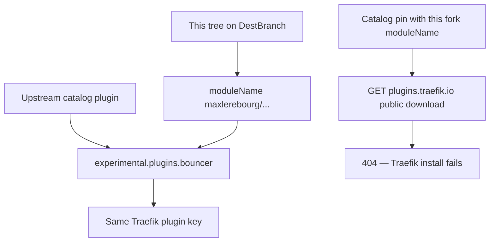

Developer review: in progress — 2026-09-18T17:48:18Z

## What this changes
**Operators.** None.

**Admin users.** None.

**Developers.** OpenSpec change `retarget-plugin-module-path` specifies retargeting `go.mod`, `.traefik.yml` `import`, Main/race GOPATH, and in-tree loads to `github.com/david-garcia-garcia/crowdsec-bouncer-traefik-plugin`, with catalog-form examples flipped to `localPlugins`.

**End users.** None.

## Motivation
This ticket’s job is to give this tree its own Traefik/Yaegi module path so it can load beside the upstream catalog plugin. On DestBranch, `go.mod`, `.traefik.yml` `import`, Main CI GOPATH, and most compose/e2e load paths still say `github.com/maxlerebourg/crowdsec-bouncer-traefik-plugin`. Traefik therefore treats this tree as the same plugin as upstream.

The DestBranch failure is a split identity: README and `docker-compose.local.yml` already name `github.com/david-garcia-garcia/crowdsec-bouncer-traefik-plugin`, while the module, manifest, CI checkout, and catalog-form examples do not. Catalog examples pin `experimental.plugins.bouncer.version=v1.7.1`. A GET of this fork’s module at that catalog URL returns 404; the catalog will not list a fork. Changing only `modulename` on those catalog pins would make Traefik fail the download at startup.

Cost of not merging: this repo cannot be a second plugin. Operators stay on one identity (upstream catalog or a colliding GOPATH). CI/Yaegi keep resolving the old import.

## Merge readiness
Propose artifacts are apply-ready; product identity is still DestBranch. 2 items remain.

Priority: P2 — operators cannot load this fork beside upstream without replacing it
Reviewed head: adba0bf
Owner decision: Required. See Decision needed.

## Review scores
| Measure | Result | What it means |
| --- | --- | --- |
| Overall readiness | 3/6 | OpenSpec landed; apply not started; CI still running |
| CI proof | 3/6 | Main Process, Race detector, and both e2e jobs in progress |
| Local tests proof | N/A | Before implement (`localTests: none`) |
| Review resolution | 6/6 | OPEN PR, no reviewer comments |

## Verification
| Check | Result | Evidence |
| --- | --- | --- |
| Branch | 2026-09-18-fork-plugin-module-path pushed | `git` `adba0bf` on `origin` |
| OpenSpec | retarget-plugin-module-path | `openspec/changes/retarget-plugin-module-path/` |
| Pull request | https://github.com/david-garcia-garcia/crowdsec-bouncer-traefik-plugin/pull/101 | pr-host List |
| CI | build 35376447167 in progress https://github.com/david-garcia-garcia/crowdsec-bouncer-traefik-plugin/actions/runs/35376447167 ; e2e 35376446968 in progress https://github.com/david-garcia-garcia/crowdsec-bouncer-traefik-plugin/actions/runs/35376446968 | pr-host CI |
| Local tests | none | handoff.yaml localTests |
| PR comments | no comments | no comments.md |

## Specs
- [core_plugin_middleware_local-plugin](https://github.com/david-garcia-garcia/crowdsec-bouncer-traefik-plugin/blob/2026-09-18-fork-plugin-module-path/openspec/changes/retarget-plugin-module-path/proposal.md) — added
- [core_plugin_middleware_bouncer](https://github.com/david-garcia-garcia/crowdsec-bouncer-traefik-plugin/blob/2026-09-18-fork-plugin-module-path/openspec/changes/retarget-plugin-module-path/proposal.md) — modified
- [build_ci_github_module-path](https://github.com/david-garcia-garcia/crowdsec-bouncer-traefik-plugin/blob/2026-09-18-fork-plugin-module-path/openspec/changes/retarget-plugin-module-path/proposal.md) — modified
- [build_ci_github_race-detector](https://github.com/david-garcia-garcia/crowdsec-bouncer-traefik-plugin/blob/2026-09-18-fork-plugin-module-path/openspec/changes/retarget-plugin-module-path/proposal.md) — modified

## Follow-up issues
- [ ] [Retarget renovate depNameTemplate off maxlerebourg](https://github.com/david-garcia-garcia/crowdsec-bouncer-traefik-plugin/blob/2026-09-18-fork-plugin-module-path/knowledge/debt/2026-09-18-renovate-depname-maxlerebourg.md) — renovate.json still templates maxlerebourg/crowdsec-bouncer-traefik-plugin; ticket left it out of scope.

## How this fits together
Local spec → branch `2026-09-18-fork-plugin-module-path` → stub PR 101 → OpenSpec change `retarget-plugin-module-path` → CI on `adba0bf`.

## Decision needed
| Question | Decision | By |
| --- | --- | --- |
| Catalog-form examples after modulename changes — local bind-mount, leave catalog pins, or accept broken catalog examples? | assumed — convert in-repo runnable compose to localPlugins + bind-mount at the new module path; keep alias bouncer; do not ship a catalog download of this fork | explore |
| What exact displayName text distinguishes from upstream? | assumed — CrowdSec Bouncer Traefik Plugin (david-garcia-garcia) | explore |
| Should README keep a catalog experimental.plugins snippet with version vX.Y.Z for this fork? | assumed — no as the working example; show localPlugins; mention 404 / fork-ban | explore |
| Should renovate.json depNameTemplate move in this change? | assumed — no. Ticket left it out of scope | explore |
| Should core_plugin_middleware_bouncer be renamed because “bouncer” is also the Traefik alias? | assumed — no. Update the import WHEN only | explore |

## Before merge
- [ ] Apply `retarget-plugin-module-path` (module / manifest / CI GOPATH / localPlugins examples)
- [ ] [P2] Document a different operator key when upstream `plugins.bouncer` is kept

## Findings
None.

## Axis review
None.

## Agent review details

### Review metrics
| Metric | Value | Why it matters |
| --- | --- | --- |
| Specs in this PR | 1 added / 3 modified | Same list as ## Specs; do not paste diff --stat |
| Open reviewer comments walked | 0 FIX / 0 ANSWER / 0 open | Unanswered review is merge risk |
| Reviewed head | adba0bf208e7052802921c0137e20d400193c52b | Card must match the branch you measured |

### Stored data model
None.

### Technical review
Best possible solution: specify `go.mod` as the identity owner, flip in-tree loads to localPlugins (catalog GET 404s; forks are not listed), keep alias `bouncer`; apply is not on DestBranch...HEAD yet.

Do we have a high-confidence way to reproduce? Yes, `go.mod` `module` and `.traefik.yml` `import` are the old path on `origin/master`.

Is this the best way to solve the issue? Yes versus DestBranch — retarget plus localPlugins, not a catalog pin of this unpublished module.

### Evidence
What I checked:
- Dest HEAD `46a81d0` (`origin/master`)
- Reviewed HEAD `adba0bf` (OpenSpec change only)
- `openspec validate retarget-plugin-module-path --strict` passed
- PR 101; comment inventory empty
- CI runs 35376447167 and 35376446968 in progress
- qualify `qualified-with-gaps`

### Rank-up moves
None.
