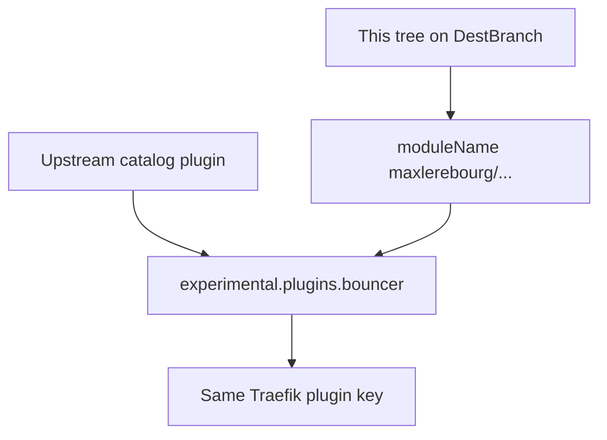

Developer review: in progress — 2026-09-18T17:34:09Z

## What this changes
**Operators.** None.

**Admin users.** None.

**Developers.** None.

**End users.** None.

## Motivation
This fork still presents Traefik and Yaegi with the upstream module path. On DestBranch, `go.mod`, `.traefik.yml` `import`, Main CI GOPATH, and most compose/e2e load paths still say `github.com/maxlerebourg/crowdsec-bouncer-traefik-plugin`. Traefik therefore treats this tree as the same catalog plugin as upstream, so operators who keep maxlerebourg loaded cannot attach this fork beside it.

The DestBranch failure is a split identity: README and `docker-compose.local.yml` already name `github.com/david-garcia-garcia/crowdsec-bouncer-traefik-plugin`, while the module, manifest, CI checkout, and catalog-form examples do not. Catalog examples also pin `experimental.plugins.bouncer.version=v1.7.1`. Changing only `modulename` without a catalog listing would make those examples ask Traefik to download a plugin that is not published.

Cost of not merging: this repo cannot be a second plugin. Operators stay on a single identity (upstream catalog or a conflicting GOPATH), and CI/Yaegi keep resolving the old import. The plugin-key collision is separate: in-tree compose uses alias `bouncer`; operators who keep upstream `plugins.bouncer` must register this fork under another key.

## Merge readiness
Prepare grounded the identity retarget; no product apply yet. 2 items remain.

Priority: P2 — operators cannot load this fork beside upstream without replacing it
Reviewed head: 911ad25
Owner decision: None.

## Review scores
| Measure | Result | What it means |
| --- | --- | --- |
| Overall readiness | 3/6 | CI is still running on the stub; no apply yet |
| CI proof | 3/6 | Main Process, Race detector, and both e2e jobs in progress |
| Local tests proof | N/A | Before implement (`localTests: none`) |
| Review resolution | 6/6 | OPEN PR, no reviewer comments |

## Verification
| Check | Result | Evidence |
| --- | --- | --- |
| Branch | 2026-09-18-fork-plugin-module-path pushed | `git` `911ad25` on `origin` |
| OpenSpec | none | `openspec/` |
| Pull request | https://github.com/david-garcia-garcia/crowdsec-bouncer-traefik-plugin/pull/101 | pr-host Create |
| CI | build 35375034528 in progress https://github.com/david-garcia-garcia/crowdsec-bouncer-traefik-plugin/actions/runs/35375034528 | pr-host CI |
| Local tests | none | handoff.yaml localTests |
| PR comments | no comments | no comments.md |

## Specs
None.

## Follow-up issues
None.

## How this fits together
Local spec → branch `2026-09-18-fork-plugin-module-path` from `origin/master` → stub PR 101 → CI started on the empty start commit.

## Decision needed
None.

## Before merge
- [ ] Retarget module / manifest / CI / example load-path identity to `github.com/david-garcia-garcia/crowdsec-bouncer-traefik-plugin`
- [ ] [P2] Document that operators who keep upstream `plugins.bouncer` must register this fork under a different key

## Findings
None.

## Axis review
None.

## Agent review details

### Review metrics
| Metric | Value | Why it matters |
| --- | --- | --- |
| Specs in this PR | none | Same list as ## Specs; do not paste diff --stat |
| Open reviewer comments walked | 0 FIX / 0 ANSWER / 0 open | Unanswered review is merge risk |
| Reviewed head | 911ad250027d9b2309050897133b3dc8cea70d77 | Card must match the branch you measured |

### Stored data model
None.

### Technical review
Best possible solution: not applied yet; DestBranch still uses the upstream module path everywhere that loads the plugin except README and `docker-compose.local.yml`.

Do we have a high-confidence way to reproduce? Yes, `go.mod` `module` and `.traefik.yml` `import` are the old path on `origin/master`.

Is this the best way to solve the issue? Not yet decided — prepare only.

### Evidence
What I checked:
- Dest HEAD `46a81d0` (`origin/master`)
- Stub HEAD `911ad25` (empty start commit)
- PR 101 created; comment inventory empty
- CI run 35375034528 in progress
- qualify `qualified-with-gaps` (catalog examples vs unpublished listing; README already retargeted)

### Rank-up moves
None.
