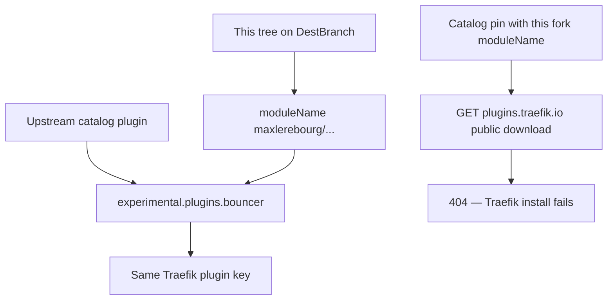

Developer review: needs changes — 2026-09-18T18:42:58Z

## What this changes
**Operators.** In-tree compose, e2e, Kubernetes values, and binary-vm now load this tree as `localPlugins.bouncer` at `github.com/david-garcia-garcia/crowdsec-bouncer-traefik-plugin` (bind-mount or a documented copy to `plugins-local/src/<module>`). Catalog `version=` pins of this module are gone. Hosts that already load upstream `experimental.plugins.bouncer` must register this fork under a different alias (`localPlugins.crowdsec` + `plugin.crowdsec`). `.traefik.yml` `displayName` is `CrowdSec Bouncer Traefik Plugin (david-garcia-garcia)`.

**Admin users.** None.

**Developers.** `go.mod` `module`, every in-tree import of this module, `.traefik.yml` `import`, and Main/race GOPATH checkout are `github.com/david-garcia-garcia/crowdsec-bouncer-traefik-plugin`. Live specs name that path. Usage `core_plugin_middleware.md` keeps `import` matching `go.mod`; packets `core_plugin_middleware_local-plugin.md` and `build_ci_github.md` cover localPlugins install and GOPATH checkout. `TestForkModulePathMatchesManifest` asserts the module line, import, and displayName. OpenSpec change `retarget-plugin-module-path` is archived at `openspec/changes/archive/2026-09-18-retarget-plugin-module-path`.

**End users.** None.

## Motivation
This ticket’s job is to give this tree its own Traefik/Yaegi module path so it can load beside the upstream catalog plugin. On DestBranch, `go.mod`, `.traefik.yml` `import`, Main CI GOPATH, and most compose/e2e load paths still say `github.com/maxlerebourg/crowdsec-bouncer-traefik-plugin`. Traefik therefore treats this tree as the same plugin as upstream.

The DestBranch failure is a split identity: README and `docker-compose.local.yml` already name `github.com/david-garcia-garcia/crowdsec-bouncer-traefik-plugin`, while the module, manifest, CI checkout, and catalog-form examples do not. Catalog examples pin `experimental.plugins.bouncer.version=v1.7.1`. A GET of this fork’s module at that catalog URL returns 404; the catalog will not list a fork. Changing only `modulename` on those catalog pins would make Traefik fail the download at startup.

Cost of not merging: this repo cannot be a second plugin. Operators stay on one identity (upstream catalog or a colliding GOPATH). CI/Yaegi keep resolving the old import.

## Merge readiness
Ready title is on PR 101. Race and both e2e jobs succeeded; Main Process Yaegi failed. 1 item remains.

Priority: P2 — operators cannot load this fork beside upstream without replacing it
Reviewed head: 52f4fa43
Owner decision: Required. See Decision needed.

## Review scores
| Measure | Result | What it means |
| --- | --- | --- |
| Overall readiness | 2/6 | Main Process failed on this head |
| CI proof | 2/6 | Main Process failed; Race and both e2e succeeded |
| Local tests proof | N/A | `prHost` remote; CI proof covers remote |
| Review resolution | 6/6 | OPEN PR, no reviewer comments |

## Verification
| Check | Result | Evidence |
| --- | --- | --- |
| Branch | 2026-09-18-fork-plugin-module-path pushed | `git` `52f4fa43` on `origin` |
| OpenSpec | retarget-plugin-module-path | `openspec/changes/archive/2026-09-18-retarget-plugin-module-path/` |
| Pull request | https://github.com/david-garcia-garcia/crowdsec-bouncer-traefik-plugin/pull/101 | pr-host List |
| CI | Main 35381200216 failure https://github.com/david-garcia-garcia/crowdsec-bouncer-traefik-plugin/actions/runs/35381200216 ; e2e 35381200215 success https://github.com/david-garcia-garcia/crowdsec-bouncer-traefik-plugin/actions/runs/35381200215 | pr-host CI |
| Local tests | passed | handoff.yaml localTests |
| PR comments | no comments | no comments.md |

## Specs
- [core_plugin_middleware_local-plugin](https://github.com/david-garcia-garcia/crowdsec-bouncer-traefik-plugin/blob/2026-09-18-fork-plugin-module-path/openspec/changes/archive/2026-09-18-retarget-plugin-module-path/proposal.md) — added
- [core_plugin_middleware_bouncer](https://github.com/david-garcia-garcia/crowdsec-bouncer-traefik-plugin/blob/2026-09-18-fork-plugin-module-path/openspec/changes/archive/2026-09-18-retarget-plugin-module-path/proposal.md) — modified
- [build_ci_github_module-path](https://github.com/david-garcia-garcia/crowdsec-bouncer-traefik-plugin/blob/2026-09-18-fork-plugin-module-path/openspec/changes/archive/2026-09-18-retarget-plugin-module-path/proposal.md) — modified
- [build_ci_github_race-detector](https://github.com/david-garcia-garcia/crowdsec-bouncer-traefik-plugin/blob/2026-09-18-fork-plugin-module-path/openspec/changes/archive/2026-09-18-retarget-plugin-module-path/proposal.md) — modified

## Follow-up issues
- [ ] [Retarget renovate depNameTemplate off maxlerebourg](https://github.com/david-garcia-garcia/crowdsec-bouncer-traefik-plugin/blob/2026-09-18-fork-plugin-module-path/knowledge/debt/2026-09-18-renovate-depname-maxlerebourg.md) — renovate.json still templates maxlerebourg/crowdsec-bouncer-traefik-plugin; ticket left it out of scope.

## How this fits together
Local spec → branch `2026-09-18-fork-plugin-module-path` → PR 101 ready title → Race and both e2e succeeded; Main Yaegi failed on `52f4fa43`.

## Decision needed
| Question | Decision | By |
| --- | --- | --- |
| Catalog-form examples after modulename changes — local bind-mount, leave catalog pins, or accept broken catalog examples? | assumed — convert in-repo runnable compose to localPlugins + bind-mount at the new module path; keep alias bouncer; do not ship a catalog download of this fork | explore |
| What exact displayName text distinguishes from upstream? | assumed — CrowdSec Bouncer Traefik Plugin (david-garcia-garcia) | explore |
| Should README keep a catalog experimental.plugins snippet with version vX.Y.Z for this fork? | assumed — no as the working example; show localPlugins; mention 404 / fork-ban | explore |
| Should renovate.json depNameTemplate move in this change? | assumed — no. Ticket left it out of scope | explore |
| Should core_plugin_middleware_bouncer be renamed because “bouncer” is also the Traefik alias? | assumed — no. Update the import WHEN only | explore |

## Before merge
- [x] Apply `retarget-plugin-module-path` (module / manifest / CI GOPATH / localPlugins examples)
- [x] [P2] Document a different operator key when upstream `plugins.bouncer` is kept
- [x] [P3] Assert `go.mod` module, `.traefik.yml` `import`, and `displayName` on this fork
- [x] [P3] Usage packets for Local plugin and GitHub Actions GOPATH
- [x] Archive `retarget-plugin-module-path` to `openspec/changes/archive/2026-09-18-retarget-plugin-module-path`
- [x] Ready PR title (drop WIP stub)
- [x] e2e (binary + mock LAPI) and e2e (docker + pester) succeeded on this head
- [ ] [P2] Main Process Yaegi tests must succeed on this head

## Findings
- [[P2] Main Yaegi tests failed](https://github.com/david-garcia-garcia/crowdsec-bouncer-traefik-plugin/actions/runs/35381200216/job/105717514816) — FIX — "Run tests with Yaegi" exited 2 on `52f4fa43` after Lint and Tests succeeded. Path: (general). Reply none.
- [[P3] Ticket job unproven](https://github.com/david-garcia-garcia/crowdsec-bouncer-traefik-plugin/blob/2026-09-18-fork-plugin-module-path/devstate/2026/09/2026-09-18-fork-plugin-module-path/codereview_coverage.md) — FIX — retargeted tests did not assert `go.mod` / `.traefik.yml` identity; `5889a22` added `TestForkModulePathMatchesManifest`. Path: `go.mod:1` / `.traefik.yml:5`. Reply none.

## Axis review
[Standards](https://github.com/david-garcia-garcia/crowdsec-bouncer-traefik-plugin/blob/2026-09-18-fork-plugin-module-path/devstate/2026/09/2026-09-18-fork-plugin-module-path/codereview_standards.md) — 0 total, 0 pending, 0 completed
[Spec](https://github.com/david-garcia-garcia/crowdsec-bouncer-traefik-plugin/blob/2026-09-18-fork-plugin-module-path/devstate/2026/09/2026-09-18-fork-plugin-module-path/codereview_spec.md) — 0 total, 0 pending, 0 completed
[Security](https://github.com/david-garcia-garcia/crowdsec-bouncer-traefik-plugin/blob/2026-09-18-fork-plugin-module-path/devstate/2026/09/2026-09-18-fork-plugin-module-path/codereview_security.md) — 0 total, 0 pending, 0 completed
[Performance](https://github.com/david-garcia-garcia/crowdsec-bouncer-traefik-plugin/blob/2026-09-18-fork-plugin-module-path/devstate/2026/09/2026-09-18-fork-plugin-module-path/codereview_performance.md) — 0 total, 0 pending, 0 completed
[Dead](https://github.com/david-garcia-garcia/crowdsec-bouncer-traefik-plugin/blob/2026-09-18-fork-plugin-module-path/devstate/2026/09/2026-09-18-fork-plugin-module-path/codereview_dead.md) — 0 total, 0 pending, 0 completed
[Test coverage](https://github.com/david-garcia-garcia/crowdsec-bouncer-traefik-plugin/blob/2026-09-18-fork-plugin-module-path/devstate/2026/09/2026-09-18-fork-plugin-module-path/codereview_coverage.md) — 1 total, 0 pending, 1 completed

## Agent review details

### Review metrics
| Metric | Value | Why it matters |
| --- | --- | --- |
| Specs in this PR | 1 added / 3 modified | Same list as ## Specs; do not paste diff --stat |
| Open reviewer comments walked | 0 FIX / 0 ANSWER / 0 open | Unanswered review is merge risk |
| Reviewed head | 52f4fa43f0b035b839dcf865d5ac026759b21a69 | Card must match the branch you measured |

### Stored data model
None.

### Technical review
Best possible solution: `go.mod` is the identity owner; in-tree loads use localPlugins at that path because catalog GET of this module 404s and forks are not listed; alias `bouncer` stays in-tree.

Do we have a high-confidence way to reproduce? Yes — `origin/master` still has the old `go.mod` module and `.traefik.yml` `import`; this branch retargets both. Main Yaegi exit 2 reproduces on this head.

Is this the best way to solve the issue? Yes versus DestBranch — retarget plus localPlugins, not a catalog pin of this unpublished module.

### Evidence
What I checked:
- Dest HEAD `45339632dc1bca9608fef84f498315d37d65cdd2` (`origin/master`)
- Reviewed HEAD `52f4fa43f0b035b839dcf865d5ac026759b21a69`
- handoff.yaml `localTests: passed`
- CI Main/Race 35381200216: Race success, Main Process failure (Yaegi step exit 2) https://github.com/david-garcia-garcia/crowdsec-bouncer-traefik-plugin/actions/runs/35381200216
- CI e2e 35381200215: e2e (binary + mock LAPI) success, e2e (docker + pester) success https://github.com/david-garcia-garcia/crowdsec-bouncer-traefik-plugin/actions/runs/35381200215
- PR 101 title ready; comment inventory empty
- qualify `qualified-with-gaps`
- Axis files: five `none.`; coverage 1 item `Status: done` (`5889a22`)
- Live change folder gone; `openspec/changes/archive/2026-09-18-retarget-plugin-module-path/proposal.md` on disk

### Rank-up moves
None.
