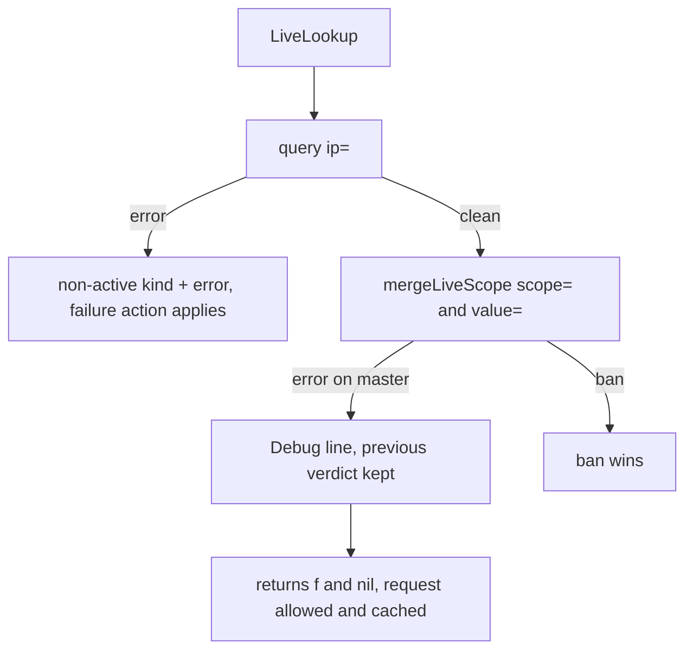

Developer review: in progress — 2026-09-18T11:21:31Z

## What this changes
**Operators.** In `live` and `none` mode `bouncerLapiFailureAction` now also governs a failed `lapiScopeHeaders` query, so under the default `ban` a request whose `Country` or `username` scope query errored is blocked instead of allowed, and that failure is logged at `WARN` instead of `DEBUG` — set `bouncerLapiFailureAction: passthrough` to keep today's permissive behavior.

**Admin users.** None.

**Developers.** Four contract changes in `pkg/lapi` versus `master`: `LiveLookup` reports a header-scope query failure as a non-active remediation plus an error, so a caller must read the remediation kind and never the error alone (`client_live.go`, `client_decisions.go`); a stream poll that fails at any stage releases the `updated` lease through the extracted `fetchAndApplyStreamDecisions` (`client_stream.go`); one LAPI/CAPI exchange is now `sendQuery`, which replays the original method and body once on an alone-mode `401`, drains every answered response, and no longer applies `%w` to a `nil` error (`client_http.go`); and the round trip has its own spec `core_plugin_lapi_query-round-trip` plus usage packet `knowledge/devdocs/core_plugin_lapi_query-round-trip.md`.

**End users.** A visitor whose header-scope decision could not be checked is now blocked rather than let through, under the default failure action.

## Behavior change requiring owner ratification (deliverable 1)
This is the heart of the PR and it changes what happens to live traffic. Row 2 is the change; every other row is stated so the ratification is a decision about one cell, not a leap of faith. `IP query` is the client-address query, `scope query` is one mapped `lapiScopeHeaders` lookup.

| IP query | Scope query | On `master` `0e7dbf0` | On this branch |
| --- | --- | --- | --- |
| clean | every scope clean | allow | allow — unchanged |
| clean | **one scope errors** | **allow**, traced only by a `DEBUG` line | non-active remediation + error → `bouncerLapiFailureAction` decides (default `ban`), logged at `WARN`, and no negative live-cache entry is written for that client address |
| clean | one scope bans | ban | ban — unchanged |
| active ban | one scope errors | ban | ban — unchanged; the ban is never downgraded and the failure action is never consulted |
| errors | not reached | non-active remediation + error → failure action | unchanged |
| clean | one errors, another bans | ban | ban — unchanged; a ban outranks another scope's failure regardless of map order |

One test per row lives in `pkg/lapi/zzz_failure_action_test.go`, and each was measured red on `master` `0e7dbf0` before the fix. `README.md` carries the operator-facing note, including `passthrough` as the way back to the old behavior.

## Motivation
In `none` and `live` mode the bouncer asks LAPI once for the client address and then once per mapped header scope (`Country`, `username`, …). `handleNoStreamCache` overloads its return: an active remediation comes back with a non-nil `handleNoStreamCache:banned` error, so the error alone does not mean failure. `mergeLiveScope` returned `(string, time.Duration)` with no error channel at all, so a scope query that failed logged at `Debug` and handed the previous verdict back unchanged.

On `master` that reads as "this scope has no decision". Measured against a LAPI that answers `ip=` with `null` and `500`s on `scope=`: `LiveLookup` returns `value="f" err=<nil>`, `pkg/bouncer` takes the allow path, `bouncerLapiFailureAction` never runs, and `handleNoStreamCache` also caches the unverified allow for that client address, so the outage outlives itself. The only trace is a `Debug` line that is off in most deployments.

Four smaller defects sit on the same two paths, each reproduced on `master` first. `handleStreamCache` keeps the `updated` lease after a failed stream GET, so no instance re-polls for the rest of `max(lapiUpdateIntervalSeconds - 1, 1)` while stream/alone cache misses are already taking the failure action. The alone-mode `401` retry reissued a POST as a bodyless GET, and `crowdsecQuery` and `getToken` could call each other without bound — the test for a second `401` exhausted the stack and panicked on `master`. Ten `crowdsecQuery` calls against a `502` opened ten connections, because the early return sat above the `defer` that closed the body. That same return produced `crowdsecQuery:unreachable url:… %!w(<nil>)` and never named the status code.

Not merging keeps a security control failing open whenever LAPI answers the address query but not a scope query, keeps a failed stream poll parked for a whole interval, and keeps two operator-facing messages wrong.

## Merge readiness
All five deliverables landed with a test per behavior-matrix row, the change is archived, and every local gate passes on this tree. CI needs one more look: the `Race detector` job failed once on `d1f5a1a` after passing on `234bc23`, whose Go code is byte-identical. 2 items remain.

Priority: P1 — a header-scope LAPI failure silently allows traffic on `master` today, so the configured failure action never protects that path
Reviewed head: d1f5a1a
Owner decision: Required. See Decision needed.

## Review scores
| Measure | Result | What it means |
| --- | --- | --- |
| Overall readiness | 2/6 | Work and review are complete; the one red CI job has to be resolved before this is reviewable |
| CI proof | 2 | `Race detector` failed on `d1f5a1a` (https://github.com/david-garcia-garcia/crowdsec-bouncer-traefik-plugin/actions/runs/35338517388/job/105578864054); the other three jobs succeeded, and all four succeeded on `234bc23` with identical Go code |
| Local tests proof | N/A | Remote PR host; CI proof is the axis. The local suites and the Docker race run all pass — see Evidence |
| Review resolution | 6 | No PR comments; `devstate/comments.md` absent and `handoff.yaml` carries `comments: none` |

## Verification
| Check | Result | Evidence |
| --- | --- | --- |
| Branch | 2026-09-18-lapi-scope-failclosed-query-hardening pushed | `git push` |
| OpenSpec | lapi-scope-failclosed-query-hardening, archived | `openspec archive --skip-specs` |
| Pull request | https://github.com/david-garcia-garcia/crowdsec-bouncer-traefik-plugin/pull/73 | GitHub MCP |
| CI | run 35338517388 Race detector failure (https://github.com/david-garcia-garcia/crowdsec-bouncer-traefik-plugin/actions/runs/35338517388/job/105578864054); Main Process, e2e binary, e2e docker all success | GitHub MCP |
| Local tests | passed | handoff.yaml localTests |
| PR comments | no comments | devstate/comments.md absent |

## Specs
- [core_plugin_lapi_failure-action](https://github.com/david-garcia-garcia/crowdsec-bouncer-traefik-plugin/blob/2026-09-18-lapi-scope-failclosed-query-hardening/openspec/changes/archive/2026-09-18-lapi-scope-failclosed-query-hardening/proposal.md) — modified
- [core_plugin_lapi_stream-lease](https://github.com/david-garcia-garcia/crowdsec-bouncer-traefik-plugin/blob/2026-09-18-lapi-scope-failclosed-query-hardening/openspec/changes/archive/2026-09-18-lapi-scope-failclosed-query-hardening/proposal.md) — modified
- [core_plugin_lapi_query-round-trip](https://github.com/david-garcia-garcia/crowdsec-bouncer-traefik-plugin/blob/2026-09-18-lapi-scope-failclosed-query-hardening/openspec/changes/archive/2026-09-18-lapi-scope-failclosed-query-hardening/proposal.md) — added

## Follow-up issues
- [ ] [The isolated-store spec is a stub, so the catalog cannot pass strict validation](https://github.com/david-garcia-garcia/crowdsec-bouncer-traefik-plugin/blob/2026-09-18-lapi-scope-failclosed-query-hardening/knowledge/debt/2026-09-18-empty-isolated-store-spec.md) — `openspec/specs/core_cache_client_isolated-store/spec.md` has a Purpose and no Requirements, on `master` too, so `openspec validate --specs --strict` cannot be used as a gate.
- [ ] [The alone-mode 401 keeps its connection while the token renewal and replay run](https://github.com/david-garcia-garcia/crowdsec-bouncer-traefik-plugin/blob/2026-09-18-lapi-scope-failclosed-query-hardening/knowledge/debt/2026-09-18-alone-401-holds-its-connection.md) — the `defer` that releases the response runs after `getToken` and the replay, so one renewal can occupy three sockets.

## How this fits together
The ticket source lives in the bus folder as `ticket/source.md`; the branch is off `master` `0e7dbf0` in a dedicated worktree; stub PR #73 was opened at prepare against `master` and is reused here. Explore reproduced all five defects, propose wrote and validated the three spec deltas, implement landed them with tests measured red first, code review ran all six axes, devdocs impact produced one new packet and two usage updates, and archive synced the deltas into `openspec/specs/` and moved the change folder.

## Decision needed
| Question | Decision | By |
| --- | --- | --- |
| Does the deliverable 1 behavior change need owner sign-off before merge? | blocked — ratify the matrix above. A deployment with a flaky scope path that used to allow silently will now apply `bouncerLapiFailureAction`, default `ban`. `passthrough` is the documented way back | explore |
| Should the alone-mode `401` release its response before renewing the token? | assumed — not applied. Bounded at three sockets per renewal, and moving the release out of the `defer` risks a double `Close` logged at `ERROR`; noted as debt for the owner to take or drop | codereview |
| Who owns identity on these paths (client address, header-scope value)? | assumed — untouched. `pkg/bouncer` resolves the client address through `pkg/ip` and passes `remoteIP` plus `scopes` into `LiveLookup`; neither is re-derived in `pkg/lapi` | explore |

## Before merge
- [ ] [P1] Owner ratifies the deliverable 1 behavior matrix
- [ ] Resolve the `Race detector` result on the head commit
- [x] Five deliverables implemented, each with a test measured red on `master` first
- [x] Six-axis code review, no hard, missing, or wrong finding left open
- [x] Devdocs impact produced, spec deltas synced, change archived
- [x] `go build`, `go vet`, `golangci-lint`, `go test ./pkg/...`, `go test .`, and a Docker race run all pass locally

## Findings
None.

## Axis review
[Standards](https://github.com/david-garcia-garcia/crowdsec-bouncer-traefik-plugin/blob/2026-09-18-lapi-scope-failclosed-query-hardening/devstate/2026/09/2026-09-18-lapi-scope-failclosed-query-hardening/codereview_standards.md) — 3 total, 0 pending, 0 completed, 3 skipped
[Spec](https://github.com/david-garcia-garcia/crowdsec-bouncer-traefik-plugin/blob/2026-09-18-lapi-scope-failclosed-query-hardening/devstate/2026/09/2026-09-18-lapi-scope-failclosed-query-hardening/codereview_spec.md) — 0 total, 0 pending, 0 completed
[Security](https://github.com/david-garcia-garcia/crowdsec-bouncer-traefik-plugin/blob/2026-09-18-lapi-scope-failclosed-query-hardening/devstate/2026/09/2026-09-18-lapi-scope-failclosed-query-hardening/codereview_security.md) — 1 total, 0 pending, 0 completed, 1 skipped
[Performance](https://github.com/david-garcia-garcia/crowdsec-bouncer-traefik-plugin/blob/2026-09-18-lapi-scope-failclosed-query-hardening/devstate/2026/09/2026-09-18-lapi-scope-failclosed-query-hardening/codereview_performance.md) — 1 total, 0 pending, 0 completed, 1 skipped
[Dead](https://github.com/david-garcia-garcia/crowdsec-bouncer-traefik-plugin/blob/2026-09-18-lapi-scope-failclosed-query-hardening/devstate/2026/09/2026-09-18-lapi-scope-failclosed-query-hardening/codereview_dead.md) — 0 total, 0 pending, 0 completed
[Test coverage](https://github.com/david-garcia-garcia/crowdsec-bouncer-traefik-plugin/blob/2026-09-18-lapi-scope-failclosed-query-hardening/devstate/2026/09/2026-09-18-lapi-scope-failclosed-query-hardening/codereview_coverage.md) — 1 total, 0 pending, 0 completed, 1 skipped

## Agent review details

### Review metrics
| Metric | Value | Why it matters |
| --- | --- | --- |
| Specs in this PR | 1 added / 2 modified | Same list as ## Specs |
| Open reviewer comments walked | 0 FIX / 0 ANSWER / 0 open | Unanswered review is merge risk |
| Reviewed head | d1f5a1aa6609899a27fc883a7dcc001bd6d0994f | Card must match the branch you measured |

### Stored data model
- Changed: live/none decision cache / the value stored under the client address — string — sample `f`. This PR does not write that entry at all when a header-scope query failed, so an unverified allow can no longer be served from cache for the rest of the TTL. The key, the type, and the encoding are unchanged. Upgrade: old values still valid.

### Technical review
Best possible solution: give `mergeLiveScope` an error return, keep the first scope failure, and test `IsActiveRemediation` before it so a ban always outranks a failure; give `handleStreamCache` exactly one lease-release site by extracting the fetch-and-apply body; thread renewal permission through an unexported `sendQuery` instead of counting retries; and mirror the existing AppSec `drainResponse` so `502/503/504` bodies are drained rather than merely closed.

Do we have a high-confidence way to reproduce? Yes — all five defects were reproduced on `master` `0e7dbf0` at explore with throwaway tests, and the shipped tests were each measured red on that same commit before the fix landed.

Is this the best way to solve the issue? Yes — the round trip earns its own spec leaf and usage packet because `core_plugin_lapi_connection` owns transport ownership, replacement, and log levels, and `pkg/appsec` already splits the same concern into `core_plugin_appsec_client`.

### Evidence
What I checked:
- `go build ./...` and `go vet ./...` → clean (worktree, `d1f5a1a`)
- `golangci-lint run ./...` → exit 0 (`.golangci.yml` `enable-all`)
- `go test ./pkg/... -count=1` → 11 packages ok
- `go test . -count=1` → ok, 50.7s (Yaegi plus e2e root suite)
- `docker run --rm -v ${PWD}:/src -w /src -e CGO_ENABLED=1 golang:1.22.12 go test -race -count=1 ./pkg/...` → 11 packages ok, repeated five times with no failure
- `openspec validate --changes --strict` → 1 passed before archive; `openspec status --change` → 4/4 artifacts, 15/15 tasks
- `validate-spec-map.mjs --write`, `validate-spec-map.mjs`, `validate-artifact-names.mjs` → all exit 0
- `openspec validate --specs --strict` → 26 passed, 1 failed; the failure is the pre-existing `core_cache_client_isolated-store` stub, red on `master` too (see Follow-up issues)
- GitHub check runs on `234bc23`: Main Process, Race detector, e2e binary, e2e docker → all success
- GitHub check runs on `d1f5a1a`: Race detector failure; job logs are not readable from this machine (anonymous log download is 403 and the MCP exposes no Actions log tool), so the failing test name could not be established

### Rank-up moves
- The `Race detector` job gives no artifact and no readable log to an agent without repository admin rights. Uploading `go test -race` output as a workflow artifact would make a failure like this one diagnosable without a re-run.