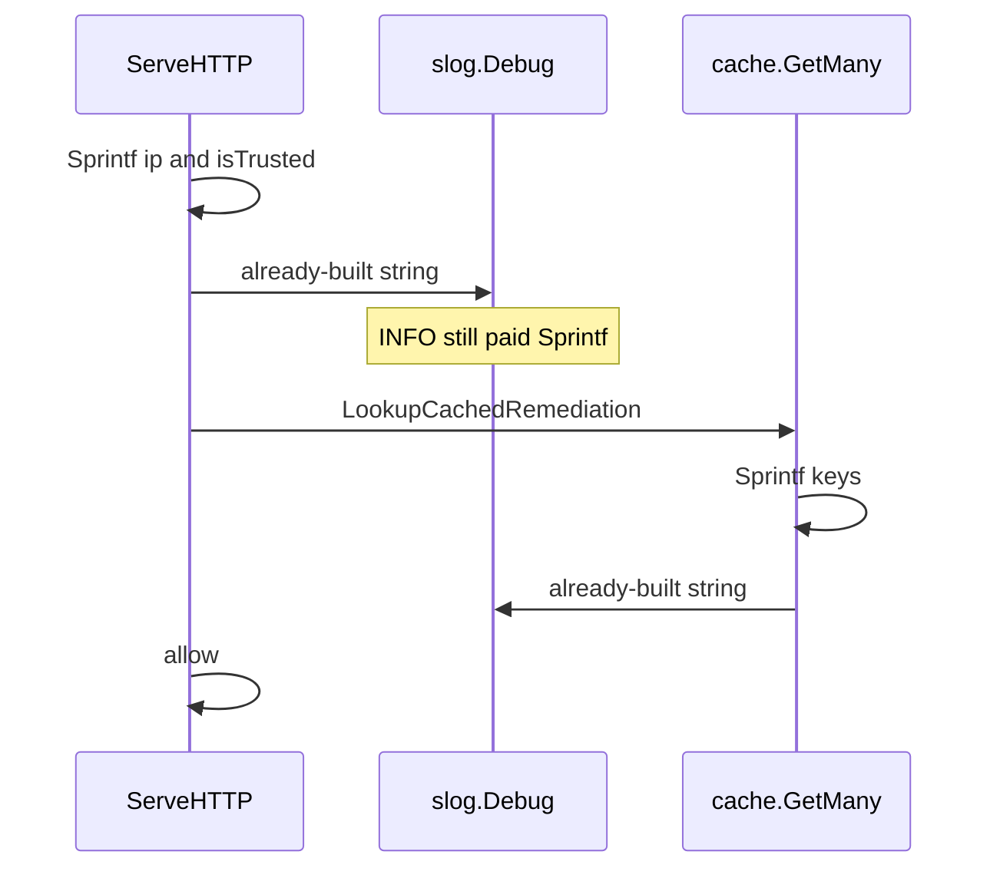

Developer review: ready for review — 2026-09-18T18:20:45Z

## What this changes
**Operators.** None.

**Admin users.** None.

**Developers.** `ServeHTTP` and `cache.Client` Get/GetMany/Set/Delete Debug now use slog attributes, so INFO does not `Sprintf` those strings. Usage packet and spec `std_go_logger_debug-attrs`. Hunt tests assert DEBUG stems plus fields.

**End users.** None.

## Motivation
Stream mode with the in-memory cache looks up a decision on every request, then allows when the cache says none. On `master`, that allow still builds debug strings first: `ServeHTTP` calls `fmt.Sprintf` for `ip` and `isTrusted` before the cache lookup, and `cache.Client` Get/GetMany (and Set/Delete) do the same. `slog.Debug` receives an already-built string, so INFO still pays `Sprintf`.

Ticket measure (compiled Go, logs to NUL): INFO allow 524 ns; DEBUG allow 2015 ns. High-traffic proxies must not run `logLevel` DEBUG, but the INFO path still allocates those strings.

If we do not merge, every stream allow keeps that formatting cost. The ticket does not ask to change log levels or logger file/format.

## Merge readiness
CI on this head succeeded. 0 items remain.

Priority: P2 — INFO allow still formats debug strings on every stream request
Reviewed head: 5255216
Owner decision: Required. See Decision needed.

## Review scores
| Measure | Result | What it means |
| --- | --- | --- |
| Overall readiness | 6/6 | OPEN PR; all required checks succeeded |
| CI proof | 6/6 | succeeded https://github.com/david-garcia-garcia/crowdsec-bouncer-traefik-plugin/actions/runs/35379182689 |
| Local tests proof | N/A | Remote PR; CI proof covers remote |
| Review resolution | 6/6 | OPEN PR #108; no reviewer comments |

## Verification
| Check | Result | Evidence |
| --- | --- | --- |
| Branch | 2026-09-18-lazy-debug-log pushed | `git` / pr-host |
| OpenSpec | lazy-debug-hot-path | `openspec/` |
| Pull request | https://github.com/david-garcia-garcia/crowdsec-bouncer-traefik-plugin/pull/108 | pr-host List |
| CI | e2e (docker + pester) success https://github.com/david-garcia-garcia/crowdsec-bouncer-traefik-plugin/actions/runs/35379182592/job/105711016504 ; e2e (binary + mock LAPI) success https://github.com/david-garcia-garcia/crowdsec-bouncer-traefik-plugin/actions/runs/35379182592/job/105711016172 ; Main Process success https://github.com/david-garcia-garcia/crowdsec-bouncer-traefik-plugin/actions/runs/35379182689/job/105711011704 ; Race detector success https://github.com/david-garcia-garcia/crowdsec-bouncer-traefik-plugin/actions/runs/35379182689/job/105711011103 | pr-host CI |
| Local tests | passed | handoff.yaml localTests |
| PR comments | no comments | no `comments.md` |

## Specs
- [std_go_logger_debug-attrs](https://github.com/david-garcia-garcia/crowdsec-bouncer-traefik-plugin/blob/2026-09-18-lazy-debug-log/openspec/changes/archive/2026-09-18-lazy-debug-hot-path/proposal.md) — added

## Follow-up issues
None.

## How this fits together
Local ticket `2026-09-18-lazy-debug-log` runs on branch `2026-09-18-lazy-debug-log` as PR #108. Title is ready; CI on this head succeeded.

## Decision needed
| Question | Decision | By |
| --- | --- | --- |
| slog attributes or `Enabled` before `Sprintf` on the hot path? | assumed — slog attributes. Same fields, recognizable message stems, no `ctx`, no format string on INFO. | explore |
| Must Set/Delete change in the same apply (ticket names them; desired says Get/GetMany at minimum)? | assumed — yes. They share the Debug `Sprintf` pattern on `cache.Client`. Leave `cache.New`. | explore |
| Which other ServeHTTP Debug lines change for Symmetry? | assumed — every Debug `Sprintf`/`+` in `ServeHTTP`. Leave `handleRemediationServeHTTP` and AppSec Debug. Leave Error/Warn. | explore |
| Re-measure ticket ns (INFO 524 / DEBUG 2015) before proposing? | assumed — no. Call sites match. Implement adds tests that INFO does not emit Debug; do not require a committed benchmark. | explore |
| Write a stdlib slog research folder? | assumed — no. Evaluation-before-Enabled is stdlib; ticket already states it. | explore |

## Before merge
- [x] [P2] On `ServeHTTP` and cache Get/GetMany (at minimum), do not evaluate `fmt.Sprintf` unless Debug is enabled; keep the fields.
- [x] CI on this head succeeded.

## Findings
None.

## Axis review
[Standards](https://github.com/david-garcia-garcia/crowdsec-bouncer-traefik-plugin/blob/2026-09-18-lazy-debug-log/devstate/2026/09/2026-09-18-lazy-debug-log/codereview_standards.md) — 0 total, 0 pending, 0 completed
[Spec](https://github.com/david-garcia-garcia/crowdsec-bouncer-traefik-plugin/blob/2026-09-18-lazy-debug-log/devstate/2026/09/2026-09-18-lazy-debug-log/codereview_spec.md) — 0 total, 0 pending, 0 completed
[Security](https://github.com/david-garcia-garcia/crowdsec-bouncer-traefik-plugin/blob/2026-09-18-lazy-debug-log/devstate/2026/09/2026-09-18-lazy-debug-log/codereview_security.md) — 0 total, 0 pending, 0 completed
[Performance](https://github.com/david-garcia-garcia/crowdsec-bouncer-traefik-plugin/blob/2026-09-18-lazy-debug-log/devstate/2026/09/2026-09-18-lazy-debug-log/codereview_performance.md) — 0 total, 0 pending, 0 completed
[Dead](https://github.com/david-garcia-garcia/crowdsec-bouncer-traefik-plugin/blob/2026-09-18-lazy-debug-log/devstate/2026/09/2026-09-18-lazy-debug-log/codereview_dead.md) — 0 total, 0 pending, 0 completed
[Test coverage](https://github.com/david-garcia-garcia/crowdsec-bouncer-traefik-plugin/blob/2026-09-18-lazy-debug-log/devstate/2026/09/2026-09-18-lazy-debug-log/codereview_coverage.md) — 0 total, 0 pending, 0 completed

## Agent review details

### Review metrics
| Metric | Value | Why it matters |
| --- | --- | --- |
| Specs in this PR | 1 added / 0 modified | Same list as ## Specs |
| Open reviewer comments walked | 0 FIX / 0 ANSWER / 0 open | Unanswered review is merge risk |
| Reviewed head | 52552167e0c07241112f4bd81f05b7c552ab03f3 | Card must match the branch you measured |

### Stored data model
None.

### Technical review
Best possible solution: DestBranch `Sprintf`s before `Debug`. This head passes existing values as slog attributes and documents that pattern.

Do we have a high-confidence way to reproduce? Yes — DestBranch call sites `Sprintf` then `Debug`. Local tests passed. Six-axis review: none. CI succeeded.

Is this the best way to solve the issue? Yes versus DestBranch: slog attributes so INFO does not format those strings.

### Evidence
What I checked:
- Product apply: slog attributes on ServeHTTP and cache Get/GetMany/Set/Delete
- Hunt tests in `pkg/cache` and `pkg/bouncer`
- Spec `std_go_logger_debug-attrs` archived
- OPEN PR #108 titled `⚡ perf(logger): skip Debug Sprintf on the request allow path`
- CI on 5255216: four checks success (pr-host check runs)

### Rank-up moves
None.
