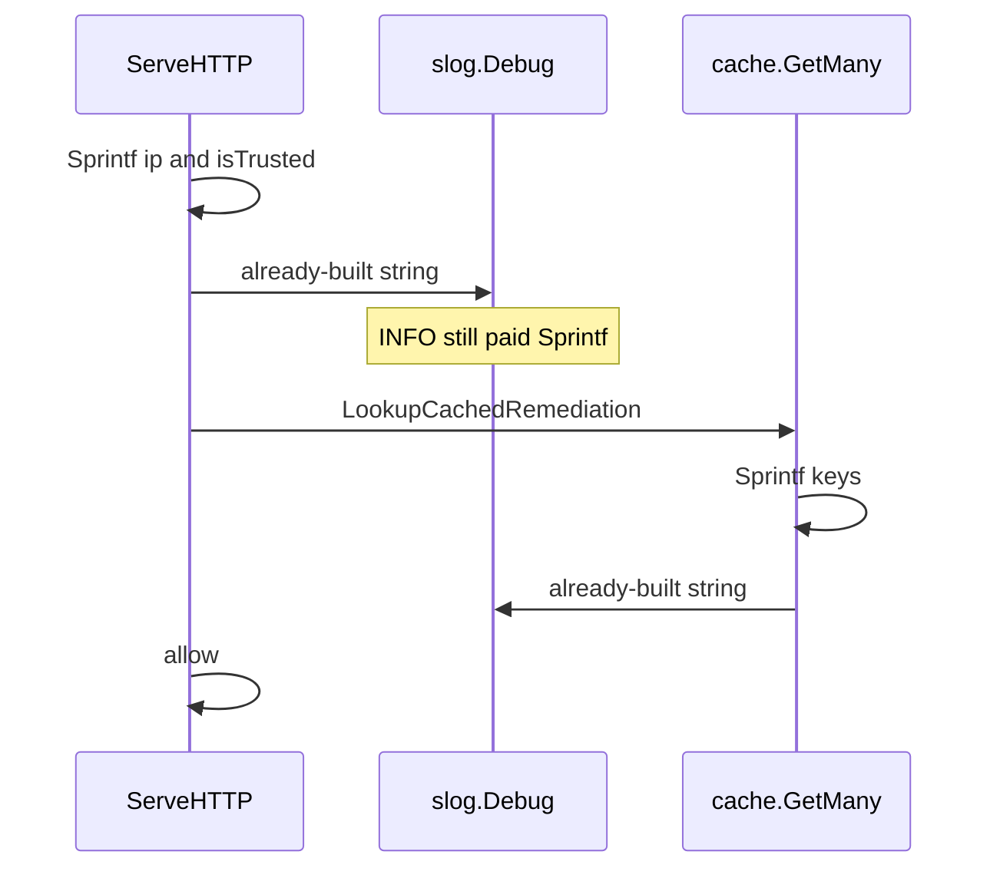

Developer review: in progress — 2026-09-18T18:02:35Z

## What this changes
**Operators.** None.

**Admin users.** None.

**Developers.** None.

**End users.** None.

## Motivation
Stream mode with the in-memory cache looks up a decision on every request, then allows when the cache says none. On `master`, that allow still builds debug strings first: `ServeHTTP` calls `fmt.Sprintf` for `ip` and `isTrusted` before the cache lookup, and `cache.Client` Get/GetMany (and Set/Delete) do the same. `slog.Debug` receives an already-built string, so INFO still pays `Sprintf`.

Ticket measure (compiled Go, logs to NUL): INFO allow 524 ns; DEBUG allow 2015 ns. High-traffic proxies must not run `logLevel` DEBUG, but the INFO path still allocates those strings.

If we do not merge, every stream allow keeps that formatting cost. The ticket does not ask to change log levels or logger file/format.

## Merge readiness
Explore written; product apply has not started. 2 items remain.

Priority: P2 — INFO allow still formats debug strings on every stream request
Reviewed head: f4cd3d6
Owner decision: Required. See Decision needed.

## Review scores
| Measure | Result | What it means |
| --- | --- | --- |
| Overall readiness | 3/6 | Stub PR is open; CI is in progress; no product apply yet |
| CI proof | 3/6 | in progress https://github.com/david-garcia-garcia/crowdsec-bouncer-traefik-plugin/actions/runs/35377630557 |
| Local tests proof | N/A | Remote PR; CI proof covers remote |
| Review resolution | 6/6 | OPEN PR #108; no reviewer comments |

## Verification
| Check | Result | Evidence |
| --- | --- | --- |
| Branch | 2026-09-18-lazy-debug-log pushed | `git` / pr-host |
| OpenSpec | none | `openspec/` |
| Pull request | https://github.com/david-garcia-garcia/crowdsec-bouncer-traefik-plugin/pull/108 | pr-host List |
| CI | e2e (docker + pester) in progress https://github.com/david-garcia-garcia/crowdsec-bouncer-traefik-plugin/actions/runs/35377630465/job/105706225954 ; e2e (binary + mock LAPI) success https://github.com/david-garcia-garcia/crowdsec-bouncer-traefik-plugin/actions/runs/35377630465/job/105706225554 ; Race detector success https://github.com/david-garcia-garcia/crowdsec-bouncer-traefik-plugin/actions/runs/35377630557/job/105705997660 ; Main Process in progress https://github.com/david-garcia-garcia/crowdsec-bouncer-traefik-plugin/actions/runs/35377630557/job/105705997215 | pr-host CI |
| Local tests | none | handoff.yaml localTests |
| PR comments | no comments | no `comments.md` |

## Specs
None.

## Follow-up issues
None.

## How this fits together
Local ticket `2026-09-18-lazy-debug-log` runs on branch `2026-09-18-lazy-debug-log` as PR #108. Explore is written; propose is next.

## Decision needed
| Question | Decision | By |
| --- | --- | --- |
| slog attributes or `Enabled` before `Sprintf` on the hot path? | assumed — slog attributes. Same fields, recognizable message stems, no `ctx`, no format string on INFO. | explore |
| Must Set/Delete change in the same apply (ticket names them; desired says Get/GetMany at minimum)? | assumed — yes. They share the Debug `Sprintf` pattern on `cache.Client`. Leave `cache.New`. | explore |
| Which other ServeHTTP Debug lines change for Symmetry? | assumed — every Debug `Sprintf`/`+` in `ServeHTTP`. Leave `handleRemediationServeHTTP` and AppSec Debug. Leave Error/Warn. | explore |
| Re-measure ticket ns (INFO 524 / DEBUG 2015) before proposing? | assumed — no. Call sites match. Implement adds tests that INFO does not emit Debug; do not require a committed benchmark. | explore |
| Write a stdlib slog research folder? | assumed — no. Evaluation-before-Enabled is stdlib; ticket already states it. | explore |

## Before merge
- [ ] [P2] On `ServeHTTP` and cache Get/GetMany (at minimum), do not evaluate `fmt.Sprintf` unless Debug is enabled; keep the fields.
- [ ] CI on this head succeeded.

## Findings
None.

## Axis review
None.

## Agent review details

### Review metrics
| Metric | Value | Why it matters |
| --- | --- | --- |
| Specs in this PR | none | Same list as ## Specs |
| Open reviewer comments walked | 0 FIX / 0 ANSWER / 0 open | Unanswered review is merge risk |
| Reviewed head | f4cd3d6c2b6d3dd411c6dc1639f26ac2a70932b1 | Card must match the branch you measured |

### Stored data model
None.

### Technical review
Best possible solution: Not applied yet. DestBranch still `Sprintf`s before `Debug` on the stream allow path.

Do we have a high-confidence way to reproduce? Yes — read `pkg/bouncer/bouncer.go` and `pkg/cache/cache.go`; `Sprintf` runs before `Debug`. Ticket ns numbers were not re-measured.

Is this the best way to solve the issue? Yes versus DestBranch: slog attributes so INFO does not format those strings. Do not replace slog or change default `logLevel`.

### Evidence
What I checked:
- Dest `origin/master` `46a81d0a52663d922f27b04b66f390f7b952da29` has `pkg/bouncer`, `pkg/cache`, `pkg/logger`
- `ServeHTTP` `Sprintf` then Debug before cache lookup (`pkg/bouncer/bouncer.go`)
- `cache.Client` Get/GetMany/Set/Delete `Sprintf` then Debug (`pkg/cache/cache.go`)
- Logger is stdlib `*slog.Logger` with default INFO (`pkg/logger/logger.go`)
- Stream/live/alone cache consult uses `GetMany` (`pkg/decisionscope/lookup.go`)
- Explore written (`devstate/explore.md`); slog attributes + Set/Delete + ServeHTTP Debug siblings assumed
- OPEN PR #108; comment inventory empty (pr-host)
- CI on this head: two success, two in progress (pr-host check runs)

### Rank-up moves
None.
