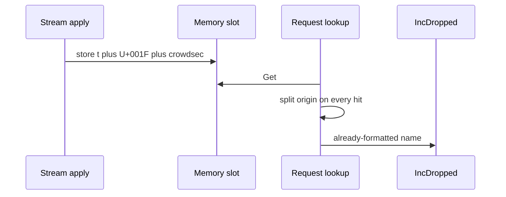

Developer review: ready for review — 2026-09-18T18:05:14Z

## What this changes
**Operators.** None.

**Admin users.** None.

**Developers.** Stream/alone memory remediations intern `MetricsOrigin` on the DecisionStore table and store a packed kind-plus-origin-id word; request lookup returns kind plus stored payload and resolves origin only on drop; Redis and live/none stay leftover strings; `active_decisions` slots compact onto that same table; catalog now has `core_cache_client_origin-dictionary` plus folded DecisionStore, Decision scopes, and usage-metrics leaves; the OpenSpec change is archived.

**End users.** None.

## Motivation
Stream/alone at hundreds of thousands of Ip decisions stores each usage-metrics origin twice on DestBranch: once concatenated onto every ttl_map / `range-index` value (`t` + U+001F + origin), and once again as a string on `activeDecisionSlots`. Probe RSS sits around 108–115 MiB at ~400K decisions, and there is no public knob to shrink that.

On DestBranch, `LookupCachedRemediation` always splits the origin name on the request path, including allow-through captcha hits that never call `IncDropped`. Not merging leaves that per-decision string tax on every stream poll and keeps drop labels coupled to a formatted leftover on every cache hit.

## Merge readiness
CI succeeded on the reviewed head; no open PR comments. 0 items remain.

Priority: P2 — operator RSS pain at large stream memory, with more RAM as the workaround
Reviewed head: 3bad8c7
Owner decision: Required. See Decision needed.

## Review scores
| Measure | Result | What it means |
| --- | --- | --- |
| Overall readiness | 6/6 | CI succeeded and the comment checklist is empty |
| CI proof | 6/6 | succeeded — [35377341157](https://github.com/david-garcia-garcia/crowdsec-bouncer-traefik-plugin/actions/runs/35377341157) |
| Local tests proof | N/A | remote PR; CI proof covers this |
| Review resolution | 6/6 | no open PR comments |

## Verification
| Check | Result | Evidence |
| --- | --- | --- |
| Branch | 2026-09-18-pack-decision-origin pushed | `git` `3bad8c7` |
| OpenSpec | pack-decision-origin | `openspec/changes/archive/2026-09-18-pack-decision-origin/` |
| Pull request | https://github.com/david-garcia-garcia/crowdsec-bouncer-traefik-plugin/pull/99 | pr-host List |
| CI | build 35377341157 succeeded https://github.com/david-garcia-garcia/crowdsec-bouncer-traefik-plugin/actions/runs/35377341157 | GitHub check runs (Main Process, Race detector, both e2e jobs) |
| Local tests | passed | handoff.yaml localTests |
| PR comments | no comments | comments: none |

## Specs
- [core_cache_client_origin-dictionary](https://github.com/david-garcia-garcia/crowdsec-bouncer-traefik-plugin/blob/2026-09-18-pack-decision-origin/openspec/changes/archive/2026-09-18-pack-decision-origin/proposal.md) — added
- [core_cache_client_decision-store](https://github.com/david-garcia-garcia/crowdsec-bouncer-traefik-plugin/blob/2026-09-18-pack-decision-origin/openspec/changes/archive/2026-09-18-pack-decision-origin/proposal.md) — modified
- [core_plugin_decisions_scopes](https://github.com/david-garcia-garcia/crowdsec-bouncer-traefik-plugin/blob/2026-09-18-pack-decision-origin/openspec/changes/archive/2026-09-18-pack-decision-origin/proposal.md) — modified
- [core_plugin_lapi_usage-metrics](https://github.com/david-garcia-garcia/crowdsec-bouncer-traefik-plugin/blob/2026-09-18-pack-decision-origin/openspec/changes/archive/2026-09-18-pack-decision-origin/proposal.md) — modified

## Follow-up issues
None.

## How this fits together
Local ticket `2026-09-18-pack-decision-origin` is this branch and [PR 99](https://github.com/david-garcia-garcia/crowdsec-bouncer-traefik-plugin/pull/99); the change is archived and CI succeeded on `3bad8c7`.

## Decision needed
| Question | Decision | By |
| --- | --- | --- |
| How do packed memory values coexist with string `cacheInterface` and Redis full-string writes without a second lock on `Get`? | assumed — `localCache` stores `uint32` in ttl_map; Redis still writes the leftover string; `table[id]` runs only on drop | propose |
| Origin-id width and overflow when `lists:<scenario>` cardinality is large? | assumed — `uint16` (65535 names); overflow stays on the leftover string path and logs once | explore |
| Do Range `range-index` blob lines pack the same way as per-IP ttl_map values? | assumed — yes on the memory path; Redis may still persist the full suffix | explore |

## Before merge
None.

## Findings
None.

## Axis review
[Standards](https://github.com/david-garcia-garcia/crowdsec-bouncer-traefik-plugin/blob/2026-09-18-pack-decision-origin/devstate/2026/09/2026-09-18-pack-decision-origin/codereview_standards.md) — 11 total, 0 pending, 11 completed
[Spec](https://github.com/david-garcia-garcia/crowdsec-bouncer-traefik-plugin/blob/2026-09-18-pack-decision-origin/devstate/2026/09/2026-09-18-pack-decision-origin/codereview_spec.md) — 1 total, 0 pending, 1 completed
[Security](https://github.com/david-garcia-garcia/crowdsec-bouncer-traefik-plugin/blob/2026-09-18-pack-decision-origin/devstate/2026/09/2026-09-18-pack-decision-origin/codereview_security.md) — 0 total, 0 pending, 0 completed
[Performance](https://github.com/david-garcia-garcia/crowdsec-bouncer-traefik-plugin/blob/2026-09-18-pack-decision-origin/devstate/2026/09/2026-09-18-pack-decision-origin/codereview_performance.md) — 0 total, 0 pending, 0 completed
[Dead](https://github.com/david-garcia-garcia/crowdsec-bouncer-traefik-plugin/blob/2026-09-18-pack-decision-origin/devstate/2026/09/2026-09-18-pack-decision-origin/codereview_dead.md) — 1 total, 0 pending, 1 completed
[Test coverage](https://github.com/david-garcia-garcia/crowdsec-bouncer-traefik-plugin/blob/2026-09-18-pack-decision-origin/devstate/2026/09/2026-09-18-pack-decision-origin/codereview_coverage.md) — 4 total, 0 pending, 3 completed, 1 skipped

## Agent review details

### Review metrics
| Metric | Value | Why it matters |
| --- | --- | --- |
| Specs in this PR | 1 added / 3 modified | Same list as ## Specs; do not paste diff --stat |
| Open reviewer comments walked | 0 FIX / 0 ANSWER / 0 open | Unanswered review is merge risk |
| Reviewed head | 3bad8c7d301e9638c07120ca028226560f6773be | Card must match the branch you measured |

### Stored data model
None.

### Technical review
Best possible solution: intern on the shared DecisionStore and pack only stream/alone memory, leaving Redis and live leftover — that is the DestBranch gap without a Redis intern table or dropping `activeDecisionSlots`.

Do we have a high-confidence way to reproduce? Yes, packed store/lookup/drop tests and overflow leftover POST labels.

Is this the best way to solve the issue? Yes, one session-scoped table on DecisionStore is the owner both cache ids and compact slots need.

### Evidence
What I checked:
- PR 99 reused; title set to `⚡️ perf(cache): pack stream remediations with interned origin ids` (GitHub MCP `update_pull_request`)
- comments.md absent; comments: none
- Sync `origin/master` already up to date (`46a81d0`)
- All four check runs succeeded: Main Process, Race detector, e2e (binary + mock LAPI), e2e (docker + pester) (GitHub MCP `get_check_runs`, runs `35377341157` and `35377341190`)
- Axis files on disk this Set (Standards 11/0/11, Spec 1/0/1, Security 0, Performance 0, Dead 1/0/1, Coverage 4/0/3 + 1 skipped)

### Rank-up moves
- Add an ipv6 compact-slot `ip_type` assertion (coverage judgement, skipped)
