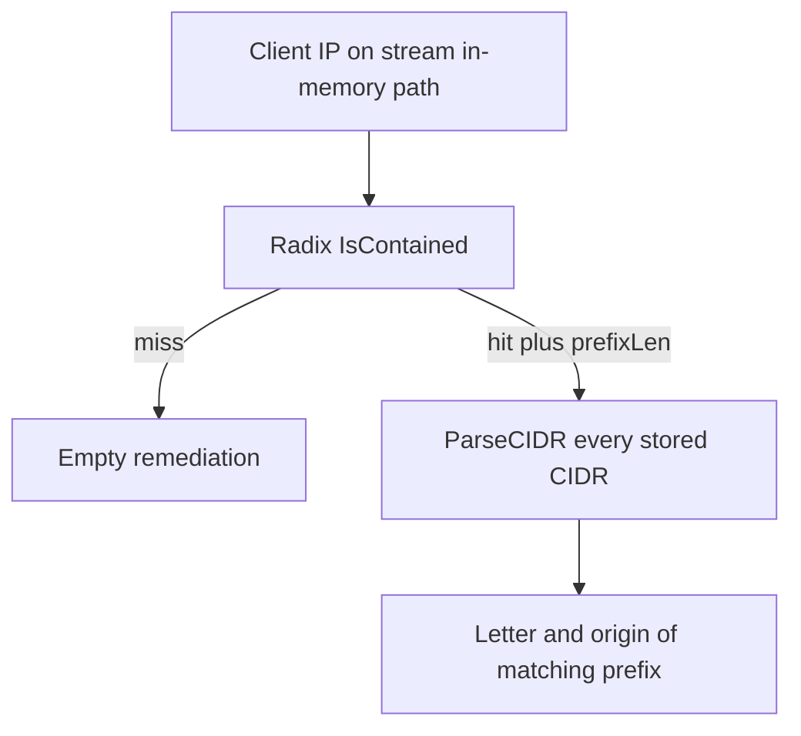

Developer review: in progress — 2026-09-18T18:12:02Z

## What this changes
**Operators.** None.

**Admin users.** None.

**Developers.** A Range helper endpoint now holds the stored letter and optional origin so a stream in-memory hit is O(prefix). Trusted-IP Checker stays a boolean set.

**End users.** None.

## Motivation
On DestBranch, stream mode with the in-memory DecisionStore already knows the winning Range prefix from the radix walk. It then re-parses every stored CIDR to recover the letter and optional origin of that prefix. A miss skips that walk; a hit does not.

That second scan is the request-path cost. Reproduced here (compiled Go, 1k CIDRs): a hit is about 53µs and 2012 allocs; a miss is 26 ns and zero allocs. Not merging leaves every Range ban or captcha paying that linear parse on the hot path.

## Merge readiness
Apply landed; required CI is still queued. 1 item remains.

Priority: P2 — request-path latency on every Range hit, limited to stream plus in-memory
Reviewed head: 1a6ff5f
Owner decision: None.

## Review scores
| Measure | Result | What it means |
| --- | --- | --- |
| Overall readiness | 3/6 | Apply is on the PR; required CI is still queued |
| CI proof | 3/6 | Checks queued on the implement head |
| Local tests proof | N/A | Remote CI is the proof axis; local `go test ./pkg/...` passed |
| Review resolution | 6/6 | No open PR comments |

## Verification
| Check | Result | Evidence |
| --- | --- | --- |
| Branch | 2026-09-18-range-hit-origin pushed | `git` origin/2026-09-18-range-hit-origin |
| OpenSpec | store-range-remediation-on-radix | `openspec/changes/store-range-remediation-on-radix/` |
| Pull request | https://github.com/david-garcia-garcia/crowdsec-bouncer-traefik-plugin/pull/106 | pr-host List |
| CI | build 35378720442 queued https://github.com/david-garcia-garcia/crowdsec-bouncer-traefik-plugin/actions/runs/35378720442 | GitHub Actions API |
| Local tests | passed | handoff.yaml localTests; `go test ./pkg/... -count=1` |
| PR comments | no comments | no comments.md; inventory empty |

## Specs
- [core_plugin_ip_radix-lookup](https://github.com/david-garcia-garcia/crowdsec-bouncer-traefik-plugin/blob/2026-09-18-range-hit-origin/openspec/changes/store-range-remediation-on-radix/proposal.md) — modified
- [core_plugin_decisions_scopes](https://github.com/david-garcia-garcia/crowdsec-bouncer-traefik-plugin/blob/2026-09-18-range-hit-origin/openspec/changes/store-range-remediation-on-radix/proposal.md) — modified

## Follow-up issues
None.

## How this fits together
Local ticket 2026-09-18-range-hit-origin is on branch 2026-09-18-range-hit-origin and stub PR 106. Range hit now reads the stored string from the winning endpoint; CI is queued on 1a6ff5f.

## Decision needed
None.

## Before merge
- [ ] Required CI must succeed on 1a6ff5f

## Findings
None.

## Axis review
None.

## Agent review details

### Review metrics
| Metric | Value | Why it matters |
| --- | --- | --- |
| Specs in this PR | 0 added / 2 modified | Same list as ## Specs; do not paste diff --stat |
| Open reviewer comments walked | 0 FIX / 0 ANSWER / 0 open | Unanswered review is merge risk |
| Reviewed head | 1a6ff5fae47f12804a1a0a5deceb201cfbcdf9ee | Card must match the branch you measured |

### Stored data model
None.

### Technical review
Best possible solution versus DestBranch: store the blob line on the radix endpoint and drop the request-path ParseCIDR walk.

Do we have a high-confidence way to reproduce? Yes, DestBranch `storedMatchingPrefix` 1k-CIDR hit 52797 ns/op 2012 allocs/op; after apply, membership tests including mapped last-insert and longest-prefix origin pass.

Is this the best way to solve the issue? Yes — `AddCIDRRemediation` / `ContainedRemediation` on the existing helper; two trees so ban still wins.

### Evidence
What I checked:
- `go test ./pkg/... -count=1` passed
- `go vet ./pkg/iplookup ./pkg/decisionscope` passed
- `TestMembershipFromIndexMappedLastInsertWins` and existing origin/ban-over-captcha locks

### Rank-up moves
None.
