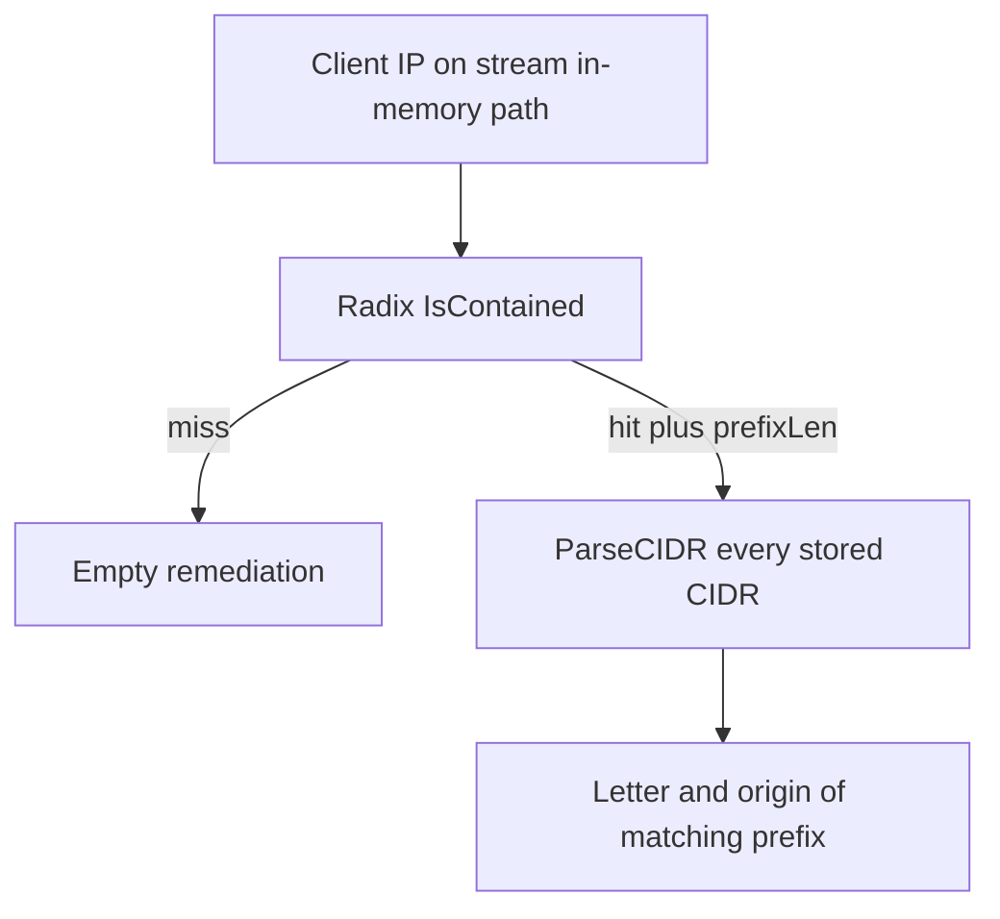

Developer review: in progress — 2026-09-18T18:08:20Z

## What this changes
**Operators.** None.

**Admin users.** None.

**Developers.** Propose `store-range-remediation-on-radix`: a Range helper endpoint MAY hold the stored letter and optional origin; trusted-IP Checker stays a boolean set.

**End users.** None.

## Motivation
On DestBranch, stream mode with the in-memory DecisionStore already knows the winning Range prefix from the radix walk. It then re-parses every stored CIDR to recover the letter and optional origin of that prefix. A miss skips that walk; a hit does not.

That second scan is the request-path cost. Reproduced here (compiled Go, 1k CIDRs): a hit is about 53µs and 2012 allocs; a miss is 26 ns and zero allocs. Not merging leaves every Range ban or captcha paying that linear parse on the hot path.

## Merge readiness
Propose is apply-ready; product apply has not started. 1 item remains.

Priority: P2 — request-path latency on every Range hit, limited to stream plus in-memory
Reviewed head: 0d8f83d
Owner decision: Required. See Decision needed.

## Review scores
| Measure | Result | What it means |
| --- | --- | --- |
| Overall readiness | 3/6 | Stub PR is open; required CI is still queued |
| CI proof | 3/6 | Checks queued on the propose head |
| Local tests proof | N/A | Before implement; remote CI is the proof axis |
| Review resolution | 6/6 | No open PR comments |

## Verification
| Check | Result | Evidence |
| --- | --- | --- |
| Branch | 2026-09-18-range-hit-origin pushed | `git` origin/2026-09-18-range-hit-origin |
| OpenSpec | store-range-remediation-on-radix | `openspec/changes/store-range-remediation-on-radix/` |
| Pull request | https://github.com/david-garcia-garcia/crowdsec-bouncer-traefik-plugin/pull/106 | pr-host List |
| CI | build 35378384010 queued https://github.com/david-garcia-garcia/crowdsec-bouncer-traefik-plugin/actions/runs/35378384010 | GitHub Actions API |
| Local tests | none | handoff.yaml localTests |
| PR comments | no comments | no comments.md; inventory empty |

## Specs
- [core_plugin_ip_radix-lookup](https://github.com/david-garcia-garcia/crowdsec-bouncer-traefik-plugin/blob/2026-09-18-range-hit-origin/openspec/changes/store-range-remediation-on-radix/proposal.md) — modified
- [core_plugin_decisions_scopes](https://github.com/david-garcia-garcia/crowdsec-bouncer-traefik-plugin/blob/2026-09-18-range-hit-origin/openspec/changes/store-range-remediation-on-radix/proposal.md) — modified

## Follow-up issues
None.

## How this fits together
Local ticket 2026-09-18-range-hit-origin is on branch 2026-09-18-range-hit-origin and stub PR 106. OpenSpec change `store-range-remediation-on-radix` is apply-ready; implement has not started.

## Decision needed
| Question | Decision | By |
| --- | --- | --- |
| Does `storedByCIDR` remain after the endpoint holds the string? | assumed — drop it; hydrate writes the string onto the node | explore |
| Does a prefixLen vs stored-key `ones` mismatch still need `storedMatchingPrefix`? | assumed — no; store the string on the same endpoint `contains` reports | explore |
| When two blob keys occupy the same remapped endpoint, which stored string wins? | assumed — last successful insert of that kind wins (blob order) | explore |

## Before merge
- [ ] Put the stored Range letter and optional origin on the radix endpoint so a stream in-memory hit is O(prefix)

## Findings
None.

## Axis review
None.

## Agent review details

### Review metrics
| Metric | Value | Why it matters |
| --- | --- | --- |
| Specs in this PR | 0 added / 2 modified | Same list as ## Specs; do not paste diff --stat |
| Open reviewer comments walked | 0 FIX / 0 ANSWER / 0 open | Unanswered review is merge risk |
| Reviewed head | 0d8f83d8132ffbefc1d108c568cf4d94020010e0 | Card must match the branch you measured |

### Stored data model
None.

### Technical review
Best possible solution: DestBranch still recovers origin by walking every stored CIDR after the radix already has the winning prefix.

Do we have a high-confidence way to reproduce? Yes, measured `storedMatchingPrefix` on 1k CIDRs: hit 52797 ns/op 2012 allocs/op; miss 26.19 ns/op 0 allocs.

Is this the best way to solve the issue? Yes — `AddCIDRRemediation` / `ContainedRemediation` on the existing helper; keep two trees so ban still wins.

### Evidence
What I checked:
- `openspec validate store-range-remediation-on-radix --strict` passed
- Product delta vs `origin/master` is the OpenSpec change plus radix-lookup Purpose
- FindSpecHost fold `core_plugin_ip_radix-lookup` and `core_plugin_decisions_scopes`

### Rank-up moves
None.
