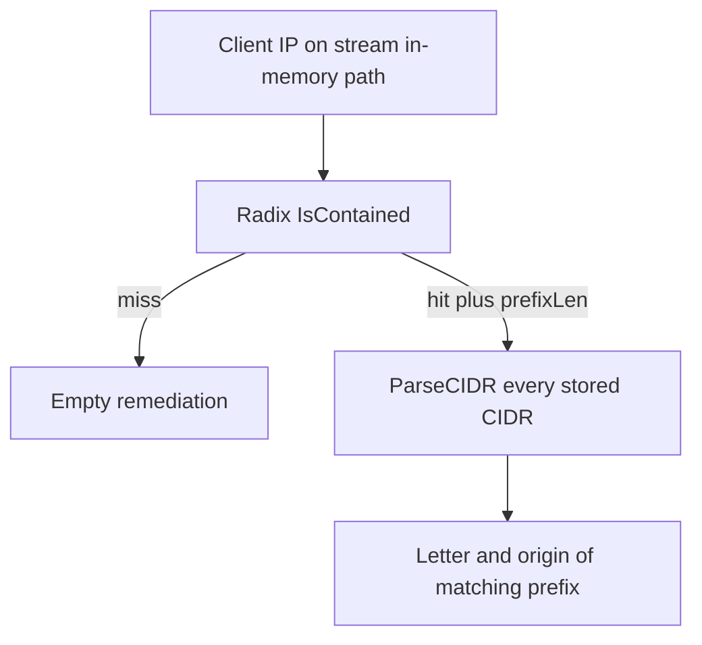

Developer review: in progress — 2026-09-18T18:04:07Z

## What this changes
**Operators.** None.

**Admin users.** None.

**Developers.** None.

**End users.** None.

## Motivation
On DestBranch, stream mode with the in-memory DecisionStore already knows the winning Range prefix from the radix walk. It then re-parses every stored CIDR to recover the letter and optional origin of that prefix. A miss skips that walk; a hit does not.

That second scan is the request-path cost. Reproduced here (compiled Go, 1k CIDRs): a hit is about 53µs and 2012 allocs; a miss is 26 ns and zero allocs. Ticket-measured 10k hits are about 450µs and 20k allocs. Not merging leaves every Range ban or captcha paying that linear parse on the hot path.

## Merge readiness
Explore is written; product apply has not started. 1 item remains.

Priority: P2 — request-path latency on every Range hit, limited to stream plus in-memory
Reviewed head: 8203915
Owner decision: Required. See Decision needed.

## Review scores
| Measure | Result | What it means |
| --- | --- | --- |
| Overall readiness | 3/6 | Stub PR is open; required CI is still running |
| CI proof | 3/6 | Checks in progress on the explore head |
| Local tests proof | N/A | Before implement; remote CI is the proof axis |
| Review resolution | 6/6 | No open PR comments |

## Verification
| Check | Result | Evidence |
| --- | --- | --- |
| Branch | 2026-09-18-range-hit-origin pushed | `git` origin/2026-09-18-range-hit-origin |
| OpenSpec | none | `openspec/` |
| Pull request | https://github.com/david-garcia-garcia/crowdsec-bouncer-traefik-plugin/pull/106 | pr-host List |
| CI | build 35377885653 in progress https://github.com/david-garcia-garcia/crowdsec-bouncer-traefik-plugin/actions/runs/35377885653 | GitHub Actions API |
| Local tests | none | handoff.yaml localTests |
| PR comments | no comments | no comments.md; inventory empty |

## Specs
None.

## Follow-up issues
None.

## How this fits together
Local ticket 2026-09-18-range-hit-origin is on branch 2026-09-18-range-hit-origin and stub PR 106. Explore recorded the Range-hit cliff and the two-tree payload plan; propose has not started.

## Decision needed
| Question | Decision | By |
| --- | --- | --- |
| Does `Helper.AddCIDR` grow an optional payload, or is a new insert path added? | assumed — new insert path; `AddCIDR` stays boolean so Checker stays a CIDR set | explore |
| Does `storedByCIDR` remain after the endpoint holds the string? | assumed — drop it; hydrate writes the string onto the node | explore |
| Does a prefixLen vs stored-key `ones` mismatch still need `storedMatchingPrefix`? | assumed — no; store the string on the same endpoint `contains` reports | explore |
| When two blob keys occupy the same remapped endpoint, which stored string wins? | assumed — last successful insert of that kind wins (blob order) | explore |

## Before merge
- [ ] Put the stored Range letter and optional origin on the radix endpoint so a stream in-memory hit is O(prefix)

## Findings
None.

## Axis review
None.

## Agent review details

### Review metrics
| Metric | Value | Why it matters |
| --- | --- | --- |
| Specs in this PR | none | Same list as ## Specs; do not paste diff --stat |
| Open reviewer comments walked | 0 FIX / 0 ANSWER / 0 open | Unanswered review is merge risk |
| Reviewed head | 8203915973ca7af045046a1ead91b3b6fc17b0f5 | Card must match the branch you measured |

### Stored data model
None.

### Technical review
Best possible solution: DestBranch still recovers origin by walking every stored CIDR after the radix already has the winning prefix.

Do we have a high-confidence way to reproduce? Yes, `go test` bench of `RangeMembership.Remediation` after `IsContained` calls `storedMatchingPrefix`: 1k-CIDR hit 52797 ns/op 2012 allocs/op; miss 26.19 ns/op 0 allocs.

Is this the best way to solve the issue? Yes for this ticket — store the letter and origin on the endpoint the walk already stops on; keep two trees so ban still wins.

### Evidence
What I checked:
- `go test ./pkg/decisionscope` passed
- Scratch bench then deleted: hit 1k ≈ 53µs / 2012 allocs; miss ≈ 26 ns / 0 allocs
- `radixNode` has no remediation payload (`pkg/iplookup/iplookup.go`)
- Product delta `origin/master...HEAD` excluding `devstate/` is empty

### Rank-up moves
None.
