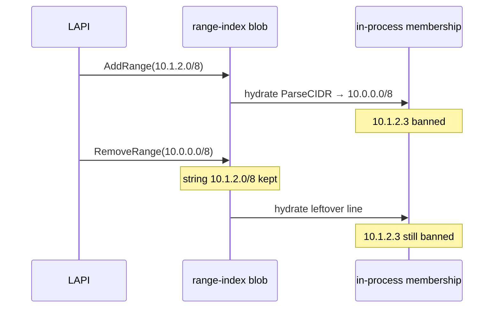

Developer review: in progress — 2026-09-18T16:56:27Z

## What this changes
**Operators.** None.

**Admin users.** None.

**Developers.** OpenSpec change `range-index-same-network-match` folds same-network Range-index line identity onto `core_plugin_decisions_scopes`; the two index loops are not applied yet.

**End users.** None.

## Motivation
Range-index upsert and delete still key a blob line by the raw CIDR string. Membership already parses leftover lines, so a stored `10.1.2.0/8` bans `10.1.2.3`. On master, `RemoveRange(10.0.0.0/8)` does not drop that line. Hydrate rebuilds from the leftover blob, so the client stays banned after CrowdSec deleted the same network.

If this PR does not land, any Range delete whose text is not byte-identical to the stored line leaves the ban in place. Operators have a workaround only when they can replay the exact stored spelling.

## Merge readiness
Propose is apply-ready; product apply has not started. 3 items remain.

Priority: P2 — leftover Range ban after an equivalent-CIDR delete, workaround is the exact stored spelling
Reviewed head: 56bdcd8
Owner decision: Required. See Decision needed.

## Review scores
| Measure | Result | What it means |
| --- | --- | --- |
| Overall readiness | 3/6 | CI still running; apply not started |
| CI proof | 3/6 | Main Process queued and Race detector in progress on [run 35371352034](https://github.com/david-garcia-garcia/crowdsec-bouncer-traefik-plugin/actions/runs/35371352034) |
| Local tests proof | N/A | Before implement (`localTests: none`) |
| Review resolution | 6/6 | No OPEN PR comments |

## Verification
| Check | Result | Evidence |
| --- | --- | --- |
| Branch | 2026-09-18-range-index-same-network-match pushed | `git` `56bdcd8` |
| OpenSpec | range-index-same-network-match | `openspec/changes/range-index-same-network-match/` |
| Pull request | https://github.com/david-garcia-garcia/crowdsec-bouncer-traefik-plugin/pull/98 | pr-host List/Create |
| CI | build 35371352034 in progress https://github.com/david-garcia-garcia/crowdsec-bouncer-traefik-plugin/actions/runs/35371352034 | pr-host CI |
| Local tests | none | handoff.yaml localTests |
| PR comments | no comments | no comments.md |

## Specs
- [core_plugin_decisions_scopes](https://github.com/david-garcia-garcia/crowdsec-bouncer-traefik-plugin/blob/2026-09-18-range-index-same-network-match/openspec/changes/range-index-same-network-match/proposal.md) — modified

## Follow-up issues
None.

## How this fits together
Local ticket on branch `2026-09-18-range-index-same-network-match` opened stub PR 98 against master. Propose artifacts are on the branch; implement has not started. CI is running on `56bdcd8`.

## Decision needed
| Question | Decision | By |
| --- | --- | --- |
| Does explore write the usage gotcha now? | assumed — no. Current packet usage is enough to call `ApplyRangeBatch`. Documenting same-network identity before the apply would state a contract the tree does not yet keep. Propose the spec delta; usage gotcha on apply or `sbs-dev-devdocsimpact`. | explore |

## Before merge
- [ ] [P2] Same-network compare in `upsertIndexCIDR` and `removeCIDRFromIndex`; persist incoming CIDR text
- [ ] [P2] `AddRange(10.1.2.0/8)` then `RemoveRange(10.0.0.0/8)` clears membership for `10.1.2.3`
- [ ] CI succeeded on this PR
- [x] Stub PR 98 opened
- [x] OpenSpec change `range-index-same-network-match` apply-ready

## Findings
None.

## Axis review
None.

## Agent review details

### Review metrics
| Metric | Value | Why it matters |
| --- | --- | --- |
| Specs in this PR | 0 added / 1 modified | Same list as ## Specs; do not paste diff --stat |
| Open reviewer comments walked | 0 FIX / 0 ANSWER / 0 open | Unanswered review is merge risk |
| Reviewed head | 56bdcd8e1a95134d7c4edb76c641fe160041f5d3 | Card must match the branch you measured |

### Stored data model
None.

### Technical review
Best possible solution: same-network compare in the two index loops plus one helper; keep incoming CIDR text and master's apply read-error contract.

Do we have a high-confidence way to reproduce? Yes, `AddRange(10.1.2.0/8)` then `RemoveRange(10.0.0.0/8)` leaves `10.1.2.3` banned on master.

Is this the best way to solve the issue? Yes versus DestBranch: compare the `*net.IPNet` (masked IP + `Mask.Size()`), not first-IP or persist rewrite, and do not reuse closed PR 92 extras.

### Evidence
What I checked:
- Product `origin/master...HEAD` excluding `devstate/` is the OpenSpec change only (`56bdcd8`)
- FindSpecHost fold `core_plugin_decisions_scopes` (high; also considered `core_plugin_lapi_stream-apply`)
- `openspec validate range-index-same-network-match` 4/4 artifacts complete
- CI check runs on head `56bdcd8`: Main Process queued, Race detector in progress (run 35371352034)
- No PR conversation comments; `comments.md` absent
- Remaining assumed open question is usage-gotcha timing (deferred to apply / devdocsimpact)

### Rank-up moves
None.
