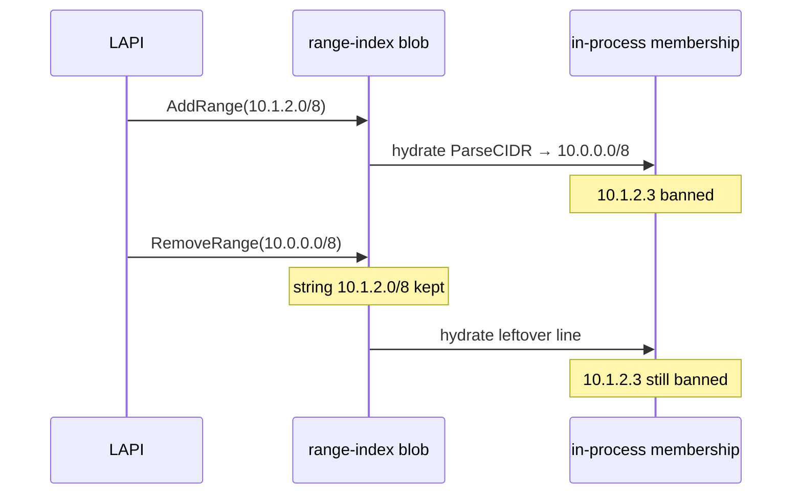

Developer review: in progress — 2026-09-18T16:47:20Z

## What this changes
**Operators.** None.

**Admin users.** None.

**Developers.** None.

**End users.** None.

## Motivation
Range-index upsert and delete still key a blob line by the raw CIDR string. Membership already `ParseCIDR`s, so a stored `10.1.2.0/8` bans `10.1.2.3`. On master, `RemoveRange(10.0.0.0/8)` does not drop that line. Hydrate rebuilds from the leftover blob, so the client stays banned after CrowdSec deleted the same network.

If this PR does not land, any Range delete whose text is not byte-identical to the stored line leaves the ban in place. Operators have a workaround only when they can replay the exact stored spelling.

## Merge readiness
Prepare grounded on a new stub PR; product apply has not started. 3 items remain.

Priority: P2 — leftover Range ban after an equivalent-CIDR delete, workaround is the exact stored spelling
Reviewed head: 388d86f
Owner decision: None.

## Review scores
| Measure | Result | What it means |
| --- | --- | --- |
| Overall readiness | 3/6 | CI still running; no product apply yet |
| CI proof | 3/6 | Main Process and Race detector in progress on [run 35370494079](https://github.com/david-garcia-garcia/crowdsec-bouncer-traefik-plugin/actions/runs/35370494079) |
| Local tests proof | N/A | Before implement (`localTests: none`) |
| Review resolution | 6/6 | No OPEN PR comments |

## Verification
| Check | Result | Evidence |
| --- | --- | --- |
| Branch | 2026-09-18-range-index-same-network-match pushed | `git` `388d86f` |
| OpenSpec | none | `openspec/` |
| Pull request | https://github.com/david-garcia-garcia/crowdsec-bouncer-traefik-plugin/pull/98 | pr-host List/Create |
| CI | build 35370494079 in progress https://github.com/david-garcia-garcia/crowdsec-bouncer-traefik-plugin/actions/runs/35370494079 | pr-host CI |
| Local tests | none | handoff.yaml localTests |
| PR comments | no comments | no comments.md |

## Specs
None.

## Follow-up issues
None.

## How this fits together
Local ticket on branch `2026-09-18-range-index-same-network-match` opened stub PR 98 against master. CI started on the prepare commits; explore has not started.

## Decision needed
None.

## Before merge
- [ ] [P2] Same-network compare in `upsertIndexCIDR` and `removeCIDRFromIndex`; persist incoming CIDR text
- [ ] [P2] `AddRange(10.1.2.0/8)` then `RemoveRange(10.0.0.0/8)` clears membership for `10.1.2.3`
- [ ] CI succeeded on this PR
- [x] Stub PR 98 opened

## Findings
None.

## Axis review
None.

## Agent review details

### Review metrics
| Metric | Value | Why it matters |
| --- | --- | --- |
| Specs in this PR | none | Same list as ## Specs; do not paste diff --stat |
| Open reviewer comments walked | 0 FIX / 0 ANSWER / 0 open | Unanswered review is merge risk |
| Reviewed head | 388d86f1b72bceb942602609d507f95316550493 | Card must match the branch you measured |

### Stored data model
None.

### Technical review
Best possible solution: not applied versus DestBranch; ticket bounds the fix to a same-network compare next to the two index loops.

Do we have a high-confidence way to reproduce? Yes, `AddRange(10.1.2.0/8)` then `RemoveRange(10.0.0.0/8)` leaves `10.1.2.3` banned on master.

Is this the best way to solve the issue? Not applied yet; the ticket forbids persist rewrite and the extras from closed PR 92.

### Evidence
What I checked:
- `upsertIndexCIDR` / `removeCIDRFromIndex` use raw string equality (`pkg/decisionscope/range.go`, dest `86ac926`)
- Membership already `ParseCIDR`s via `AddCIDR` (`pkg/decisionscope/rangemembership.go`, `pkg/iplookup/iplookup.go`)
- Hydrate rebuilds from the blob after `ApplyRangeBatch` (`pkg/lapi/client_stream.go`)
- Unread-base apply tests already exist (`pkg/lapi/zzz_ipcachekey_test.go`)
- Product `origin/master...HEAD` excluding `devstate/` is empty (`388d86f`)
- One OPEN PR 98; comment-id set empty

### Rank-up moves
None.
