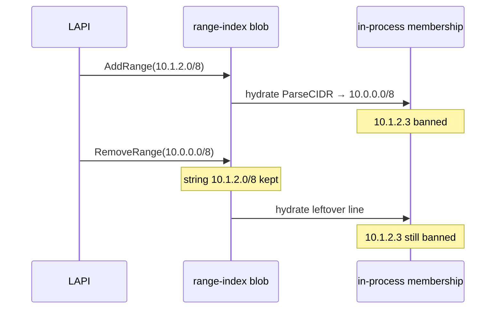

Developer review: ready for review — 2026-09-18T17:05:31Z

## What this changes
**Operators.** None.

**Admin users.** None.

**Developers.** `upsertIndexCIDR` and `removeCIDRFromIndex` treat two CIDR texts as the same `range-index` line when `net.ParseCIDR` yields the same masked IP and `Mask.Size()` ones/bits (`indexCIDRsSameNetwork`); persist stays the incoming spelling.

**End users.** A client such as `10.1.2.3` is allowed again after a Range delete spelled `10.0.0.0/8` when the leftover blob line was `10.1.2.0/8`.

## Motivation
Range-index upsert and delete still key a blob line by the raw CIDR string. Membership already parses leftover lines, so a stored `10.1.2.0/8` bans `10.1.2.3`. On master, `RemoveRange(10.0.0.0/8)` does not drop that line. Hydrate rebuilds from the leftover blob, so the client stays banned after CrowdSec deleted the same network.

If this PR does not land, any Range delete whose text is not byte-identical to the stored line leaves the ban in place. Operators have a workaround only when they can replay the exact stored spelling.

## Merge readiness
Implement landed the same-network compare and CI succeeded on the apply. 0 items remain.

Priority: P2 — leftover Range ban after an equivalent-CIDR delete, workaround is the exact stored spelling
Reviewed head: 0a4130c
Owner decision: None.

## Review scores
| Measure | Result | What it means |
| --- | --- | --- |
| Overall readiness | 6/6 | Apply landed; required checks succeeded; no open PR comments |
| CI proof | 6/6 | Main Process, Race detector, e2e (binary + mock LAPI), and e2e (docker + pester) succeeded on [run 35371741733](https://github.com/david-garcia-garcia/crowdsec-bouncer-traefik-plugin/actions/runs/35371741733) and [run 35371741861](https://github.com/david-garcia-garcia/crowdsec-bouncer-traefik-plugin/actions/runs/35371741861) |
| Local tests proof | N/A | `prHost` remote (CI proof covers remote); handoff `localTests: passed` |
| Review resolution | 6/6 | No OPEN PR comments |

## Verification
| Check | Result | Evidence |
| --- | --- | --- |
| Branch | 2026-09-18-range-index-same-network-match pushed | `git` `0a4130c` |
| OpenSpec | range-index-same-network-match | `openspec/changes/range-index-same-network-match/` |
| Pull request | https://github.com/david-garcia-garcia/crowdsec-bouncer-traefik-plugin/pull/98 | pr-host List/Create |
| CI | build 35371741733 success https://github.com/david-garcia-garcia/crowdsec-bouncer-traefik-plugin/actions/runs/35371741733 ; build 35371741861 success https://github.com/david-garcia-garcia/crowdsec-bouncer-traefik-plugin/actions/runs/35371741861 | pr-host CI |
| Local tests | passed | handoff.yaml localTests |
| PR comments | no comments | no comments.md |

## Specs
- [core_plugin_decisions_scopes](https://github.com/david-garcia-garcia/crowdsec-bouncer-traefik-plugin/blob/2026-09-18-range-index-same-network-match/openspec/changes/range-index-same-network-match/proposal.md) — modified

## Follow-up issues
None.

## How this fits together
Local ticket on branch `2026-09-18-range-index-same-network-match` reuses stub PR 98 against master. Implement applied same-network line identity; next phase is code review.

## Decision needed
None.

## Before merge
- [x] [P2] Same-network compare in `upsertIndexCIDR` and `removeCIDRFromIndex`; persist incoming CIDR text
- [x] [P2] `AddRange(10.1.2.0/8)` then `RemoveRange(10.0.0.0/8)` clears membership for `10.1.2.3`
- [x] CI succeeded on this PR
- [x] Stub PR 98 opened
- [x] OpenSpec change `range-index-same-network-match` apply-ready

## Findings
None.

## Axis review
None.

## Agent review details

### Review metrics
| Metric | Value | Why it matters |
| --- | --- | --- |
| Specs in this PR | 0 added / 1 modified | Same list as ## Specs; do not paste diff --stat |
| Open reviewer comments walked | 0 FIX / 0 ANSWER / 0 open | Unanswered review is merge risk |
| Reviewed head | 0a4130c82627a60c2e5a6c77ab9fa820f1da720e | Card must match the branch you measured |

### Stored data model
None.

### Technical review
Best possible solution: same-network compare in the two index loops plus one helper; keep incoming CIDR text and master's apply read-error contract.

Do we have a high-confidence way to reproduce? Yes, `AddRange(10.1.2.0/8)` then `RemoveRange(10.0.0.0/8)` leaves `10.1.2.3` banned on master and is now covered in `zzz_range_test.go`.

Is this the best way to solve the issue? Yes versus DestBranch: compare the `*net.IPNet` (masked IP + `Mask.Size()`), not first-IP or persist rewrite, and do not reuse closed PR 92 extras.

### Evidence
What I checked:
- Product `origin/master...HEAD` excluding `devstate/` is the OpenSpec change plus `pkg/decisionscope/range.go`, `zzz_range_test.go`, and the usage gotcha (`0a4130c`)
- `go test ./pkg/decisionscope/ ./pkg/lapi/ -count=1` passed; `go test ./... -count=1` passed
- CI on head `0a4130c`: Main Process and Race detector success (run 35371741733); both e2e jobs success (run 35371741861)
- No PR conversation comments; `comments.md` absent
- Usage-gotcha open question resolved on implement

### Rank-up moves
None.
