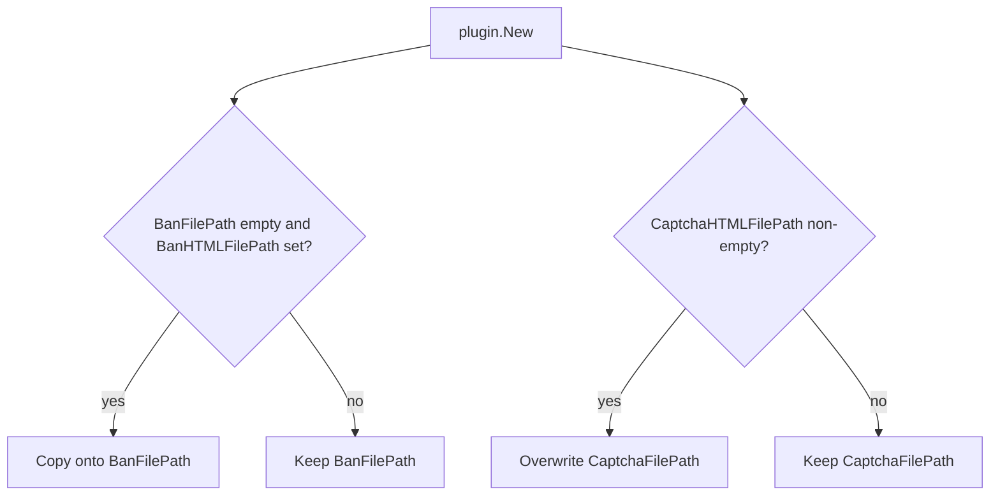

Developer review: in progress — 2026-09-18T17:13:59Z

## What this changes
**Operators.** None.

**Admin users.** None.

**Developers.** Prepare only: grounded removal of `BanHTMLFilePath` / `CaptchaHTMLFilePath` and opened stub PR #100. Versus `master`, those Deprecated fields and both `plugin.New` aliases still exist.

**End users.** None.

## Motivation
Operators still have two names for the ban and captcha template paths. The current keys are `banFilePath` and `captchaFilePath`. The old `banHtmlFilePath` and `captchaHtmlFilePath` keys remain on Config as Deprecated fields, and `plugin.New` copies them onto the current fields.

On `master`, ban copies the old key only when `banFilePath` is empty. Captcha copies whenever `captchaHtmlFilePath` is non-empty and overwrites `captchaFilePath`. Real e2e labels and the mock captcha scenario still set the old keys, so those suites depend on the aliases.

Not merging leaves the captcha overwrite, the extra public keys, and in-tree YAML that will break once the fields are gone.

## Merge readiness
Prepare is grounded (`qualified-with-gaps`). The fields and aliases are still on this branch. 2 items remain.

Priority: P2 — real operator pain, with a workaround or limited blast radius
Reviewed head: 7886941
Owner decision: None.

## Review scores
| Measure | Result | What it means |
| --- | --- | --- |
| Overall readiness | 3/6 | CI still in progress; no product gate yet |
| CI proof | 3/6 | Race detector succeeded; three checks in progress |
| Local tests proof | N/A | Before implement; remote PR uses CI |
| Review resolution | 6/6 | OPEN PR #100; no reviewer comments |

## Verification
| Check | Result | Evidence |
| --- | --- | --- |
| Branch | 2026-09-18-remove-html-filepath-deprecations pushed | `git` `origin/2026-09-18-remove-html-filepath-deprecations` at `7886941` |
| OpenSpec | none | `openspec/` unchanged vs `master` |
| Pull request | https://github.com/david-garcia-garcia/crowdsec-bouncer-traefik-plugin/pull/100 | pr-host Create |
| CI | Race detector success https://github.com/david-garcia-garcia/crowdsec-bouncer-traefik-plugin/actions/runs/35373005118/job/105691150736 ; e2e (docker + pester) in progress https://github.com/david-garcia-garcia/crowdsec-bouncer-traefik-plugin/actions/runs/35373004997/job/105691150544 ; Main Process in progress https://github.com/david-garcia-garcia/crowdsec-bouncer-traefik-plugin/actions/runs/35373005118/job/105691150359 ; e2e (binary + mock LAPI) in progress https://github.com/david-garcia-garcia/crowdsec-bouncer-traefik-plugin/actions/runs/35373004997/job/105691150240 | pr-host CI |
| Local tests | none | handoff.yaml localTests |
| PR comments | no comments | no `comments.md` |

## Specs
None.

## Follow-up issues
None.

## How this fits together
Local ticket `2026-09-18-remove-html-filepath-deprecations` runs on branch `2026-09-18-remove-html-filepath-deprecations` as PR #100. CI started on the prepare commit.

## Decision needed
None.

## Before merge
- [ ] [P2] Delete `BanHTMLFilePath` and `CaptchaHTMLFilePath` from Config and both `plugin.New` alias blocks.
- [ ] [P2] Retarget in-tree e2e YAML and the live `build_e2e_pester_crowdsec-stack` scenario from the old keys to `banFilePath` / `captchaFilePath`.

## Findings
None.

## Axis review
None.

## Agent review details

### Review metrics
| Metric | Value | Why it matters |
| --- | --- | --- |
| Specs in this PR | none | Same list as ## Specs |
| Open reviewer comments walked | 0 FIX / 0 ANSWER / 0 open | Unanswered review is merge risk |
| Reviewed head | 78869411860070ce813601add9e3be22a0943b35 | Card must match the branch you measured |

### Stored data model
None.

### Technical review
Best possible solution: Not yet — this branch only records the requirement; DestBranch still ships the Deprecated fields and both aliases.

Do we have a high-confidence way to reproduce? Yes, `plugin.go` copies captcha whenever the old key is set and ban only when the new key is empty; real e2e labels still use the old keys.

Is this the best way to solve the issue? Not applied yet. The constraint that matters is deleting both settings with no alias, not the declined empty-guard fix.

### Evidence
What I checked:
- Dest `origin/master` at `6d7043d` has both Deprecated fields and both `plugin.New` aliases (`git ls-tree`, `pkg/configuration/configuration.go`, `plugin.go`)
- Ticket-named `examples/enhanced-decisions` and README old keys are not on dest
- OPEN PR #100; comment inventory empty (pr-host)
- CI: Race detector success; three checks in progress (pr-host check runs)

### Rank-up moves
None.
