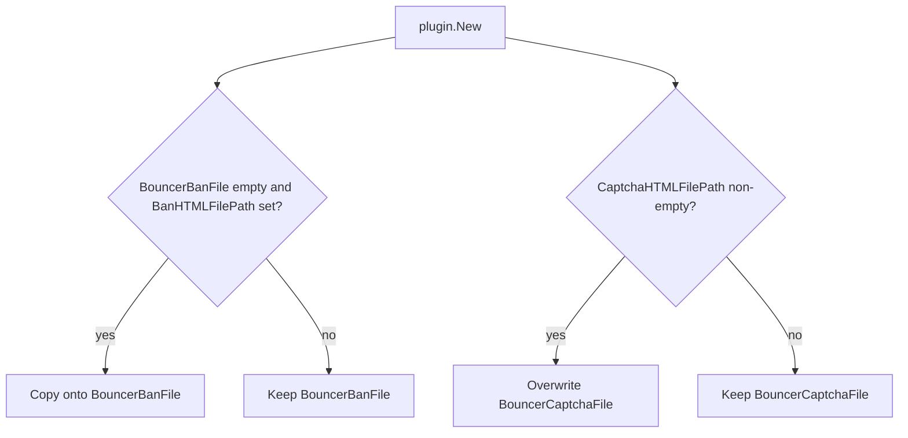

Developer review: in progress — 2026-09-18T17:49:29Z

## What this changes
**Operators.** Set `bouncerBanFile` and `bouncerCaptchaFile` only. YAML or labels that still set `banHtmlFilePath` / `captchaHtmlFilePath` (or the HTML-cased twins) are ignored by Traefik and are not copied onto the current fields; those deploys get CreateConfig defaults (`bouncerBanFile` empty, `bouncerCaptchaFile` `/captcha.html`).

**Admin users.** None.

**Developers.** `Config` no longer has `BanHTMLFilePath` or `CaptchaHTMLFilePath`. `plugin.New` snapshots Traefik’s decode and does not read the old keys. Live e2e, examples, README, and `build_e2e_pester_crowdsec-stack` name `bouncerBanFile` / `bouncerCaptchaFile`.

**End users.** None.

## Motivation
Operators still have two names for the ban and captcha template paths on `master`. The current keys are `bouncerBanFile` and `bouncerCaptchaFile`. The old `banHtmlFilePath` and `captchaHtmlFilePath` keys remain on Config as Deprecated fields, and `plugin.New` copies them onto the current fields.

On `master`, ban copies the old key only when `bouncerBanFile` is empty. Captcha copies whenever `captchaHtmlFilePath` is non-empty and overwrites `bouncerCaptchaFile`. Real e2e labels, including the custom-ban route’s `banhtmlfilepath`, and the mock captcha scenario still set the old keys.

Not merging leaves the captcha overwrite, the extra public keys, and in-tree YAML that silently falls back to defaults once the fields are gone. Closed PR #85’s empty-guard alias is not the fix: the owner wants the keys deleted.

## Merge readiness
Six-axis review is clean. CI on `e6f08ee` is still running. 0 review items remain.

Priority: P2 — leftover deprecated captcha key silently replaces the named template; workaround is unset the old key
Reviewed head: e6f08ee
Owner decision: Required. See Decision needed.

## Review scores
| Measure | Result | What it means |
| --- | --- | --- |
| Overall readiness | 3/6 | CI in progress on reviewed head |
| CI proof | 3/6 | Required checks in progress on e6f08ee |
| Local tests proof | N/A | Remote PR; CI proof covers this |
| Review resolution | 6/6 | OPEN PR #100; no reviewer comments |

## Verification
| Check | Result | Evidence |
| --- | --- | --- |
| Branch | 2026-09-18-remove-html-filepath-deprecations pushed | `git` `origin/2026-09-18-remove-html-filepath-deprecations` at `e6f08ee` |
| OpenSpec | remove-html-filepath-deprecations | `openspec/changes/remove-html-filepath-deprecations/` |
| Pull request | https://github.com/david-garcia-garcia/crowdsec-bouncer-traefik-plugin/pull/100 | pr-host |
| CI | Race detector queued https://github.com/david-garcia-garcia/crowdsec-bouncer-traefik-plugin/actions/runs/35376562576/job/105702486273 ; Main Process in_progress https://github.com/david-garcia-garcia/crowdsec-bouncer-traefik-plugin/actions/runs/35376562576/job/105702486611 ; e2e (binary + mock LAPI) queued https://github.com/david-garcia-garcia/crowdsec-bouncer-traefik-plugin/actions/runs/35376562564/job/105702489804 ; e2e (docker + pester) queued https://github.com/david-garcia-garcia/crowdsec-bouncer-traefik-plugin/actions/runs/35376562564/job/105702489697 | pr-host CI |
| Local tests | passed | handoff.yaml localTests |
| PR comments | no comments | no `comments.md` |

## Specs
- [build_e2e_pester_crowdsec-stack](https://github.com/david-garcia-garcia/crowdsec-bouncer-traefik-plugin/blob/2026-09-18-remove-html-filepath-deprecations/openspec/changes/remove-html-filepath-deprecations/proposal.md) — modified

## Follow-up issues
None.

## How this fits together
Local ticket `2026-09-18-remove-html-filepath-deprecations` runs on that branch as PR #100. Code review wrote six clean axis files; CI is re-running on `e6f08ee` after that bus commit.

## Decision needed
| Question | Decision | By |
| --- | --- | --- |
| Does this ticket need a CHANGELOG entry or catalog version bump? | assumed — no CHANGELOG file on dest; do not invent one. Catalog version is a release job, not this change. Breaking for operators who still set only the old keys; state that on the PR Operators line. | explore |

## Before merge
- [x] [P2] Delete `BanHTMLFilePath` and `CaptchaHTMLFilePath` from Config and both `plugin.New` alias blocks.
- [x] [P2] Retarget live leftovers (real e2e including custom-ban `banhtmlfilepath`, mock captcha, README sample, captcha / custom-captcha examples, live `build_e2e_pester_crowdsec-stack` WHEN) to `bouncerBanFile` / `bouncerCaptchaFile`.

## Findings
None.

## Axis review
[Standards](https://github.com/david-garcia-garcia/crowdsec-bouncer-traefik-plugin/blob/2026-09-18-remove-html-filepath-deprecations/devstate/2026/09/2026-09-18-remove-html-filepath-deprecations/codereview_standards.md) — 0 total, 0 pending, 0 completed
[Spec](https://github.com/david-garcia-garcia/crowdsec-bouncer-traefik-plugin/blob/2026-09-18-remove-html-filepath-deprecations/devstate/2026/09/2026-09-18-remove-html-filepath-deprecations/codereview_spec.md) — 0 total, 0 pending, 0 completed
[Security](https://github.com/david-garcia-garcia/crowdsec-bouncer-traefik-plugin/blob/2026-09-18-remove-html-filepath-deprecations/devstate/2026/09/2026-09-18-remove-html-filepath-deprecations/codereview_security.md) — 0 total, 0 pending, 0 completed
[Performance](https://github.com/david-garcia-garcia/crowdsec-bouncer-traefik-plugin/blob/2026-09-18-remove-html-filepath-deprecations/devstate/2026/09/2026-09-18-remove-html-filepath-deprecations/codereview_performance.md) — 0 total, 0 pending, 0 completed
[Dead](https://github.com/david-garcia-garcia/crowdsec-bouncer-traefik-plugin/blob/2026-09-18-remove-html-filepath-deprecations/devstate/2026/09/2026-09-18-remove-html-filepath-deprecations/codereview_dead.md) — 0 total, 0 pending, 0 completed
[Test coverage](https://github.com/david-garcia-garcia/crowdsec-bouncer-traefik-plugin/blob/2026-09-18-remove-html-filepath-deprecations/devstate/2026/09/2026-09-18-remove-html-filepath-deprecations/codereview_coverage.md) — 0 total, 0 pending, 0 completed

## Agent review details

### Review metrics
| Metric | Value | Why it matters |
| --- | --- | --- |
| Specs in this PR | 0 added / 1 modified | Same list as ## Specs |
| Open reviewer comments walked | 0 FIX / 0 ANSWER / 0 open | Unanswered review is merge risk |
| Reviewed head | e6f08ee29777123e9b3a705a5a84ab11764748b4 | Card must match the branch you measured |

### Stored data model
None.

### Technical review
Best possible solution: Delete both Deprecated fields and both `New` copies. Dest still ships them. Do not reuse declined PR #85 empty-guard.

Do we have a high-confidence way to reproduce? Yes. Dest `plugin.go` copies captcha whenever the old key is set and ban only when the new key is empty. After this apply, leftover `banhtmlfilepath` on the custom-ban e2e was ignored and the suite failed until that label was retargeted to `bouncerBanFile`.

Is this the best way to solve the issue? Yes versus dest. The constraint that matters is deleting both settings with no alias.

### Evidence
What I checked:
- Six-axis review of `origin/master...HEAD` excluding `devstate/` and `.cursor/`; all axes `none`
- Nested Task tool unavailable; axis files written in-process (`e6f08ee`)
- Product apply unchanged since `6701999` (fields and New copies gone; live leftovers retargeted)
- OPEN PR #100; comment inventory empty
- CI on `e6f08ee` in progress (Race detector queued, Main Process in_progress, both e2e queued)
- Prior product CI on `6701999`: Race detector, Main Process, e2e (binary + mock LAPI), e2e (docker + pester) success

### Rank-up moves
None.
