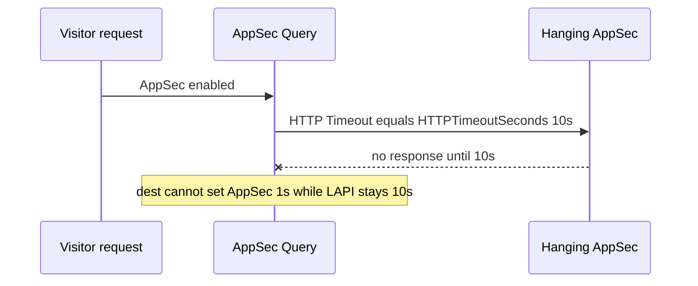

Developer review: ready for review — 2026-09-18T18:21:40Z

## What this changes
**Operators.** Optional YAML knobs `lapiHttpTimeoutSeconds`, `appsecHttpTimeoutSeconds`, and `bouncerCaptchaHttpTimeoutSeconds` inherit `httpTimeoutSeconds` (still default 10). Example: `appsecHttpTimeoutSeconds: 1` with `bouncerAppsecFailureAction: passthrough`.

**Admin users.** None.

**Developers.** One `Config.EffectiveHTTPTimeoutSeconds` owner; LAPI/AppSec `newTransport` and the captcha siteverify client store effective seconds so Adopt last-writes; timeout stays out of reclaim identity.

**End users.** An AppSec hang can fail open after the AppSec override instead of waiting the shared 10s LAPI budget.

## Motivation
On master, one public `httpTimeoutSeconds` (default 10) is the HTTP client Timeout for LAPI stream/live, AppSec Query, and captcha siteverify. An AppSec listener that never answers holds the request for the same ten seconds as a slow LAPI GET. Operators who want AppSec to fail fast (`appsecHttpTimeoutSeconds: 1` plus passthrough) cannot do that without also shortening LAPI.

Dest already last-writes a timeout-only reload through `AdoptTransport` and keeps timeout out of reclaim identity. Closed PR #41 put effective timeout back into that identity; this branch must not. Until inheriting knobs exist and the three clients read effective seconds instead of raw `HTTPTimeoutSeconds`, AppSec hangs stay coupled to the LAPI budget.

## Merge readiness
Product apply landed and CI succeeded. 1 item remains.

Priority: P2 — AppSec hang waits the full shared LAPI timeout; workaround is changing the one knob or disabling AppSec
Reviewed head: 7a4ca08
Owner decision: Required. See Decision needed.

## Review scores
| Measure | Result | What it means |
| --- | --- | --- |
| Overall readiness | 6/6 | Apply landed; CI succeeded; no open comments |
| CI proof | 6/6 | Main Process, Race detector, and both e2e jobs succeeded https://github.com/david-garcia-garcia/crowdsec-bouncer-traefik-plugin/actions/runs/35378926780 |
| Local tests proof | N/A | Remote PR; CI proof covers it |
| Review resolution | 6/6 | No OPEN PR comments |

## Verification
| Check | Result | Evidence |
| --- | --- | --- |
| Branch | 2026-09-18-split-http-timeouts pushed | `git` / origin |
| OpenSpec | split-http-timeouts | `openspec/changes/split-http-timeouts/` |
| Pull request | https://github.com/david-garcia-garcia/crowdsec-bouncer-traefik-plugin/pull/104 | pr-host List |
| CI | build 35378926780 succeeded https://github.com/david-garcia-garcia/crowdsec-bouncer-traefik-plugin/actions/runs/35378926780 | pr-host check runs |
| Local tests | passed | handoff.yaml localTests |
| PR comments | no comments | no comments.md |

## Specs
- [core_plugin_middleware_config-validation](https://github.com/david-garcia-garcia/crowdsec-bouncer-traefik-plugin/blob/2026-09-18-split-http-timeouts/openspec/changes/split-http-timeouts/proposal.md) — modified
- [core_plugin_lapi_connection](https://github.com/david-garcia-garcia/crowdsec-bouncer-traefik-plugin/blob/2026-09-18-split-http-timeouts/openspec/changes/split-http-timeouts/proposal.md) — modified
- [core_plugin_appsec_client](https://github.com/david-garcia-garcia/crowdsec-bouncer-traefik-plugin/blob/2026-09-18-split-http-timeouts/openspec/changes/split-http-timeouts/proposal.md) — modified
- [core_plugin_lapi_reclaim-key](https://github.com/david-garcia-garcia/crowdsec-bouncer-traefik-plugin/blob/2026-09-18-split-http-timeouts/openspec/changes/split-http-timeouts/proposal.md) — modified
- [core_plugin_middleware_bouncer](https://github.com/david-garcia-garcia/crowdsec-bouncer-traefik-plugin/blob/2026-09-18-split-http-timeouts/openspec/changes/split-http-timeouts/proposal.md) — modified

## Follow-up issues
None.

## How this fits together
Local spec on branch `2026-09-18-split-http-timeouts` opened stub PR 104 against master. Implement wired inheriting timeouts on the existing LAPI, AppSec, and captcha clients. CI succeeded.

## Decision needed
| Question | Decision | By |
| --- | --- | --- |
| Whether a negative inherit knob is invalid or treated as inherit (ticket names only zero or omitted). | assumed — invalid. New knobs join `requiredInt0` (`cannot be less than 0`). Zero or omitted inherits. | explore |
| What Go names for the inherit helpers (ticket shorthand `EffectiveLapi` / `EffectiveAppsec` / `EffectiveCaptcha` hides that they return seconds)? | assumed — one `Config.EffectiveHTTPTimeoutSeconds(override int64) int64`. Call sites pass each knob. | explore |

## Before merge
- [x] Add inheriting LAPI, AppSec, and captcha siteverify timeout knobs; wire effective seconds on the existing clients
- [x] Keep timeout out of reclaim identity so a timeout-only YAML change Adopts
- [x] Document README knobs, including AppSec 1s + passthrough
- [x] Tests that fail if wiring still reads raw HTTPTimeoutSeconds
- [ ] Six-axis code review of the apply

## Findings
None.

## Axis review
None.

## Agent review details

### Review metrics
| Metric | Value | Why it matters |
| --- | --- | --- |
| Specs in this PR | 0 added / 5 modified | Same list as ## Specs |
| Open reviewer comments walked | 0 FIX / 0 ANSWER / 0 open | Unanswered review is merge risk |
| Reviewed head | 7a4ca08531651bd6f74ddc756f612a9460930f2e | Card must match the branch you measured |

### Stored data model
None.

### Technical review
Best possible solution: One `Config.EffectiveHTTPTimeoutSeconds` and store effective seconds on the existing transports so Adopt last-writes; timeout stays out of identity.

Do we have a high-confidence way to reproduce? Yes, hanging-listener AppSec Query with override 1s + passthrough returns well under 10s; LAPI adopt and captcha Timeout tests fail if wiring still reads raw `HTTPTimeoutSeconds`.

Is this the best way to solve the issue? Yes — dest already Adopts timeout; this apply adds per-backend seconds without a second HTTP stack or identity key.

### Evidence
What I checked:
- `EffectiveHTTPTimeoutSeconds` inherit/override and `requiredInt0` validation (`pkg/configuration/configuration.go`, `7a4ca08`)
- LAPI/AppSec `newTransport` store effective seconds (`pkg/lapi/client_http.go`, `pkg/appsec/client_http.go`)
- Bouncer captcha siteverify Timeout from Effective (`pkg/bouncer/bouncer.go`)
- Identity owners unchanged (`pkg/lapi/session.go`, `pkg/lapi/identity.go`, `pkg/appsec/session.go`)
- Local `go test ./...` passed; targeted lint passed
- One OPEN PR 104; comment inventory empty; CI succeeded on `7a4ca08` (build 35378926780)

### Rank-up moves
None.
