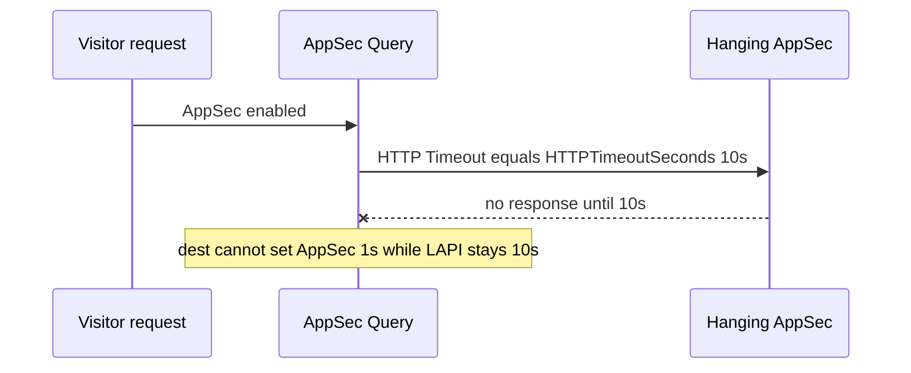

Developer review: in progress — 2026-09-18T17:56:14Z

## What this changes
**Operators.** None.

**Admin users.** None.

**Developers.** None.

**End users.** None.

## Motivation
On master, one public `httpTimeoutSeconds` (default 10) is the HTTP client Timeout for LAPI stream/live, AppSec Query, and captcha siteverify. An AppSec listener that never answers holds the request for the same ten seconds as a slow LAPI GET. Operators who want AppSec to fail fast (`crowdsecAppsecHttpTimeoutSeconds: 1` plus passthrough) cannot do that without also shortening LAPI.

Dest already last-writes a timeout-only reload through `AdoptTransport` and keeps timeout out of reclaim identity. Closed PR #41 put effective timeout back into that identity; this branch must not. Until inheriting knobs exist and the three clients read effective seconds instead of raw `HTTPTimeoutSeconds`, AppSec hangs stay coupled to the LAPI budget.

## Merge readiness
Explore decided inherit knobs and identity stay on dest Adopt. Product apply is not started. 4 items remain.

Priority: P2 — AppSec hang waits the full shared LAPI timeout; workaround is changing the one knob or disabling AppSec
Reviewed head: 6fe68bf
Owner decision: Required. See Decision needed.

## Review scores
| Measure | Result | What it means |
| --- | --- | --- |
| Overall readiness | 3/6 | Explore done; CI in progress; no product apply |
| CI proof | 3/6 | Checks in progress on 6fe68bf |
| Local tests proof | N/A | Before implement |
| Review resolution | 6/6 | No OPEN PR comments |

## Verification
| Check | Result | Evidence |
| --- | --- | --- |
| Branch | 2026-09-18-split-http-timeouts pushed | `git` / origin |
| OpenSpec | none | `openspec/` |
| Pull request | https://github.com/david-garcia-garcia/crowdsec-bouncer-traefik-plugin/pull/104 | pr-host List |
| CI | build 35377204148 in progress https://github.com/david-garcia-garcia/crowdsec-bouncer-traefik-plugin/actions/runs/35377204148 ; build 35377204191 in progress https://github.com/david-garcia-garcia/crowdsec-bouncer-traefik-plugin/actions/runs/35377204191 | pr-host check runs |
| Local tests | none | handoff.yaml localTests |
| PR comments | no comments | no comments.md |

## Specs
None.

## Follow-up issues
None.

## How this fits together
Local spec on branch `2026-09-18-split-http-timeouts` opened stub PR 104 against master. Explore wrote decisions. CI in progress.

## Decision needed
| Question | Decision | By |
| --- | --- | --- |
| Whether a negative inherit knob is invalid or treated as inherit (ticket names only zero or omitted). | assumed — invalid. New knobs join `requiredInt0` (`cannot be less than 0`). Zero or omitted inherits. | explore |
| What Go names for the inherit helpers (ticket shorthand `EffectiveLapi` / `EffectiveAppsec` / `EffectiveCaptcha` hides that they return seconds)? | assumed — one `Config.EffectiveHTTPTimeoutSeconds(override int64) int64`. Call sites pass each knob. | explore |

## Before merge
- [ ] Add inheriting LAPI, AppSec, and captcha siteverify timeout knobs; wire effective seconds on the existing clients
- [ ] Keep timeout out of reclaim identity so a timeout-only YAML change Adopts
- [ ] Document README knobs, including AppSec 1s + passthrough
- [ ] Tests that fail if wiring still reads raw HTTPTimeoutSeconds

## Findings
None.

## Axis review
None.

## Agent review details

### Review metrics
| Metric | Value | Why it matters |
| --- | --- | --- |
| Specs in this PR | none | Same list as ## Specs |
| Open reviewer comments walked | 0 FIX / 0 ANSWER / 0 open | Unanswered review is merge risk |
| Reviewed head | 6fe68bf059ed50febea20c6fe346f9d7857126ff | Card must match the branch you measured |

### Stored data model
None.

### Technical review
Best possible solution: Not started versus dest — inherit knobs on the existing transports, timeout stays out of identity.

Do we have a high-confidence way to reproduce? Yes, dest `newTransport` and bouncer captcha construct read raw `HTTPTimeoutSeconds`; session tests pass that a timeout-only reload Adopts and identity hex stays.

Is this the best way to solve the issue? Yes — dest already Adopts timeout; the missing piece is per-backend seconds, not a second HTTP stack or identity key.

### Evidence
What I checked:
- Dest LAPI/AppSec `newTransport` Timeout from `HTTPTimeoutSeconds` (`pkg/lapi/client_http.go`, `pkg/appsec/client_http.go`, `46a81d0`)
- Dest captcha siteverify Timeout from the same field (`pkg/bouncer/bouncer.go`)
- Dest identity omits timeout (`pkg/lapi/identity.go`, `pkg/lapi/session.go`, `pkg/appsec/session.go`)
- Session adopt/identity tests pass (`TestSessionKey_PolicyAndTLSDoNotChangeKey`, `TestOpenStream_TLSOnlyAdoptsTransport`, `TestOpen_TimeoutOnlyAdoptsTransport`)
- One OPEN PR 104; comment inventory empty; CI in progress on `6fe68bf`

### Rank-up moves
None.
