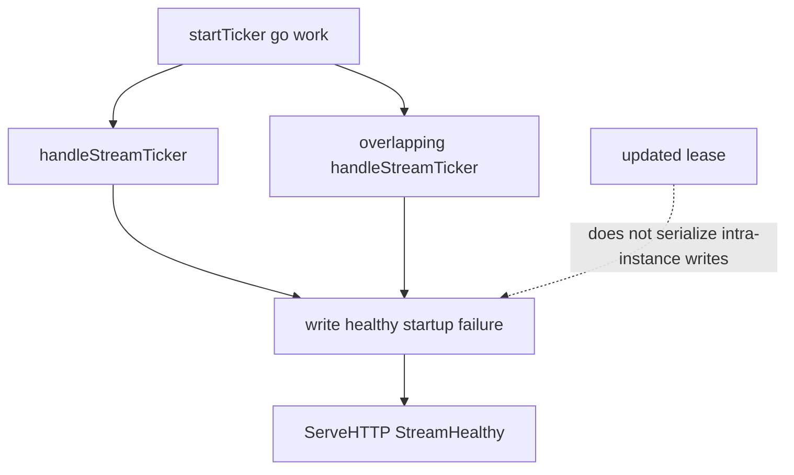

Developer review: in progress — 2026-09-18T06:40:16Z

## What this changes
**Operators.** None.

**Admin users.** None.

**Developers.** Prepare only: requirement grounded and stub PR opened. No apply versus `master`.

**End users.** None.

## Motivation
On `master`, the stream ticker starts a new goroutine every interval and never waits for the last poll. Three Client fields that decide `startup=` and whether cache-miss traffic is treated as a LAPI failure are written and read with no synchronization. The shared `updated` lease does not stop that: it can expire before a slow poll finishes, and a lease loser still writes `isCrowdsecStreamStartup`. A Traefik reload already `Wake`s while a previous GET can still be in flight.

If this does not land, overlapping polls can flap stream health (default `UpdateMaxFailure=0` then bans cache-miss requests) and can interleave range-blob apply. Nothing in CI runs the race detector today, so the next overlap regresses silently.

## Merge readiness
Prepare grounded (`qualified`). Explore is next. 3 items remain.

Priority: P1 — production stream health and decision apply are racy on DestBranch today
Reviewed head: 8b5a237
Owner decision: None.

## Review scores
| Measure | Result | What it means |
| --- | --- | --- |
| Overall readiness | 3/6 | CI still in progress; no apply yet |
| CI proof | 3/6 | in progress Main Process https://github.com/david-garcia-garcia/crowdsec-bouncer-traefik-plugin/actions/runs/35315838018/job/105507175901 ; e2e (binary + mock LAPI) https://github.com/david-garcia-garcia/crowdsec-bouncer-traefik-plugin/actions/runs/35315838023/job/105507176458 ; e2e (docker + pester) https://github.com/david-garcia-garcia/crowdsec-bouncer-traefik-plugin/actions/runs/35315838023/job/105507176215 |
| Local tests proof | N/A | `localTests: none` (before implement; remote PR) |
| Review resolution | 6/6 | OPEN PR #72; no review comments |

## Verification
| Check | Result | Evidence |
| --- | --- | --- |
| Branch | 2026-09-18-stream-poll-single-flight pushed | `git` |
| OpenSpec | none | `openspec/` |
| Pull request | https://github.com/david-garcia-garcia/crowdsec-bouncer-traefik-plugin/pull/72 | pr-host Create |
| CI | build 35315838018 in progress https://github.com/david-garcia-garcia/crowdsec-bouncer-traefik-plugin/actions/runs/35315838018 | pr-host check runs |
| Local tests | none | handoff.yaml localTests |
| PR comments | no comments | no comments.md |

## Specs
None.

## Follow-up issues
None.

## How this fits together
Local ticket `2026-09-18-stream-poll-single-flight` is branch and stub PR #72. Prepare wrote the bus; explore is next. No Task subagent is available in this session; prepare ran in-process.

## Decision needed
None.

## Before merge
- [ ] Explore, propose, implement, review, and green CI
- [x] Stub PR opened
- [x] Requirement grounded

## Findings
None.

## Axis review
None.

## Agent review details

### Review metrics
| Metric | Value | Why it matters |
| --- | --- | --- |
| Specs in this PR | none | Same list as ## Specs; do not paste diff --stat |
| Open reviewer comments walked | 0 FIX / 0 ANSWER / 0 open | Unanswered review is merge risk |
| Reviewed head | 8b5a237b635e8c0abc1a4015f3f2bdc448b729ec | Card must match the branch you measured |

### Stored data model
None.

### Technical review
Best possible solution: Not yet — prepare only.

Do we have a high-confidence way to reproduce? Yes, Docker `go test -race ./pkg/lapi/` on dest HEAD already failed `TestSleepDrainsMetrics` and `TestOpenStream_SleepingIntervalChangeWakesSameSlot`.

Is this the best way to solve the issue? Design is owner-decided in the ticket; apply has not started.

### Evidence
What I checked:
- Dest HEAD `b42860f` `startTicker` still does `go work()` (`pkg/lapi/client.go`)
- `StreamHealthy` is a raw bool read (`pkg/lapi/client.go`)
- Docker race on dest + empty start commits failed the two named tests (golang:1.22.12, CGO_ENABLED=1)
- No Task tool in this session; prepare wrote the bus in-process

### Rank-up moves
None.
