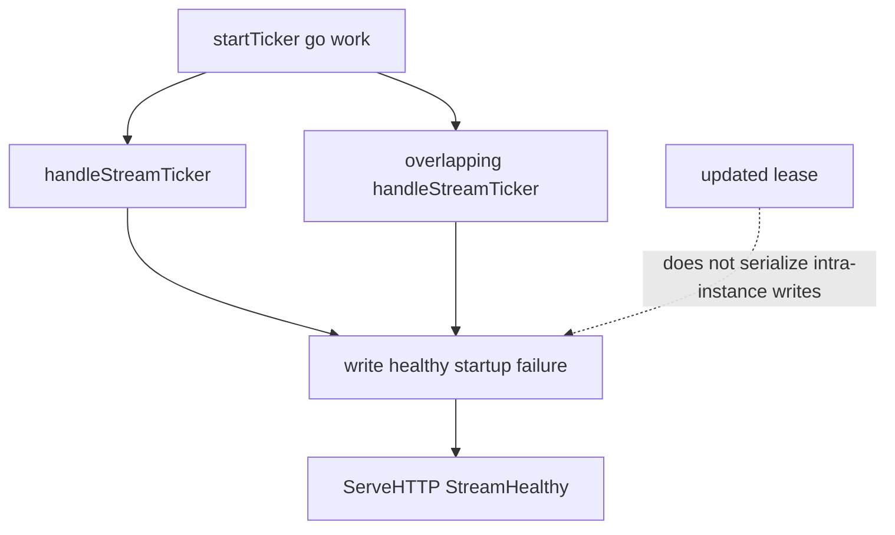

Developer review: ready for review — 2026-09-18T06:51:45Z

## What this changes
**Operators.** None. No new deploy key. Watch existing stream-healthy / stream-unhealthy lines; overlapping polls no longer flap them.

**Admin users.** None.

**Developers.** Three deliverables versus `master`: (1) skip-if-busy on `handleStreamTicker` plus atomic startup/healthy/failure and no `go` in `startTicker`; (2) test-only mutex around `TestSleepDrainsMetrics` body capture; (3) a second CI job `Race detector` that runs `go test -race ./pkg/...`.

**End users.** Cache-miss visitors are less likely to be banned because two overlapping polls flapped stream health. Cached hits were already unaffected.

## Motivation
On `master`, the stream ticker starts a new goroutine every interval and never waits for the last poll. Three Client fields that decide `startup=` and whether cache-miss traffic is a LAPI failure are written and read with no synchronization. The shared `updated` lease does not stop that: it can expire before a slow poll finishes, and a lease loser still writes startup. A Traefik reload already `Wake`s while a previous GET can still be in flight.

If this does not land, overlapping polls can flap stream health (default `UpdateMaxFailure=0` then bans cache-miss requests) and can interleave range-blob apply. Nothing in CI ran the race detector, so the next overlap would regress silently.

## Merge readiness
Apply landed. CI succeeded, including the new Race detector job. 1 item remains (owner merge).

Priority: P1 — production stream health and decision apply are racy on DestBranch today
Reviewed head: a32736e
Owner decision: None.

## Review scores
| Measure | Result | What it means |
| --- | --- | --- |
| Overall readiness | 6/6 | CI succeeded; no open review comments |
| CI proof | 6/6 | Main Process https://github.com/david-garcia-garcia/crowdsec-bouncer-traefik-plugin/actions/runs/35316430783/job/105508966646 ; Race detector https://github.com/david-garcia-garcia/crowdsec-bouncer-traefik-plugin/actions/runs/35316430783/job/105508966478 ; e2e (binary + mock LAPI) https://github.com/david-garcia-garcia/crowdsec-bouncer-traefik-plugin/actions/runs/35316430789/job/105509021980 ; e2e (docker + pester) https://github.com/david-garcia-garcia/crowdsec-bouncer-traefik-plugin/actions/runs/35316430789/job/105509022090 |
| Local tests proof | N/A | remote PR; local gates passed |
| Review resolution | 6/6 | OPEN PR #72; no review comments |

## Verification
| Check | Result | Evidence |
| --- | --- | --- |
| Branch | 2026-09-18-stream-poll-single-flight pushed | `git` |
| OpenSpec | stream-poll-single-flight | `openspec/changes/archive/2026-09-18-stream-poll-single-flight/` |
| Pull request | https://github.com/david-garcia-garcia/crowdsec-bouncer-traefik-plugin/pull/72 | pr-host |
| CI | build 35316430783 succeeded https://github.com/david-garcia-garcia/crowdsec-bouncer-traefik-plugin/actions/runs/35316430783 | pr-host check runs |
| Local tests | passed | handoff.yaml localTests |
| PR comments | no comments | no comments.md |

## Specs
- [core_plugin_lapi_stream-single-flight](https://github.com/david-garcia-garcia/crowdsec-bouncer-traefik-plugin/blob/2026-09-18-stream-poll-single-flight/openspec/changes/archive/2026-09-18-stream-poll-single-flight/proposal.md) — added
- [build_ci_github_race-detector](https://github.com/david-garcia-garcia/crowdsec-bouncer-traefik-plugin/blob/2026-09-18-stream-poll-single-flight/openspec/changes/archive/2026-09-18-stream-poll-single-flight/proposal.md) — added

## Follow-up issues
None.

## How this fits together
Local ticket `2026-09-18-stream-poll-single-flight` is branch and PR #72. CI is green. Owner merges; this run does not.

## Decision needed
None.

## Before merge
- [x] Green CI on the apply head, including the new Race detector job
- [ ] Owner merge only — do not merge from this run
- [x] Local `go build` / `go vet` / `go test ./pkg/...` / `go test .` / `golangci-lint` / Docker `-race ./pkg/lapi/`
- [x] Ticket source removed from the repository root

## Findings
- **Deliverable 1 (production fix)** — skip-if-busy CAS on `handleStreamTicker`, atomic int64 flags, `startTicker` runs `work()` inline. Path: `pkg/lapi/client_stream.go:49`, `pkg/lapi/client.go:257`.
- **Deliverable 2 (test-harness only)** — `testMetricsBody` mutex so `TestSleepDrainsMetrics` is not a production-bug stand-in. Path: `pkg/lapi/zzz_metrics_test.go`.
- **Deliverable 3 (CI)** — job `race` / `Race detector` runs `go test -race -count=1 ./pkg/...` with `CGO_ENABLED: 1`. No package excluded. Path: `.github/workflows/main.yml:85`.
- Observation (out of scope) — workflow `on.push.branches` is `main` while the default branch is `master`, so pushes to master still skip CI.

## Axis review
[Standards](https://github.com/david-garcia-garcia/crowdsec-bouncer-traefik-plugin/blob/2026-09-18-stream-poll-single-flight/devstate/2026/09/2026-09-18-stream-poll-single-flight/codereview_standards.md) — 0 total, 0 pending, 0 completed
[Spec](https://github.com/david-garcia-garcia/crowdsec-bouncer-traefik-plugin/blob/2026-09-18-stream-poll-single-flight/devstate/2026/09/2026-09-18-stream-poll-single-flight/codereview_spec.md) — 0 total, 0 pending, 0 completed
[Security](https://github.com/david-garcia-garcia/crowdsec-bouncer-traefik-plugin/blob/2026-09-18-stream-poll-single-flight/devstate/2026/09/2026-09-18-stream-poll-single-flight/codereview_security.md) — 0 total, 0 pending, 0 completed
[Performance](https://github.com/david-garcia-garcia/crowdsec-bouncer-traefik-plugin/blob/2026-09-18-stream-poll-single-flight/devstate/2026/09/2026-09-18-stream-poll-single-flight/codereview_performance.md) — 0 total, 0 pending, 0 completed
[Dead](https://github.com/david-garcia-garcia/crowdsec-bouncer-traefik-plugin/blob/2026-09-18-stream-poll-single-flight/devstate/2026/09/2026-09-18-stream-poll-single-flight/codereview_dead.md) — 0 total, 0 pending, 0 completed
[Test coverage](https://github.com/david-garcia-garcia/crowdsec-bouncer-traefik-plugin/blob/2026-09-18-stream-poll-single-flight/devstate/2026/09/2026-09-18-stream-poll-single-flight/codereview_coverage.md) — 0 total, 0 pending, 0 completed

## Agent review details

### Review metrics
| Metric | Value | Why it matters |
| --- | --- | --- |
| Specs in this PR | 2 added / 0 modified | Same list as ## Specs |
| Open reviewer comments walked | 0 FIX / 0 ANSWER / 0 open | Unanswered review is merge risk |
| Reviewed head | a32736ea21704330174d620cb53ed05a42d9cf36 | Card must match the branch you measured |

### Stored data model
None.

### Technical review
Best possible solution: Intra-instance CAS skip plus atomic publish of the three flags, without holding lifecycle `mu` across HTTP and without a new Yaegi `select` loop.

Do we have a high-confidence way to reproduce? Yes. Docker `-race ./pkg/lapi/` failed on dest (`TestSleepDrainsMetrics`, `TestOpenStream_SleepingIntervalChangeWakesSameSlot`) and is silent after the fix.

Is this the best way to solve the issue? Yes — it is the owner-decided design. CAS is the only race-free skip on an `int64` field.

### Evidence
What I checked:
- `go build ./...` exit 0
- `go vet ./...` exit 0
- `go test ./pkg/... -count=1` all ok
- `go test . -count=1` ok 50.707s
- `golangci-lint run ./...` exit 0
- Docker race before: FAIL `TestSleepDrainsMetrics` and `TestOpenStream_SleepingIntervalChangeWakesSameSlot`
- Docker race after: `ok pkg/lapi 7.812s`; `ok ./pkg/...` all packages, none excluded
- CI Race detector succeeded https://github.com/david-garcia-garcia/crowdsec-bouncer-traefik-plugin/actions/runs/35316430783/job/105508966478
- Main worktree left on `master`; ticket file deleted from repository root
- PRs #30 and #42 not closed

### Rank-up moves
None.
