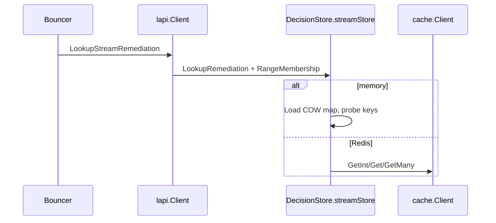

Developer review: in progress — 2026-09-19T15:35:00.000Z

## What this changes

**Operators.** None.

**Admin users.** None.

**Developers.** Stream/alone Ip and header decisions live on `DecisionStore.streamStore` (Redis → `cache.Client`; memory → COW `map[string]LiveSlot{word,expiresAt}`). `Client.LookupStreamRemediation` + bouncer single path; removed `liveTick` / `UsesLiveSnapshot`. Memory intern overflow: Warn + kind-only word (no slot leftover string).

**End users.** None.

## Motivation

On `origin/master`, stream/alone with in-memory `DecisionStore` still resolves each request through the TTL heap (`LookupCachedRemediation`), paying heap churn and many allocations per miss. That path is correct for live/none memo keys but the wrong store for stream Ip/header slots that are updated on a tick cadence.

If we keep a parallel `Client.liveTick` scratch map, apply and lookup follow different backends and Redis vs memory leaks into `Client`. The cost of not merging a proper store split is permanent dual paths and continued master-scale lookup cost on stream memory deployments.

## Merge readiness

Implement landed (584ff695); tasks 7/7 complete; full `go test ./...` passed locally. RETHINK comment has `Implement:` but stays `[ ]` until pullrequest. CI re-run pending on pushed head.

Priority: P2 — stream/alone memory lookup cost on master; architecture fix without operator-facing config change.

Reviewed head: da134ea4

Owner decision: None.

## Review scores

| Measure | Result | What it means |
| --- | --- | --- |
| Overall readiness | 3/6 | Implement done; RETHINK `[ ]`; CI pending |
| CI proof | 3/6 | Pending on da134ea4 — [PR checks](https://github.com/david-garcia-garcia/crowdsec-bouncer-traefik-plugin/pull/118/checks) |
| Local tests proof | 6/6 | handoff `localTests: passed`; `go test ./...` |
| Review resolution | 1/6 | `comments.md` RETHINK `[ ]` (Implement filled) |

## Verification

| Check | Result | Evidence |
| --- | --- | --- |
| Branch | 2026-09-19-optcow-stream-lookup pushed | PR #118 → master |
| OpenSpec | tasks 7/7 | `openspec/changes/2026-09-19-optcow-stream-lookup/tasks.md` |
| Pull request | https://github.com/david-garcia-garcia/crowdsec-bouncer-traefik-plugin/pull/118 | GitHub |
| Local tests | passed | implement run |
| PR comments | RETHINK open | chat-store-split — Implement 584ff695 |

## Performance (100k Ip fixture, windows/amd64, vs `origin/master`)

| Measure | `origin/master` (TTL / cached lookup) | This branch (stream map lookup) | Why |
| --- | --- | --- | --- |
| Seq miss | 394 ns/op, 12 allocs, 248 B | 81 ns/op, 1 alloc, 8 B | Map load + fixed probes vs TTL `GetInt` + slice/`GetMany` on miss path |
| Parallel miss | 173 ns/op, 12 allocs | 6.6 ns/op, 1 alloc | Read-mostly `atomic.Value` map vs contended heap lookups |
| Heap retained 100k Ips | ~18.4 MiB (TTL map bench) | ~8.9 MiB (packed slot map bench) | Packed `LiveSlot` vs TTL heap nodes + keys |

Master has no stream-map benchmark; baseline row is master’s stream/alone behavior (still TTL-backed). Branch row is `LookupStreamMapRemediation` / memory store after implement.

## Specs

Modified (fold) — deltas in change folder:

- [core_cache_client_decision-store](https://github.com/david-garcia-garcia/crowdsec-bouncer-traefik-plugin/blob/2026-09-19-optcow-stream-lookup/openspec/changes/2026-09-19-optcow-stream-lookup/specs/core_cache_client_decision-store/spec.md)
- [core_plugin_lapi_stream-apply](https://github.com/david-garcia-garcia/crowdsec-bouncer-traefik-plugin/blob/2026-09-19-optcow-stream-lookup/openspec/changes/2026-09-19-optcow-stream-lookup/specs/core_plugin_lapi_stream-apply/spec.md)
- [core_plugin_decisions_scopes](https://github.com/david-garcia-garcia/crowdsec-bouncer-traefik-plugin/blob/2026-09-19-optcow-stream-lookup/openspec/changes/2026-09-19-optcow-stream-lookup/specs/core_plugin_decisions_scopes/spec.md)
- [core_plugin_middleware_bouncer](https://github.com/david-garcia-garcia/crowdsec-bouncer-traefik-plugin/blob/2026-09-19-optcow-stream-lookup/openspec/changes/2026-09-19-optcow-stream-lookup/specs/core_plugin_middleware_bouncer/spec.md)

Proposal: [proposal.md](https://github.com/david-garcia-garcia/crowdsec-bouncer-traefik-plugin/blob/2026-09-19-optcow-stream-lookup/openspec/changes/2026-09-19-optcow-stream-lookup/proposal.md)

## Follow-up issues

None.

## How this fits together

RETHINK → explore → propose → **implement (done)** → codereview (next).

## Decision needed

None.

## Before merge

- [x] Implement store split and remove bolt-on
- [ ] Close RETHINK after pullrequest reply
- [ ] Green CI on reviewed head
- [x] Benchmarks vs `origin/master` on delivery card

## Findings

Store split implemented; codereview not run this phase.

## Axis review

None (implement phase).

## Agent review details

### Review metrics

| Metric | Value | Why it matters |
| --- | --- | --- |
| go test ./... | pass | full repo |
| Product SHA | 584ff695 | streamStore replace |

### Stored data model

| Store | Field | Type | Sample |
| --- | --- | --- | --- |
| DecisionStore | stream | streamStore | memory: `atomic.Value` → `map[string]LiveSlot` |
| LiveSlot | Word, ExpiresAt | uint32, int64 | removed `Leftover` |

### Technical review

Implement complete — axis review pending codereview phase.

### Evidence

- `pkg/lapi/streamstore.go`, `pkg/lapi/client_lookup.go`
- `openspec/changes/2026-09-19-optcow-stream-lookup/tasks.md`

### Rank-up moves

Run `sbs-dev-codereview` on `origin/master...584ff695`.
