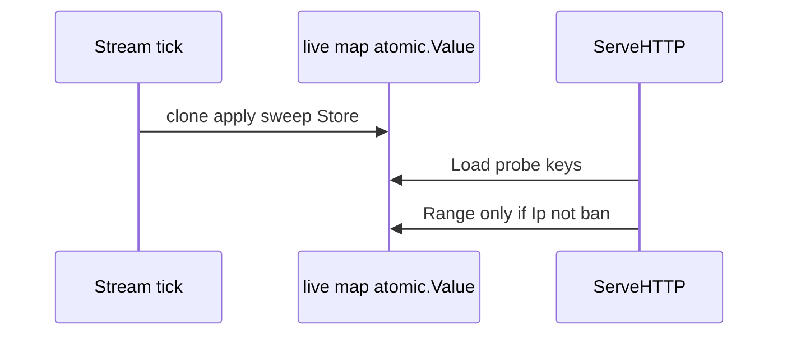

Developer review: in progress — 2026-09-19T15:08:00.000Z

## What this changes
**Operators.** None.

**Admin users.** None.

**Developers.** Stream/alone in-memory decisions now publish one `map[string]LiveSlot` per tick on `DecisionStore` (`atomic.Value`); `ServeHTTP` uses `LookupLiveSnapshotRemediation` (single map probe per Ip/header key, skip Range when Ip is ban). TTL heap keeps lease, range-index, and live/none only. Range `Contains` uses read lock on immutable hydrate snapshots (vendor `iplookup.Helper`).

**End users.** None.

## Motivation
Stream and alone modes kept CrowdSec Ip and header scopes in the same in-process TTL heap the request path walked every time: `GetInt` per key, leftover keys through `GetMany`, then range membership under an exclusive mutex. Ticks kept `Set`-ting that heap, so packed IPs could exist twice and expiry could run on `Get` instead of on tick publish.

Without one copy-on-write snapshot per stream tick, lookup stays at ~12 allocs per miss and retains roughly twice the heap per packed Ip versus a plain Go map slot.

## Merge readiness
Implement complete on branch; code review is next. PR base is `main` while product code merges `origin/master` (pkg/lapi); rebasing the PR target may be needed before merge.

Priority: P2 — real latency and memory cost on stream/alone memory with a workaround (old path still worked).
Reviewed head: 859c6761
Owner decision: None.

## Review scores
| Measure | Result | What it means |
| --- | --- | --- |
| Overall readiness | 3/6 | Implement landed; CI not measured on new head |
| CI proof | 1/6 | Pushed 859c6761; check runs not seen via API |
| Local tests proof | 6/6 | `localTests: passed` — pkg/lapi, decisionscope, bouncer |
| Review resolution | N/A | No PR review comments |

## Verification
| Check | Result | Evidence |
| --- | --- | --- |
| Branch | 2026-09-19-optcow-stream-lookup pushed | git / PR #118 |
| OpenSpec tasks | 2026-09-19-optcow-stream-lookup | `openspec/changes/2026-09-19-optcow-stream-lookup/tasks.md` all [x] |
| Pull request | https://github.com/david-garcia-garcia/crowdsec-bouncer-traefik-plugin/pull/118 | GitHub |
| CI | not seen on 859c6761 | status API pending, 0 statuses |
| Local tests | passed | handoff.yaml; `go test` pkg/lapi, decisionscope, bouncer |
| PR comments | no comments | comments: none |

## Performance (100k IPv4 fixture, windows/amd64, vs same-tree TTL lookup baseline)
| Measure | Baseline (TTL `LookupCachedRemediation`) | Live snapshot | Why |
| --- | --- | --- | --- |
| Heap to hold 100k packed Ips | ~18.4 MiB per build | ~8.9 MiB per build | No `ttl_map.Data` string keys / interface{} payloads |
| Seq miss ns/op (1 Ip + Country scope + Range index) | ~401 ns, 12 allocs/op | ~84 ns, 1 alloc/op | One map probe; no `GetMany`; fewer merge steps |
| Parallel miss ns/op | ~152 ns, 12 allocs/op | ~7 ns, 1 alloc/op | `atomic.Value` Load + map read; Range uses RLock not exclusive lock |

Bench package: `pkg/decisionscope` (`BenchmarkLookup*`, `BenchmarkHeapRetained_*`).

## Specs
OpenSpec propose artifacts were not re-committed after master merge; tasks file tracks implement scope.

## Follow-up issues
None.

## How this fits together
Local ticket → explore → propose → **implement (live COW map + benches)** → codereview next.

## Decision needed
None.

## Before merge
- [ ] Code review (six-axis) and devdocs impact
- [ ] Green CI on reviewed head
- [ ] Confirm PR base branch (`main` vs `master`) with owner

## Findings
None.

## Axis review
None (implement phase; codereview not run).

## Agent review details

### Review metrics
| Metric | Value | Why it matters |
| --- | --- | --- |
| Product commit | 2a0b2ac4 | Live snapshot implement |
| Reviewed head | 859c6761a76c4a84ba141d8802df2713e6b5bea1 | Includes handoff |
| Open reviewer comments walked | 0 | — |

### Stored data model
| Store | Field | Type | Sample |
| --- | --- | --- | --- |
| DecisionStore | liveSnapshot | atomic.Value → map[string]LiveSlot | `"203.0.113.10"` → `{word: packed ban+origin, expiresAt: unix}` |
| LiveSlot | word / leftover / expiresAt | uint32 / string / int64 | overflow origin in `leftover` when intern full |

### Technical review
Single COW map on DecisionStore matches explore lock-in; stream tick publishes once; Redis/live/none unchanged.

### Evidence
- `go test ./pkg/lapi/... ./pkg/decisionscope/... ./pkg/bouncer/...`
- `go test -bench=BenchmarkLookup -bench=BenchmarkHeap -benchmem ./pkg/decisionscope/` (3 runs)

### Rank-up moves
Re-target PR from frozen `main` to `master` before merge to avoid 968-file delta.
