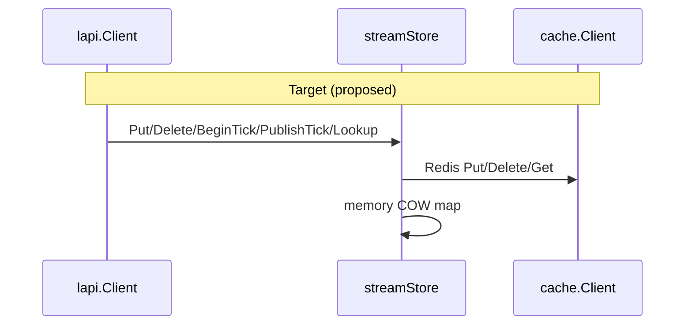

Developer review: in progress — 2026-09-19T15:29:09.574Z

## What this changes

**Operators.** None.

**Admin users.** None.

**Developers.** OpenSpec `2026-09-19-optcow-stream-lookup`: `streamStore` on `DecisionStore` (Redis → `cache.Client`, memory → COW `map[string]liveSlot{word,expiresAt}`); remove `Client.liveTick` / `UsesLiveSnapshot`; bouncer uses one `LookupStreamRemediation`; intern overflow Warn + kind-only word (no `Leftover`). Branch code still bolt-on until implement replaces it.

**End users.** None.

## Motivation

On `origin/master`, stream/alone memory still walks the TTL heap on every request. This branch added a faster map but kept the wrong split: `Client` branches `liveTick != nil` vs `cache.Set`, and bouncer branches on `UsesLiveSnapshot()`. Performance belongs on a store chosen at `OpenDecisionStore`, not Client tick scratch.

If we ship the bolt-on, dual write paths become permanent. Branch memory path ~86 ns / 1 alloc vs ~408 ns / 12 allocs (100k fixture) — keep after store split, not the current shape.

## Merge readiness

Propose complete; OpenSpec apply-ready with tasks unchecked. Implement must replace branch bolt-on per tasks. PR base `master`. RETHINK comment has `Propose:` accept; item still `[ ]` until implement lands.

Priority: P2 — stream/alone memory cost on master; wrong architecture on branch until store split is implemented.

Reviewed head: 561646c5

Owner decision: None.

## Review scores

| Measure | Result | What it means |
| --- | --- | --- |
| Overall readiness | 3/6 | Propose done; implement/replace pending; RETHINK open |
| CI proof | N/A | Not re-run this phase |
| Local tests proof | 6/6 | handoff `localTests: passed` (prior implement; code stale vs spec) |
| Review resolution | 1/6 | `comments.md` RETHINK `[ ]` (Propose filled) |

## Verification

| Check | Result | Evidence |
| --- | --- | --- |
| Branch | 2026-09-19-optcow-stream-lookup | PR #118 → master |
| OpenSpec | valid, apply-ready | `openspec validate 2026-09-19-optcow-stream-lookup --strict` |
| Pull request | https://github.com/david-garcia-garcia/crowdsec-bouncer-traefik-plugin/pull/118 | GitHub |
| Explore reproduce | passed | `explore.md` § Reproduce |
| PR comments | RETHINK open | chat-store-split — Propose accept |

## Performance (branch HEAD, 100k fixture, vs same-tree TTL bench)

| Measure | TTL lookup (cached path) | Live snapshot (to keep after store split) |
| --- | --- | --- |
| Seq miss | ~408 ns, 12 allocs | ~86 ns, 1 alloc |
| Parallel miss | ~153 ns, 12 allocs | ~6.8 ns, 1 alloc |
| Heap 100k Ips | ~18.4 MiB | ~8.9 MiB |

Baseline for delivery card: **`origin/master`**.

## Specs

Modified (fold) — deltas in change folder:

- [core_cache_client_decision-store](https://github.com/david-garcia-garcia/crowdsec-bouncer-traefik-plugin/blob/2026-09-19-optcow-stream-lookup/openspec/changes/2026-09-19-optcow-stream-lookup/specs/core_cache_client_decision-store/spec.md)
- [core_plugin_lapi_stream-apply](https://github.com/david-garcia-garcia/crowdsec-bouncer-traefik-plugin/blob/2026-09-19-optcow-stream-lookup/openspec/changes/2026-09-19-optcow-stream-lookup/specs/core_plugin_lapi_stream-apply/spec.md)
- [core_plugin_decisions_scopes](https://github.com/david-garcia-garcia/crowdsec-bouncer-traefik-plugin/blob/2026-09-19-optcow-stream-lookup/openspec/changes/2026-09-19-optcow-stream-lookup/specs/core_plugin_decisions_scopes/spec.md)
- [core_plugin_middleware_bouncer](https://github.com/david-garcia-garcia/crowdsec-bouncer-traefik-plugin/blob/2026-09-19-optcow-stream-lookup/openspec/changes/2026-09-19-optcow-stream-lookup/specs/core_plugin_middleware_bouncer/spec.md)

Proposal: [proposal.md](https://github.com/david-garcia-garcia/crowdsec-bouncer-traefik-plugin/blob/2026-09-19-optcow-stream-lookup/openspec/changes/2026-09-19-optcow-stream-lookup/proposal.md)

## Follow-up issues

None.

## How this fits together

RETHINK → explore → **propose (done)** → implement (replace bolt-on) → codereview.

## Decision needed

None.

## Before merge

- [ ] Implement store split and remove bolt-on
- [ ] Close RETHINK after implement + reply
- [ ] Green CI on reviewed head
- [ ] Benchmarks vs `origin/master` on delivery card

## Findings

OpenSpec matches human store-split lock; branch product code still wrong shape.

## Axis review

None (propose phase).

## Agent review details

### Review metrics

| Metric | Value | Why it matters |
| --- | --- | --- |
| OpenSpec validate | pass strict | 4 folds + tasks |
| RETHINK Propose | accept | chat-store-split |

### Stored data model

| Store | Field | Type | Sample |
| --- | --- | --- | --- |
| DecisionStore | streamStore | interface + redis/memory impl | memory: `atomic.Value` → `map[string]liveSlot{word,expiresAt}` |
| liveSlot (memory) | word, expiresAt | uint32, int64 | no `Leftover` field |

### Technical review

Propose only — implement review pending.

### Evidence

- `devstate/specs.md`
- `openspec/changes/2026-09-19-optcow-stream-lookup/`

### Rank-up moves

Run implement to replace `liveTick` / `UsesLiveSnapshot` per tasks.
