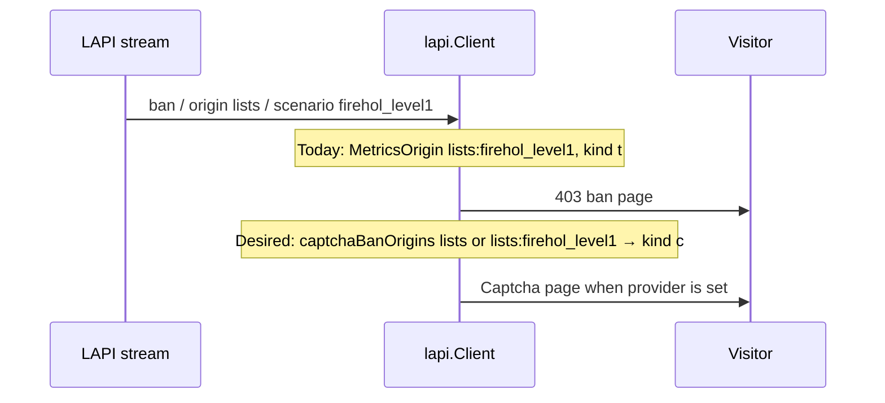

Developer review: in progress — 2026-09-20T19:18:09Z

IssueKey: 2026-09-20-captcha-ban-origins
JobName: 2026-09-20-captcha-ban-origins

[sgsi-dev-ticket-status:2026-09-20-captcha-ban-origins]

## What this changes
**Operators.** None yet versus `master`; explore locked a future `captchaBanOrigins` Traefik list (upstream https://github.com/maxlerebourg/crowdsec-bouncer-traefik-plugin/pull/369) so selected LAPI `ban` origins store captcha, including per-list `lists:<name>`.

**Admin users.** None.

**Developers.** Versus `master`, still no product delta; explore retargeted dest to `master` (not `main`) and requires one `lapi.Client` helper after `MetricsOrigin`, used by stream Ip/header, stream Range, and live/none strongest-pick.

**End users.** None.

## Motivation
CrowdSec CAPI and console list decisions always arrive as type `ban`. Console and `profiles.yaml` cannot turn those into captcha, so a visitor whose address sits on a shared blocklist gets a hard 403.

On `master`, stream and live map `RemediationValue(decision.Type)` only. `MetricsOrigin` already rewrites list decisions to `lists:<scenario>` for metrics and stored origin, but that string does not change the kind letter. Upstream https://github.com/maxlerebourg/crowdsec-bouncer-traefik-plugin/pull/369 remaps on raw `decision.Origin`; this fork must match the rewritten string so `lists` and `lists:firehol_level1` can differ.

Without merge, operators cannot offer captcha for community or per-list bans.

## Merge readiness
Explore complete; propose not started. Dest is `master`.

Priority: P2 — real visitor 403s on shared blocklists with no captcha path until origin remap ships.
Reviewed head: 7bbf23eb
Owner decision: Required. See Decision needed.

## Review scores
| Measure | Result | What it means |
| --- | --- | --- |
| Overall readiness | 1 | Explore written; no product apply |
| CI proof | 1 | Branch pushed after dest rebase; checks not measured this Set |
| Local tests proof | N/A | Before implement |
| Review resolution | N/A | No PR review comments |

## Verification
| Check | Result | Evidence |
| --- | --- | --- |
| Branch | 2026-09-20-captcha-ban-origins pushed | `git` `7bbf23eb` |
| OpenSpec | none | handoff.yaml |
| Pull request | https://github.com/david-garcia-garcia/crowdsec-bouncer-traefik-plugin/pull/130 | GitHub, base `master` |
| CI | not seen | not queried this Set |
| Local tests | none | handoff.yaml |
| PR comments | no comments | comments: none |

## Specs
None.

## Follow-up issues
None.

## How this fits together
Local ticket → branch `2026-09-20-captcha-ban-origins` on dest `master` → stub PR #130 → adopt upstream https://github.com/maxlerebourg/crowdsec-bouncer-traefik-plugin/pull/369 with `lists:<name>` matching on `MetricsOrigin`.

## Decision needed
| Question | Decision | By |
| --- | --- | --- |
| Should ValidateParams reject unknown origin tokens? | assumed — no; trim and ignore empty entries only | explore |
| Exact vs case-fold match for `CAPI` / `lists`? | assumed — exact equality on the metrics origin; `lists` also matches a `lists:` prefix | explore |
| Can two routers sharing one Client have different CaptchaBanOrigins? | assumed — no; first `New` wins; do not add the list to the Open key | explore |
| Does `lists` match a decision whose MetricsOrigin stayed `lists` (empty scenario)? | assumed — yes | explore |

## Before merge
None.

## Findings
None.

## Axis review
None.

## Agent review details

### Review metrics
| Metric | Value | Why it matters |
| --- | --- | --- |
| Specs in this PR | none | No spec.md in dest...HEAD |
| Open reviewer comments walked | 0 FIX / 0 ANSWER / 0 open | No inventory |
| Reviewed head | 7bbf23eb907aa59de75613bae9a3454c6c09b644 | Card matches measured HEAD |

### Stored data model
None.

### Technical review
Best possible solution: remap at store/query using `MetricsOrigin` plus one Client helper, matching upstream #369 live+stream scope with per-list matching this fork already has the origin string for.

Do we have a high-confidence way to reproduce? Yes, `RemediationValue` on stream/live paths with no CaptchaBanOrigins (`pkg/lapi/client_decisions.go`, `pkg/lapi/client_stream.go`).

Is this the best way to solve the issue? Yes versus DestBranch: ServeHTTP remap would break live strongest-pick and Range ban-over-captcha; raw `origin` match cannot distinguish lists.

### Evidence
What I checked:
- Dest retarget: PR #130 base `master` (`a9e1d70b`), branch `7bbf23eb` (GitHub pull_request_read, git)
- Upstream #369 remaps stream Set and live prefer-ban via `remediationForDecision` (PR files)
- Fork `MetricsOrigin` rewrite (`pkg/lapi/client_metrics.go`)
- Reclaim key must not include this list (`openspec/specs/core_plugin_lapi_reclaim-key/spec.md`)

### Rank-up moves
None.
