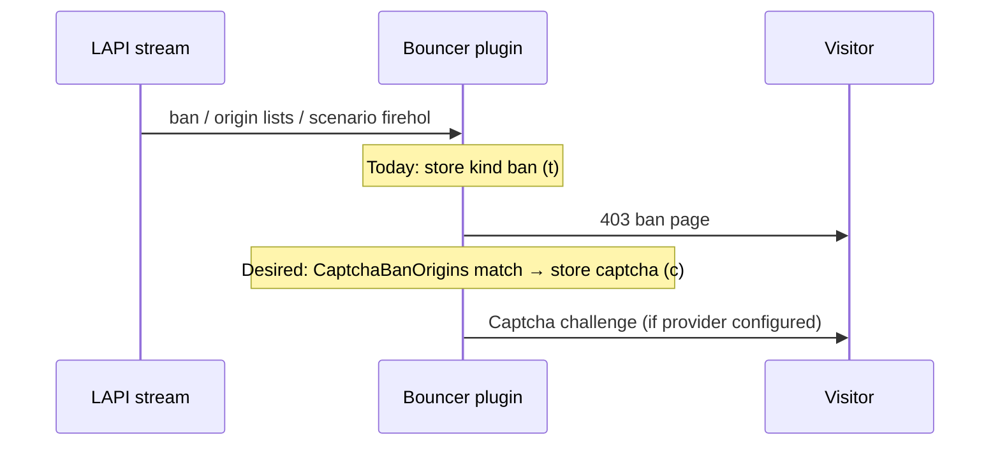

Developer review: in progress — 2026-09-20T18:43:37Z

IssueKey: 2026-09-20-captcha-ban-origins
JobName: 2026-09-20-captcha-ban-origins

[sgsi-dev-ticket-status:2026-09-20-captcha-ban-origins]

## What this changes
**Operators.** None yet on `main`; prepare grounded a future `CaptchaBanOrigins` Traefik plugin setting (see upstream https://github.com/maxlerebourg/crowdsec-bouncer-traefik-plugin/pull/369) to store captcha instead of ban for selected LAPI origins.

**Admin users.** None.

**Developers.** Versus `main`, only the devstate bus is committed; product code still maps LAPI `ban` to stored kind `t` with no origin-based remap (`pkg/lapi/client_decisions.go`, `pkg/lapi/client_stream.go`).

**End users.** None.

## Motivation
CrowdSec blocklists (CAPI community list, console-subscribed lists) arrive as decision type `ban`. Console and `profiles.yaml` cannot turn those into captcha at the source, so shared-list false positives get a hard 403 unless the bouncer remaps chosen origins when decisions are stored.

On `main`, stream and live paths use `RemediationValue(decision.Type)` only; `MetricsOrigin` affects labels and stored origin strings (`lists:` + scenario) but not the ban/captcha letter. Upstream added `CaptchaBanOrigins` in https://github.com/maxlerebourg/crowdsec-bouncer-traefik-plugin/pull/369; this fork must adopt that with per-list matching on rewritten origins (`lists` vs `lists:<name>`).

Without merge, operators on blocklists keep no captcha escape hatch for listed origins they trust.

## Merge readiness
Prepare complete; explore not started. 8 workflow phases remain.

Priority: P2 — real end-user pain on shared blocklists with no captcha path until origin remap ships.
Reviewed head: 67f3e3e2
Owner decision: None.

## Review scores
| Measure | Result | What it means |
| --- | --- | --- |
| Overall readiness | 1 | Stub PR exists; CI not measured |
| CI proof | 1 | Pushed; checks not seen yet |
| Local tests proof | N/A | Before implement |
| Review resolution | N/A | No PR review comments inventoried |

## Verification
| Check | Result | Evidence |
| --- | --- | --- |
| Branch | 2026-09-20-captcha-ban-origins pushed | origin tracking |
| OpenSpec | none | handoff.yaml |
| Pull request | https://github.com/david-garcia-garcia/crowdsec-bouncer-traefik-plugin/pull/130 | GitHub |
| CI | not seen | not yet queried |
| Local tests | none | handoff.yaml |
| PR comments | no comments | comments: none |

## Specs
None.

## Follow-up issues
None.

## How this fits together
Local ticket → branch `2026-09-20-captcha-ban-origins` → stub PR #130 → product work follows upstream https://github.com/maxlerebourg/crowdsec-bouncer-traefik-plugin/pull/369 with fork-specific list origin matching.

## Decision needed
None.

## Before merge
None.

## Findings
None.

## Axis review
| Axis | Report | Status |
| --- | --- | --- |
| Standards | None. | N/A |
| Spec | None. | N/A |
| Security | None. | N/A |
| Performance | None. | N/A |
| Dead | None. | N/A |
| Test coverage | None. | N/A |

### Stored data model
None.
